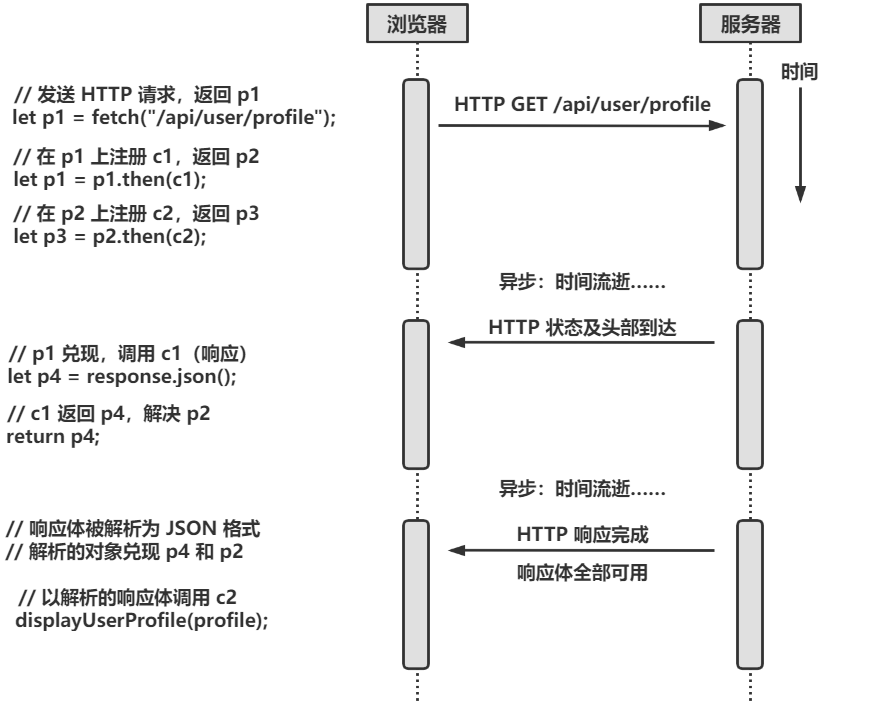

JavaScript 的异步编程

- ES6新增的期约（Promise）是一种对象，代表某个异步操作尚不可用的结果
- ES2017 新增的 `async` 和 `await` 关键字为简化异步编程提供新语法，允许开发者将基于期约的异步代码写出同步的形式
- ES2018 引入异步迭代器和 `for/await` 循环，允许在看起来同步的简单循环中操作异步事件流

<!--more-->


## 使用回调的异步编程

在最基本的层面，JavaScript 异步编程是基于回调实现的

回调即函数，可以传递给其他函数，其他函数在满足某个条件或发生某个（异步）事件时调用（回调）这个函数

### 定时器

一种最简单的异步操作即在一定时间后运行某些代码

```js
setTimeout(checkForUpdates, 60000);
```

`setTimeout()` 函数的第一个参数是一个函数，第二个参数是以毫秒为单位的时间间隔

`setTimeout()` 用来注册回调函数，还指定在什么异步条件下调用回调函数

`setTimeout()` 只会调用一次指定的回调函数，若需要重复运行，使用 `setInterval()` 

```js
// 1分钟后调用checkForUpdates，然后每过1分钟调用一次
let updateIntervalId = setInterval(checkForUpdates, 60000);

// setInterval()返回一个值，把这个值传给clearInterval()
// 可以停止这种重复调用（类似地，setTimeout()也返回一个值，
// 可以把它传给clearTimeout()）
function stopCheckingForUpdates(){
    clearInterval(updataIntervalld);
}
```


### 事件

客户端 JavaScript 编程几乎全都是事件驱动的，等待用户行为，然后响应用户的动作

事件驱动的 JavaScript 程序在特定上下文中为特定类型的事件注册回调函数，而浏览器在指定的事件发生时调用这些函数，这些回调函数叫做事件处理程序或事件监听器，通过 `addEventListener()` 注册

```js
// 浏览器返回一个对象，表示与下面的CSS选择符匹配的<button>元素
let okay = document.querySelector('#confirmUpdateDialog button.okey');

// 然后注册一个回调函数，当用户单击该按钮时会被调用
okey.addEventListener('click',applyUpadte);
```


### 网络事件

JavaScript 中常见的异步操作来源还可以是网络请求

``` js
// 从Web服务器获取数据
function getCurrentVersionNumber(versionCallback){    // 注意回调参数
    // 通过脚本向后端版本API发送一个HTTP请求
    let request = new XMLHeepRequest();
    request.open("GET","http://www.example.com/api/version");
    request.send();
    
    // 注册一个将在响应到达时调用的回调
    request.onload = function(){
        if(request.status === 200){
            // 如果HTTP状态码没问题，则取得版本号并调用回调
            let currentVersion = parseFloat(request.responseText);
            versionCallback(null, currentVersion);
        }else{
            // 否则，通过回调报告错误
            versionCallback(response.statusText, null);
        }
    };
    // 注册另一个将在网络出错时调用的回调
    request.onerror = request.ontimeout = function(e){
        versionCallback(e.type, null);
    };
}
```

客户端 JavaScript 代码可以使用 `XMLHttpRequest` 类及回调函数来发送 HTTP 请求并异步处理服务器返回的响应

> `XMLHttpRequest` 类在现代客户端 JavaScript 中，很大程度上已经被 `fetch()` API 取代

对于大多数 Web API（包括XMLHttpRequest），都可以通过在生成事件的对象上调用 `addEventListener()` 并将相关事件的名字传给回调函数来定义事件处理程序，也可以如上述代码，将回调函数赋值给这个对象的一个属性来注册事件监听器


### Node 中的回调与事件

Node.js 服务器端 JavaScript 环境底层就是异步的，定义了很多使用回调和事件的 API。

```js
// 读取文件内容的默认API是异步的，会在读取文件内容后调用一个回调函数
const fs = require("fs");     // "fs"模块有文件系统相关的API
let options = {
    // 默认选项填写
};

// 读取配置文件，然后调用回调函数
fs.readFile("config..json", "utf-8", (err, text) => {
    if(err){
        // 如果有错误，显示一条警告消息，但仍然继续
        console.warn("Could not read config file:", err);
    }else{
        // 否则，解析文件内容并赋值给选项对象
        Object.assign(options, JSON.parse(text));
    }
    
    // 无论是什么情况，都启动运行程序
    startProgram(options);
});
```

Node 的 `fs.readFile()` 函数参数

- filename（必选），表示要读取的文件名。
- encoding（可选），表示文件的字符编码。
- callback 是回调函数，用于接收文件的内容。


Node 也定义了一些基于事件的 API

```js
// 在Node中通过HTTP请求获取URL的内容
const https = require("https");

// 读取URL文本内容，将其异步传给回调
function getText(url, callback){
    // 对URL发送一个HTTP GET请求
    request = https.get(url);
    
    // 注册一个函数处理“response”事件
    request.on("response", response =>{
        // 这个响应事件意味着收到了响应头
        let httpStatus = response.statusCode;
        
        // 此时没有收到HTTP响应体
        // 因此还要注册几个事件处理程序，以便收到响应体时被调用
        response.setEncoding("utf-8");      // 应该Unicode文本
        let body = "";                      // 需要在这里积累
        
        // 每个响应体块就绪时都会调用这个事件处理程序
        response.on("data", chunk => { body += chunk; });
        
        // 响应完成时会调用这个事件处理程序
        response.on("end", ()=>{
            if(httpStatus === 200){         // 如果HTTP响应码没问题
                callback(null, body);       // 把响应体传给回调
            }else{                          // 否则传错误
                callback(httpStatus, null);
            }
        });
    });
    
    // 为底层网络错误注册一个事件处理程序
    request.on("error", (err) =>{
        callback(err, null);
    });
}
```

上述代码包含两层处理事件监听器的异步代码，Node 使用 `on()` 方法注册事件监听器


## 期约

期约是一个对象，表示异步操作的结果

使用期约的好处：

- 基于回调的异步编程经常会出现回调多层嵌套的情形，造成代码缩进过多以致难以阅读，期约让这种嵌套回调以一种更线性的期约链形式表达
- 基于回调的异步编程难以处理错误。若一个异步函数（或异步调用的回调）抛出异常，该异常没有办法传播到异步操作的发起者，对此，可以使用回调参数严密跟踪和传播错误并返回值，但这样麻烦且易出错，期约标准化了异步错误处理，通过期约链提供一种让错误正确传播的途径

期约表示的是一次异步计算的未来结果，不能使用它们表示重复的异步计算


### 使用期约

核心 JavaScript 支持期约后，浏览器也开始实现基于期约的 API

```js
getJSON(url).then(jsonData => {
    // 这是一个回调函数，在解析得到JSON值
    // 后被异步调用，并接收该JSON值作为参数
})
```

类似上节的 `getText()` 函数，发送异步 HTTP 请求，并将 HTTP 响应体传给以字符串形式指定的一个回调函数

`getJSON()` 不接受回调函数，将 HTTP 响应体解析成 JSON 格式并返回一个期约，`getJSON()` 向指定 url 发送异步 HTTP 请求，在请求结果待定期间返回一个期约对象，这个对象有一个实例方法 `then()`，回调函数传给这个 `then()` 方法，当 HTTP 响应到达，响应体被解析为 JSON 格式，解析后的值被传给作为 `then()` 的参数的函数

 `then()` 方法可以想成 `addEventListener()` 方法，若多次调用一个期约对象的 `then()` 方法，则指定的每个函数都会在预期计算完成后被调用

期约表示一个计算，每个通过 `then()` 方法注册的函数都只会被调用一次，且即使调用 `then()` 时异步计算已经完成，传给 `then()` 的函数也会被异步调用

通常以动词开头来命名返回期约的函数以及使用期约结果的函数

```js
// 假设有一个类似的函数可以显示用户简历
function displayUserProfile(profile) { /* 省略实现细节 */ }

// 在返回期约的函数中使用这个函数
getJSON("/api/user/profile").then(displayUserProfile);
```


**使用期约处理错误**

期约可以通过给 `then()` 方法传第二个函数来实现错误处理

```js
getJSON("/api/user/profile").then(displayUserProfile,handleProfileError);
```

上述代码中，若 `getJSON()` zheng'chang结束，它会将计算结果传给 `displayUserProfile()`，若出现错误（如用户没有登录、服务器下线、用户网络中断、请求超时等），将 Error 对象传给 `handleProfileError()`

实际开发中，更多的使用传统方式

```js
getJSON("/api/user/profile").then(displayUserProfile).catch(handleProfileError);
```


### 期约链

期约以线性 `then()` 方法调用链的形式表达一连串异步操作，而无需把每个操作嵌套在前一个操作的回调内部

```js
// 示例
fetch(documentURL)                        // 发送HTTP请求
	.then(response => response.json())    // 获取JSON格式的响应体
	.then(document => {                   // 在取得解析后的JSON时
    	return render(document);          // 把文档显示给用户
	})
	.then(rendered => {                   // 在取得渲染的文档后
    	cacheInDatabase(rendered);        // 把它缓存在本地数据库中
	})
	.catch(error => handle(error));       // 处理发生的错误
```

HTTP API 的最简单形式就是函数 `fetch()`，传给它一个 URL，返回一个期约，这个期约在 HTTP 响应开始到达且 HTTP 状态和头部可用时兑现

```js
fetch("/api/user/profile").then(response => {
    // 在期约解决时，可以访问 HTTP 状态和头部
    if(response.ok && response.headers.get("Content-Type") === "application/json"){
        // 还未得到响应体时的操作
    }
});
```

 `fetch()` 返回的期约兑现时，传给它的 `then()` 方法的函数会被调用，这个函数会收到一个 `Response` 对象，通过这个响应对象可以访问请求状态和头部，也可以通过 `text()` 和 `json()` 方法取得文本和 JSON 格式的响应体。不过，虽然最初的期约兑现，响应体尚未到达，用于取得响应体的方法本身也返回期约

```js
fetch("/api/user/profile")
    .then(response => {
    	return response.json();
	})
	.then(profile => {
    	displayUserProfile(profile);
	});
```

若存在方法链，每一个 `then()` 方法调用都返回一个新期约兑现，这个新期约对象在传给 `then()` 的函数执行结束才会兑现


### 解决期约

```js
function c1(response){                // 回调1
    let p4 = response.json();
    return p4;                        // 返回期约4
}

function c2(profile){                 // 回调2
    displayUserProfile(profile);
}

let p1 = fetch("/api/user/profile");  // 期约1，任务1
let p2 = p1.then(c1);                 // 期约2，任务2
let p3 = p2.then(c2);                 // 期约3，任务3
```

通过期约抓取 URL 过程，如图所示




当把回调 c 传给 `then()` 方法时，`then()` 返回期约 p，并安排好在将来某个时刻异步调用 c，届时，这个回调执行某些计算并返回一个值 v。当这个回调返回值 v 时，p 就以这个值得到解决

- 当期约以一个非期约值解决时，会立即以这个值兑现，即若 c 返回非期约值，该返回值变为 p 的值，p 兑现，结束
- 若返回值 v 是一个期约，p 会得到解决但并未兑现，此时，p要等到期约 v 落定后才能落定
  - v 兑现，p 会以相同的值兑现
  - v 被拒绝，p 会以相同的理由被拒绝


### 期约错误

给 `.then()` 方法传第二个回调函数，这个函数会在期约被拒绝时调用，传给第二个回调函数的参数是一个值（通常是一个 `Error` 对象），表示拒绝理由

在实际编程中，基于期约的错误一般是通过给期约链添加一个 `.catch()` 方法调用来处理

在异步代码中，未处理的异常往往不会得到报告，错误只会静默发生，导致极难调试，因此细致的错误处理在异步编程中尤为重要

期约的 `.catch()` 实际上是对以 `null` 为第一个参数，以错误处理回调为第二个参数的 `.then()` 调用的简写

ES2018 中，期约对象新增 `.finally()` 方法，类似 `try/catch/fianlly` 语句中的 `finally` 子句，若在期约链中添加一个 `finally` 调用，那么传给 `.finally()` 的回调会在期约落定时被调用，无论期约是兑现还是被拒绝，回调都会被调用，调用时不会给传任何参数

```js
// 接近实际中的URL抓取代码
fetch("/api/user/profile")         // 发送HTTP请求
	.then(response => {            // 在状态和头部就绪时调用
    	if(!response.ok){          // 若遇到404或类似错误
            return null;           // 返回空内容
        }
    
    	// 检测头部以确保服务器发送的是JSON
    	// 若不是，表明服务器失效，是一个严重错误
    	let type = response.headers.get("content-type");
    	if(type !== "application/json"){
            throw new TypeError(`Expected JSON, got ${type}`);
        }
    
    	// 执行到此，说明状态码为2xx，内容类型为JSON
    	// 可以安心返回一个期约，表示解析响应体之后得到的JSON对象
    	return response.json();
	})
	.then(profile => {             // 调用时传入解析后的响应体或null
    	if(profile){
            displayUserProfile(profile);
        }else{          // 若遇到404错误并返回null
            displayLoggedOutProfilePage();
        }
	})
	.catch(e => {
    	if(e instanceof NerworkError){
            // fetch()在互联网连接故障执行下面代码
            displayErrorMessage("Check your internet connection.");
        }else if(e instanceof TypeError){
            // 若前面抛出TypeError执行下面代码
            displayErrorMessage("Something is wrong with our server!");
        }else{
            // 发生意料之外的错误
            console.error(e);
        }
	});
```

在复杂网络环境下，错误可能以某种概率随机发生，处理这些错误时，可以重新发送异步请求

```js
// 基于期约的操作来查询数据库
queryDatabase()
	.then(displayTable)
	.catch(displayDatabaaseError);
```

假设瞬间网络负载问题会导致这个查询有 1% 的失败概率

```js
// 重新发送请求
queryDatabase()
	.catch(e => wait(500).then(queryDatabase)) //若失败，等待并重试
	.then(displayTable)
	.catch(displayDatabaaseError);
```

此时，错误率降低


### 并行期约

若要并行执行多个异步操作，可以使用函数 `Promise.all()`

`Promise.all()` 接收一个期约对象的数组作为输入，返回一个期约

- 若输入期约中的任意一个拒绝，返回的期约也将拒绝
- 否则，返回的期约会以每个输入期约兑现值得数组兑现

```js
// 抓取多个URL文本

// 先定义一个URL数组
const urls = [ /* 零或多个URL */ ];
// 然后将其转换为一个期约对象的数组
promises = urls.map(url => fetch(url).then(r => r.text()));
// 现在用一个期约来并行运行数组中的所有期约
Promise.all(promises)
    .then(bodies => { /* 处理得到的字符串数组 */ })
    .catch(e => console.error(e));
```

`Promise.all()` 输入数组可以包含期约对象和非期约值，若为非期约值，会被当作一个已兑现期约的值，复制到数组中。由此函数返回的期约会在任何一个输入期约被拒绝时拒绝

ES2020中，`Promise.allSettled()` 与 `Promise.all()` 一样，但是，`Promise.allSettled()` 永远不拒绝返回的期约，而是会等所有输入期约全部落定后兑现

`Promise.allSettled()` 返回的期约解决为一个对象数组，其中每个对象都对应一个输入期约，且都有一个 `status` 属性

- 若属性值为 `fulfilled`，则该对象还会有一个 `value` 属性，包含兑现的值
- 若属性值为 `rejected`，则该对象还会有一个 `reason` 属性，包含对应期约的错误或拒绝理由

```js
Promise.allSettled([Promise.resolve(1), Promise.reject(2), 3])
    .then(results => {
        results[0]    // => {status: "fulfilled", value: 1}
        results[1]    // => {status: "rejected", reason: 2}
        results[2]    // => {status: "fulfilled", value: 3}
    });
```

若想同时运行多个期约，但只关心第一个兑现的值，可以使用 `Promise.race()`，`Promise.race()` 返回一个期约，这个期约会在输入数组的期约有一个兑现或拒绝时马上兑现或拒绝（或者，若输入数组中有非期约值，直接返回第一个非期约值）


### 创建期约

前面使用的是浏览器内置的返回期约的函数，可以创建自己的基于期约的API

#### 基于其他期约的期约

给定一个期约，调用 `.then()` 就可以创建（并返回）一个新期约

```js
// 以已有的fetch()函数为起点，实现getJSON()
function getJSON(url){
    return fetch(url).then(response => response.json());
}
```

```js
// 以getJSON()作为初始期约的来源
function getHighScore(){
    return getJSON("/api/user/profile").then(profile => profile.highScore);
}
```


#### 基于同步值的期约

若需要实现一个已有的基于期约的 API，并从一个函数返回期约，尽管执行的计算不涉及异步操作，在这种情况下，可以使用`Promise.resolve()` 和 `Promise.reject()`

`Promise.resolve()` 接收一个值作为参数，并返回一个会立即（但异步）以该值兑现的期约

`Promise.reject()` 接收一个参数，并返回一个以该参数作为理由拒绝的期约

上面两个静态方法返回的期约在被返回时并未兑现或拒绝，但它们会在当前同步代码块运行结束后立即兑现或拒绝

在一个异步函数中包含同步执行的代码，通过以上两个方法来处理这些同步操作的值是很常见的


#### 从头创建期约

可以使用 `Promise()` 构造函数来创建一个新期约对象，而且可以完全控制这个新期约

```js
// 基于期约的wait()函数
function wait(duration){
    // 创建并返回新期约
    return new Promise((resolve, reject) => {   // 这两个函数控制期约
        // 如果参数无效，拒绝期约
        if(duration < 0){
            reject(new Error("Time travel not yet implemented"));
        }
        // 否则，异步等待，然后解决期约
        // setTimeout调用resolve()时未传参，意味着新期约会以undefined值兑现
        setTimeout(resolve, duration);
    });
}
```

用来控制 `Promise()` 构造函数创建的期约对象命运的函数为 `resolve()` 和 `reject()`，若把一个期约传给 `resolve()`，返回的期约会解决为该新期约，但是通常这里都传一个非期约值，这个值会兑现返回的期约

在 Node 中使用 `getJSON()` 函数

```js
// 异步getJSON()函数
const http = require("http");

function getJSON(url){
    // 创建并返回一个新期约
    return new Promise((resolve, reject) => {
        // 向指定的URL发送一个HTTP GET请求
        request = http.get(url, response => {   // 收到响应时调用
            // 如果HTTP状态码不对，拒绝这个期约
            if(response.statusCode !== 200){
                reject(new Error(`HTTP status ${response.statusCode}`));
                response.resume();    // 这样不会导致内存泄漏
            }
            // 如果响应头不对
            else if(response.headers["content-type"] !== "application/json"){
                reject(new Error("Invalid content-type"));
                response.resume();    // 不会造成内存泄漏
            }else{
                // 否则，注册事件处理程序读取响应体
                let body = "";
                response.setEncoding("utf-8");
                response.on("data", chunk => { body += chunk; });
                response.on("end", () => {
                    // 接收完全部响应体后，尝试解析
                    try{
                        let parsed = JSON.parse(body);
                        // 如果解析成功，兑现期约
                        resolve(parsed);
                    }catch(e){
                        // 若解析失败，拒绝期约
                        reject(e);
                    }
                });
            }
        });
        // 如果收到响应之前请求失败（如网络故障），拒绝期约
        request.on("error", error =>{
            reject(error);
        });
    });
}
```


### 串行期约

若要按顺序运行任意数量的期约需要动态构建期约链

```js
// 抓取URL数组，为了避免网络过载，一次只抓取一个URL
function fetchSequentially(urls){
    // 抓取URL时，要把响应体保存在这里
    const bodies = [];
    
    // 这个函数返回一个期约，它只抓取一个URL响应体
    function fetchOne(url){
        return fetch(url)
            .then(response => response.text())
        	.then(body => {
           		// 把响应体保存在数组，故意省略返回值，返回undefined
            	bodies.push(body);
        	});
    }
    
    // 从一个立即（以undefined值）兑现的期约开始
    let p = Promise.resolve(undefined);
    
    // 现在循环目标URL，构建任意长度的期约链
    // 链的每个环节都会拿取一个URL的响应体
    for(url of urls){
        p = p.then(() => fetchOne(url));
    }
    
    // 期约链的最后一个期约兑现后，响应体数组（bodies）已经就绪
    // 可以将这个bodies数组通过期约返回，注意，这里为包含任何错误处理程序
    // 希望将错误传播给调用者
    return p.then(() => bodies);
}
```

如上述函数定义后，就可以如前面使用 `Promise.all()` 并行抓取，按顺序依次抓取每个URL

```js
fetchSequentially(urls)
	.then(bodies => { /*处理得到的字符串数组*/ })
	.catch(e => console.error(e));
```

`fetchSequentially()` 函数首先会创建一个返回后立即兑现的期约，然后基于这个初始期约构建一个线性的长期约链并返回链中的最后一个期约，类似于多米诺骨牌形式的期约链

还有另一种实现方法，不是事先创建期约，而是让每个期约的回调函数创建并返回下一个期约，类似于俄罗斯套娃的相互嵌套的期约

```js
// 这个函数接收一个输入值数组和一个promiseMaker函数
// 对输入数组中的任何值x，promiseMaker(x)都应该返回
// 一个兑现为输出值的期约。这个函数返回一个期约，该期约
// 最终会兑现为一个包含计算得到的输出值的数组
//
// promiseSequence()不是一次创建所有期约然后让它们
// 并行运行，而是每次只运行一个期约，直到上一个期约兑现
// 之后，才会调用promiseMaker()计算下一个值
function promiseSequence(inputs, promiseMaker){
    // 为数组创建一个可以修改的私有副本
    inputs = [...inputs];
    
    // 这是要用作期约回调的函数，它的伪递归魔术是核心逻辑
    function handleNextInput(outputs){
        if(inputs.length === 0){
            // 如果没有输入值了，则返回输出值的数组
            // 这个数组最终兑现这个期约，以及所有之前
            // 已经解决但尚未兑现的期约
            return outputs;
        }else{
            // 如果还有要处理的输入值，那么我们将返回
            // 一个期约对象，把当前期约解决为一个来自新期约的未来值
            let nextInput = inputs.shift();     // 取得下一个输入值
            return promiseMaker(nextInput)      // 计算下一个输出值
            	// 然后用这个新输出值创建一个新输出值的数组
           		.then(output => outputs.concat(output))
            	// 然后“递归”，传入新的、更长的输出值的数组
            	.then(handleNextInput);
        }
    }
    
    // 从一个以空数组兑现的期约开始
    // 使用上面的函数作为它的回调
    return Promise.resolve([]).then(handleNextInput);
}
```

可以使用器抓取多个URL的响应

```js
// 传入一个URL，返回一个以改URL的响应体文本兑现的期约
function fetchBody(url){ return fetch(url).then(r => r.text()); }
// 使用它依次抓取一批URL的响应体
promiseSequence(urls, fetchBody)
    .then(bodies => { /* 处理字符串数组 */ })
    .catch(console.error);
```


## async和await

ES2017 新增两个关键字 `async` 和 `await`，代表异步 JavaScript 编程范式的迁移

 `async` 和 `await` 接收基于期约的高校代码并且隐藏期约，让异步代码向低效阻塞的同步代码一样容易理解和推理

### await表达式

`await` 关键字接收一个期约并将其转换为一个返回值或一个抛出的异常

通常不会使用 `await` 来接收一个保存期约的变量，更多的将其放在一个会返回期约的函数调用前面

```js
let response = await fetch("/api/user/profile");
let profile = await response.json();
```

`await` 关键字并不会导致你的程序阻塞或者在指定的期约落定前什么都不做，代码依然是异步的，`await` 只是掩盖了这个事实，即任何使用 `await` 的代码本身都是异步的


### async函数

任何使用 `await` 的代码本身都是异步的，因此，只能在以 `async` 关键字声明的函数内部使用 `await` 关键字

```js
// 重写gitHighScore()函数
async function gitHighScore(){
    let response = await fetch("/api/user/profile");
    let profile = await response.json();
    return profile.highScore;
}
```

将函数声明为 `async` 意味着该函数的返回值将是一个期约，即便函数体中不出现期约相关的代码

- 若 `async` 函数正常返回，则作为该函数真正返回值的期约对象将解决为这个明显的返回值
- 若 `async` 函数抛出异常，则返回的期约对象将以该异常被拒绝

可以对任何函数使用 `async` 关键字


### 等候多个期约

```js
// 使用async重写getJSON()函数
async function getJSON(url){
    let response = await fetch(url);
    let body = await response.json();
    return body;
}

// 使用这个函数抓取两个JSON值
let value1 = await getJSON(url1);
let value2 = await getJSON(url2);
```

上述代码的问题在于它不必顺序执行，必须等到抓取第一个 URL 的结果之后才会开始抓取第二个 URL 的值

若第二个 URL 并不依赖从第一个 URL 抓取的值，则应该尝试同时抓取两个值

```js
let [value1, value2] = await Promise.all([getJSON(url1), getJSON(url2)]);
```


## 异步迭代

期约只适合单次运行的异步计算，不适合与重复性异步事件来源一起使用，由于一个期约无法用于连续的异步事件，我们也不能使用常规的 `async` 函数和 `await` 语句来处理事件

ES2018 为此提供了解决方法——异步迭代器。异步迭代器基于期约，配合 `for/await` 语句使用

### for/await循环

Node 12 的可读流实现了异步迭代

```js
const fs = require("fs");

async function parseFile(filename){
    let stream = fs.createReadStream(filename, { encoding: "utf-8"});
    for await(let chunk of stream){
        parseChunk(chunk);    // 假设parseChunk()是在其他地方定义的
    }
}
```

异步迭代器会产生一个期约，`for/await` 循环等待该期约兑现，将兑现值赋给循环变量，然后在运行循环体

```js
// 有一个URL数组
const urls = [url1, url2, url3];
// 对每个URL调用fetch()取得一个期约的数组
const promises = urls.map(url => fetch(url));
// 循环数组中的URL
for await(const response of promises){
    handle(response);
}
```


### 异步迭代器

异步迭代器与常规迭代器类似，有两个重要区别

- 异步可迭代对象以符号名字 `Symbol.asyncIterator` 而非 `Symbol.iterator` 实现一个方法
- 异步迭代器的 `next()` 方法返回一个期约，解决为一个迭代器结果对象，而不是直接返回一个迭代器结果对象


### 异步生成器

可以使用声明为 `async` 的生成器函数来实现异步生成器，通过 `yield` 生成的值会自动包装到期约中

```js
// 一个基于期约的包装函数，包装setTimeout()以实现等待
// 返回一个期约，这个期约会在指定的毫秒数之后兑现
function elapsedTime(ms){
    return new Promise(resolve => setTimeout(resolve, ms));
}

// 一个异步迭代器函数，按照固定的时间间隔
// 递增并生成指定（或无穷）个数的计数器
async function* clock(interval, max = Infinity){
    for(let count = 1; count <= max; count++){    // 常规for循环
    	await elapsedTime(interval);              // 等待时间流逝
        yield count;                              // 生成计数器
    }
}

// 一个测试函数，使用异步迭代器和for/await
async function test(){                            // 使用async声明，以便使用for/await
    for await(let tick of clock(300, 100)){       // 循环100次，每次间隔300ms
        console.log(tick);
    }
}
```


### 实现异步迭代器

直接实现异步迭代器，需要包含一个 `Symbol.asyncIterator()`  方法的对象，该方法要返回一个 `next()` 方法的对象，这个 `next()` 方法要返回解决为一个迭代器结果对象的期约

```js
// 重写clock()函数
function clock(interval, max = Infinity){
    // 一个setTimeout的期约版，可以实现等待
    // 注意参数是一个绝对时间而非时间间隔
    function until(time){
        return new Promise(resolve => setTimeout(resolve, time - Data.now()));
    }
    
    // 返回一个异步可迭代对象
    return{
        startTime: Date.now(),     // 记住开始时间
        count: 1,                  // 记住第几次迭代
        asyns next(){              // 方法使其称为迭代器
            if(this.count > max){  // 是否结束
                return { done: true};   // 结束后的迭代结果
            }
            // 计算下次迭代什么时间开始
            let targetTime = this.startTime + this.count * interval;
            // 等待该时间到来
            await until(targetTime);
            // 在迭代结果对象中返回计数器的值
            return { value: this.count++ };
        },
        // 这个方法表示迭代器对象同时也是一个可迭代对象
        [Symbol.asyncIterator](){ return this; }
    };
}
```

异步迭代器的优点是允许我们表示异步事件流或数据流

上述的 `clock()` 函数写起来相当简单，，因为其中的异步源为 `setTimeout()` 调用，但是在面对其他异步源时，如事件处理程序的触发，实现异步迭代器就困难许多。通常只有一个事件处理程序响应事件，但每次调用迭代器的 `next()` 方法都必须返回唯一的期约，在第一个期约解决之前很有可能出现多次调用 `next()` 的情况，即任何异步迭代器方法都必须能在内部维护一个期约队列，让期约按照异步事件发生的顺序依次解决

可以将期约队列的逻辑封装到一个 `AsyncQueue` 类中，基于这个类编写异步迭代器

`AsyncQueue` 类包含一个队列类应有的 `enqueue()` 和 `dequeue()` 方法，`dequeue()` 方法返回一个期约而不是一个实际的值，因此尚未调用 `enqueue()` 之前调用 `dequeue()` 方法是没问题的。这个里欸 `AsyncQueue` 类也是一个异步迭代器，与 `for/await` 配合使用，循环体在每次入队一个新值运行一次

```js
/**
 * 一个异步可迭代队列类。使用enqueue()添加值，使用dequeue()移除值
 * dequeue()返回一个期约意味着值可以在入队之前出队。这个类实现了
 * [Symbol.asyncIterator]和next()，可以与for/await配合使用
 * （这个循环在调用close()方法前不会终止）
 **/
class AsyncQueue{
    constructor(){
        // 已经入队尚未出队的值保存在这里
        this.values = [];
        // 如果期约出队时它们对应的值尚未入队，
        // 就把那些期约的解决方法保存在这里
        this.resolvers = [];
        // 一旦关闭，任何值不能再入队
        // 也不会再返回任何未兑现的期约
        this.closed = false;
    }
    
    enqueue(){
        if(this.closed){
            throw new Error("AsyncQueue closed");
        }
        if(this.resolvers.length > 0){
            // 如果这个值已经有对应的期约，则解决该期约
            const resolve = this.resolvers.shift();
            resolve(value);
        }else{
            // 否则，排队
            this.values.push(value);
        }
    }
    
    dequeue(){
        if(this.values.length > 0){
            // 如果有一个排队的值，为其返回一个解决期约
            const value = this.values.shift();
            return Promise.resolve(value);
        }else if(this.closed){
            // 如果没有排队的值，而且队列已关闭
            // 返回一个解决未EOS（流终止）标记的期约
            return Promise.resolve(AsyncQueue.EOS);
        }else{
            // 否则，返回一个未解决的期约，
            // 将解决方法排队，以便后面使用
            return new Promise((resolve) => { 
                this.resolvers.push(resolve); 
            });
        }
    }
    
    closed(){
        // 一旦关闭，任何值都不能再入队
        // 因此以EOS标记解决所有待决期约
        while(this.resolvers.length > 0){
            this.resolvers.shift()(AsyncQueue.EOS);
        }
        this.closed = true;
    }
    
    // 定义这个方法，让这个类为异步可迭代对象
    [Symbol.asyncIterator](){ return this; }
    
    // 定义next()方法，让类成为异步迭代器
    // dequeue()返回的期约会解决为一个值
    // 或者在关闭时解决为EOS标记，这里需要
    // 返回一个解决为迭代器结果对象的期约
    next(){
        return this.dequeue()
        	.then(value => (value === AsyncQueue.EOS)
                 			? {value: undefined, done: true }
                 			: {value: value, done: false });
    }
}

// dequeue()方法返回的标记值，在关闭时表示“流终止”
AsyncQueue.EOS = Symbol("end-of-stream");
```

使用 `AsyncQueue` 产生一个浏览器事件流，通过 `for/await` 循环来处理

```js
// 把指定文档元素上指定类型的事件推入一个AsyncQueue对象
// 然后返回这个队列，以便将其作为事件流来使用
function eventStream(elt, type){
    const q = new AsyncQueue();                    // 创建一个队列
    elt.addEventListener(type, e => q.enqueue(e)); // 入队事件
    return q;
}

async function handleKeys(){
    // 取得一个keypress事件流，对每个事件都执行一次循环
    for await(const event of eventStream(document, "keypress")){
        console.log(event.key)
    }
}
```

