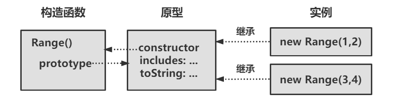

当多个对象经常需要共享一个属性时，可以为这些对象定义一个类，这个类的成员或实例，各自拥有属性来保存或定义自己的状态

JavaScript 中，类使用基于原型的继承

若两个对象继承同一个原型，通常（但不必定）意味着它们是通过同一个构造函数或工厂函数创建和初始化的

<!-- more -->


## 类和原型

JavaScript 中，类意味着一组对象从同一个原型对象继承属性，即原型对象是类的核心特征

```js
// 一个简单的 JavaScript 类

// 这个工厂函数返回一个新范围对象
function range(from, to){
    // 使用Object,create()创建一个对象，继承下面定义的原型对象
    // 这个原型对象保存为这个函数的一个属性，为所有范围对象定义共享方法（行为）
    let r = Object.create(range.methods);
    
    // 保存新范围对象的起点和终点（状态）
    // 这些属性不是继承的，是当前对象独有的
    r.from = from;
    r.to = to;
    
    // 最后返回新对象
    return r;
}

// 这个原型对象定义由所有范围对象继承的方法
range.methods = {
    // 若x在范围内则返回true，否则返回false
    // 这个方法适用于文本、日期和数值范围
    
    includes(x){ return this.from <= x && x <= this.to;},
    
    // 这个生成器函数让这个类的实例可迭代
    // 只适用于数值范围
    *[Symbol.iterator](){
        for(let x = Math.ceil(this.from); x <= this.to; x++) yield x;
    },
    
    // 返回范围的字符串表示
    toString(){ return "(" + this.from + "..." + this.to + ")";}
};

// 使用范围对象的实例
let r = range(1,3);    // 创建一个范围对象
r.includes(2);         // => true：2在范围内
r.toString();          // => "(1...3)"
[...r];                // => [1, 2, 3];通过迭代器转换为数组
```

- 这段代码定义了一个工厂函数 `range()`，用于创建新的 `Range` 对象
- 使用 `range()` 函数的 `methods` 属性保存定义这个类的原型对象
- `range()` 函数为每个 `Range` 对象定义 `from` 和 `to` 属性，这两个属性是非共享、非继承属性，定义每个范围对象独有的状态
- 原型的方法中有一个是计算的名字 `Symbol.iterator`，即为 `Range` 对象定义一个迭代器。方法前有一个星号 * ，表示是一个生成器函数
- 定义在 `range.methods()` 中的共享方法都会用到在 `range()` 工厂函数中初始化的 `from` 和 `to` 属性，通过 `this` 关键字引用调用它们的对象


## 类和构造函数

构造函数是一种专门用于初始化新对象的函数

构造函数要使用 `new` 关键字调用，使用 `new` 调用构造函数会自动创建新对象，因此构造函数本身只需初始化新对象的状态

构造函数调用的关键在于构造函数的 `prototype` 属性将被用作新对象的原型

```js
// 使用构造函数的Range类（ES6之前的老代码）

// 初始化新Range对象的构造函数
// 不创建或返回对象，只初始化this
function Range(from, to){
    // 保存新范围对象的起点和终点（状态）
    // 这些属性不是继承的，是当前对象独有的
    this.from = from;
    this.to = to;
}

// 所有Range对象都继承这个对象
// 注意这个属性必须命名为prototype
Range.prototype = {
    // 若x在范围内则返回true，否则返回false
    // 这个方法适用于文本、日期和数值范围
    
    includes(x){ return this.from <= x && x <= this.to;},
    
    // 这个生成器函数让这个类的实例可迭代
    // 只适用于数值范围
    *[Symbol.iterator](){
        for(let x = Math.ceil(this.from); x <= this.to; x++) yield x;
    },
    
    // 返回范围的字符串表示
    toString(){ return "(" + this.from + "..." + this.to + ")";}
};

// 使用这个新Range类的实例
let r = new Range(1,3);    // 创建一个Range对象
r.includes(2);             // => true：2在范围内
r.toString();              // => "(1...3)"
[...r];                    // => [1, 2, 3];通过迭代器转换为数组
```

> `new.target` 表达式用于判断函数是否作为构造函数被调用
>
> 若 `new.target` 是 `undefined`，那么包含函数就是作为普通函数调用的，没有使用 `new` 关键字
>
> 只适用于以老方式定义的构造函数，使用 `class` 关键字创建的类不允许不适用 `new` 调用它们的构造函数


当且仅当两个对象继承同一个原型对象是，它们才是同一个类的实例

使用 `instanceof` 操作符测试类的成员关系

```js
r instanceof Range         // => true：r继承了 Range.prototype
```

使用 `isPrototypeOf()` 方法测试某个对象原型链中是否包含指定原型（用于定义类时未定义构造函数）

```js
range.methods.isPrototypeOf(r);     // range.methods 是r的原型对象
```


**`constructor` 属性**

每个普通 JavaScript 函数自动拥有一个 `prototype` 属性，这个属性的值是一个对象，有一个不可枚举的 `constructor` 属性

这个 `constructor` 属性的值就是该函数对象

```js
let F = function(){};      // 一个函数对象
let p = F.prototype;       // 一个与F关联的原型对象
let c = p.constructor;     // 与原型关联的函数
c === F                    // => true：对任何F，F.prototype.constructor === F
```


如下图，构造函数、其原型对象、原型对构造函数的反向引用，以及通过该构造函数创建的实例之间的关系



上图使用 Range() 构造函数，没有 `constructor` 属性，可以显示为原型添加

```js
Range.prototype = {
    constructor: Range,     // 显示设置反向引用constructor
    
    /* 方法定义 */
}
```


## Class 关键字定义类

ES6 引入 `class` 关键字

```js
// 使用class重写的Range类

class Range{
    constructor(from, to){
        // 保存新范围对象的起点和终点（状态）
        // 这些属性不是继承的，是当前对象独有的
        this.from = from;
        this.to = to;
    }
    
    // 若x在范围内则返回true，否则返回false
    // 这个方法适用于文本、日期和数值范围
    includes(x){ return this.from <= x && x <= this.to;},
    
    // 这个生成器函数让这个类的实例可迭代
    // 只适用于数值范围
    *[Symbol.iterator](){
        for(let x = Math.ceil(this.from); x <= this.to; x++) yield x;
    },
    
    // 返回范围的字符串表示
    toString(){ return `(${this.from}...${this.to})`;}
}

// 使用这个新Range类的实例
let r = new Range(1,3);    // 创建一个Range对象
r.includes(2);             // => true：2在范围内
r.toString();              // => "(1...3)"
[...r];                    // => [1, 2, 3];通过迭代器转换为数组
```


### 静态方法

在 `class` 体中，把 `static` 关键字放在方法声明前可定义静态方法

静态方法是作为构造函数而非原型对象的属性定义的

```js
// 在上述代码中添加
static parse(s){
    let matches = s.match(/^\((\d+)\.\.\.(\d+)\)$/);
    if(!matches){
        throw new TypeError(`Cannot parse Range from "${s}".`)
    }
    return new Range(parseInt(matches[1]), parseInt(matches[2]));
}
```

以上代码定义的方法是 `Range.parse()`，而非 `Range.prototype.parse()`，必须通过构造函数而非实例调用它

```
let r = Range.parse('(1...10)');    // 返回一个新Range对象
r.prase('(1...10)');                // TypeError：r.parse不是一个函数
```


### 示例：复数类

```js
/**
 * 这个Complex类的实例代表复数
 * 复数是一个实数和一个虚数之和
 * 虚数是-1的平方根
 */
class Complex {
    // 在这种类字段声明标准化后，可以使用
    // 如下方式声明私有字段保存变量
    //
    // #r = 0;
    // #i = 0;
    
    // 这个构造函数定义了它需要在每个实力上创建的实例属性
    // 这两个字段保存复数的实数和虚数部分，即对象的状态
    constructor(real, imaginary){
        this.r = real;            // 实数部分
        this.i = imaginary;       // 虚数部分
    }
    
    // 两个实例方法，用于复数的加法和乘法
    // 若c和d是这个类两个实例，可以写c.plus(d)或d.times(c)
    plus(that){
        return new Complex(this.r + that.r, this.i + that.i);
    }
    times(that){
        return new Complex(this.r * that.r - this.i * that.i,
                           this.r * that.i + this.i * that.r);
    }
    
    // 两个复数计算方法的静态版本
    // Complex.sum(c,d)和Complex.product(c,d)
    static sum(c, d) { return c.plus(d); };
    static product(c, d) { return c.times(d); };
    
    // 使用获取函数定义的实例方法，因此可以像使用字段一样使用
    // 若使用是私有字段this.#r和this.#i，那下面的获取方法可以使用
    get real() { return this.r; };
    get imaginary() { return this,i; };
    get magintude() { return Math.hypot(this.r, this,i); };
    
    // 每个类都应有一个toString()方法
    toString() { return `{${this.r},${this.i}}`; };
    
    // 测试类的两个实例是否表示相同的值
    equals(that){
        return that instanceof Complex &&
            this.r === that.r &&
            this.i === that.i;
    };
    
    // 若类使用静态字段，则可以如下定义一个常量Complex.ZERO
    // static ZERO = new Complex(0,0);
}

// 定义几个保存预定义复数的类字段
Complex.ZERO = new Complex(0,0);
Complex.ONE = new Complex(1,0);
Complex.I = new Complex(0,1);
```

使用上述的构造函数、实例字段、实例方法、类字段和类方法

```js
let c = new Complex(2, 3);      // 通过构造函数创建一个新对象
let d = new Complex(c.i, c.r);  // 使用c的实例字段
c.plus(d).toString()            // => "{5,5}";使用实例方法
c.magnitude                     // => Math.hypot(2,3);使用获取函数
Complex.product(c, d)           // => new Complex(0, 13);使用静态方法
Complex.ZERO.toString()         // => "{0,0}";使用静态属性
```


### 为已有类添加方法

JavaScript 基于原型的继承机制是动态的，即对象从原型继承属性，修改原型属性，已创建的对象继承修改后的原型属性

```js
// 给复数类添加计算共轭复数的方法
Complex.prototype.conj = function(){ return new Complex(this.r, -this.i); };
```

内置 JavaScript 类的原型对象也可以添加新属性，在旧版中添加新语言特性

```js
// 如果字符串上没有定义startsWith()方法
if(!String.prototype.startsWith){
    // ...使用已有的indexOf()方法实现一个
    String.prototype.startsWith = function(s){
        return this.indexOf(s) === 0;
    };
}
```

给内置类型的原型添加方法通常被认为是不好的做法，若 JavaScript 以后的新版本定义了同名方法，会导致兼容性和困惑问题


## 子类

面向对象编程中，类可以继承另一个类

### 子类与原型

ES6 之前的旧方式定义子类

```js
// Range类的子类

// 子类构造函数
function Span(start, span){
    if(span >= 0){
        this.from = start;
        this.to = start + span;
    }else{
        this.to = start;
        this.from = start +span;
    }
}

// 确保Span的原型继承Range的原型
Span.prototype = Object.create(Range.prototype);

// 若不想继承Range.prototype.constructor，定义自己的constructor属性
Span.prototype.constructor = Span;

// 通过定义自己的toString()方法，Span覆盖从Range继承的toString()方法
Span.prototype.toString = function(){
    return `(${this.from}...+${this.to = this.from})`;
};
```


### ES6 定义子类

在 ES6 及之后，继承父类可以通过在类声明中加上一个 `extends` 子句，对内置类也可以

```js
// Map检查键和值类型的子类

class TypedMap extends Map{
    constructor(keyType, valueType, entries){
        // 若指定了条目，检查类型
        if(entries){
            for(let [k, v] of entries){
                if(typeof k !== keyType || typeof v !== valueType){
                    throw new TypeError(`Wrong type for entry [${k}, ${v}]`);
                }
            }
        }
        
        // 使用（通过类型检查的）初始化条目初始化父类
        super(entries);
        
        // 初始化子类，保存键和值的类型，后面set()方法要使用
        this.keyType = keyType;
        this.valueType = valueType;
    }
    
    // 重定义set()方法，为所有新增映射条目 添加类型检查逻辑
    set(key, value){
        // 若键或值得类型不对抛出错误
        if(this.keyType && typeof key !== this.keyType){
            throw new TypeError(`${key} is not of type ${this.keyType}`);
        }
        if(this.valueType && typeof value !== this.valueType){
            throw new TypeError(`${value} is not of type ${this.valueType}`);
        }
        
        // 若类型正确，调用超类的set()方法为映射添加条目，同时返回父类方法返回的值
        return super.set(key, value);
    }
}
```

以上这个类可以使用私有字段，防止用户修改 `keyType` 和 `valueType` 属性，绕过类型检查，可以改为 `#keyType` 和 `#valueType` 

在构造函数中使用 `super()`，需了解

- 使用 `extends` 关键字定义类，这个类的构造函数必须使用 `super()` 调用父类构造函数
- 没有在子类中定义构造函数，解释器会自动创建，这个隐式定义的构造函数会获取传给他的值，再将这些值传给 `super()`
- 在通过 `super()` 调用父类构造函数之前，不能在构造函数中使用 `this` ，确保父类先于子类初始化


### 委托非继承

在 OOP 中，在类中创建另一个类的实例，并在需要时委托该实例去达到要求更加方便、灵活。

这种委托策略通常称为“组合”（composition），OOP 的一个准则：能组合不继承（favor composition over inheritance）

```js
// 通过委托实现的类似Set的类

/**
 * 一个类似Set的类，但会记录值被添加的次数，可以像使用Set一样
 * 调用add()和remove()，调用count()获取某个值已经被添加多少次
 * 默认迭代器回送至少被添加过1次的值，若想迭代[value, count]对，使用entries()
 */
class Histogram{
    // 初始化只涉及创建一个要委托的Map对象
    constructor() { this.map = new Map(); };
    
    // 对给定的键，次数就是映射中的值，若映射中不存在这个键，则为0
    count(key) { return this.map.get(key) || 0; };
    
    // 这个类似Set的方法has()在次数大于0时返回true
    has(key) { return this.count(key) < 0; };
    
    // 直方图的大小就是映射中条目的数量
    get size() { return this.map.size; };
    
    // 若要添加一个键，只需递增其在映射中的次数
    add(key) { this.map.set(key, this.count(key) + 1); };
    
    // 删除键需在次数为0时从映射中删除相应键
    delete(key){
        let count = this.count(key);
        if(count === 1){
            this.map.delete(key);
        }else if(count > 1){
            this.map.set(key, count -1);
        }
    }
    
    // 迭代直方图就是返回映射中存储的键
    [Symbol.iterator]() { return this.map.keys(); };
    
    // 其他迭代器方法直接委托给映射对象
    keys() { return this.map.keys(); };
    values() { return this.map.values(); };
    entries() { return this.map.entries(); };
}
```

`Histogram()` 构造函数只创建了一个 Map 对象，这个类的方法都委托给了相应的映射方法，实现起来简单


### 类层次与抽象类

当存在多级子类的情况，使用继承而不是组合

JavaScript 可以定义抽象类，作为一组相关子类的公共父类，JavaScript 官方没有正式定义抽象方法或抽象类的语法

```js
// 抽象与具体的集合类层次

/**
 * AbstractSet类只定义一个抽象方法has()
 */
class AbstractSet{
    // 抛出错误，强制子类必须定义这个方法的可用版本
    has(x) { throw new Error("Abstract method"); };
}

/**
 * NotSet是AbstractSet的一个具体子类，这个集合的成员是不属于其他集合的任何值
 * 因为使用另一个集合定义，所以它不可写；因为有无限个成员，所以不可枚举
 * 这个类只支持检测成员关系和使用数学符号把集合转换为字符串
 */
class NotSet extends AbstractSet{
    constructor(set){
        super();
        this.set = set;
    }
    
    // 实现继承的抽象方法
    has(x) { return !this.set.has(x); }
    // 同时覆盖Object方法
    toString() { return `x | x \u2209 ${this.set.toString()} }`; }
}

/**
 * RangeSet是AbstractSet的一个具体子类
 * 这个集合的成员是介于from和to（含二者）之间的所有z
 * 因为使用另一个集合定义，所以它不可写；因为有无限个成员，所以不可枚举
 * 这个类只支持检测成员关系和使用数学符号把集合转换为字符串
 */
class RangeSet extends AbstractSet{
    constructor(from, to){
        super();
        this.from = from;
        this.to = to;
    }
    
    has(x) { return x >= this.from && x <= this.to; }
    toString() { return `{ x | ${this.from} ≤ x ≤ ${this.to} }`; }
}

/*
 * AbstractEnumerableSet是AbstractSet的一个抽象子类
 * 这个抽象类定义了一个抽象的获取方法，返回集合的大小，并且定义了一个抽象迭代器
 * 在此基础上实现了具体的isEmpty()、toString()和equals()方法
 * 实现这个迭代器、大小获取方法以及（继承的）has()方法的子类无偿获得这些具体方法
 */
class AbstractEnumerableSet extends AbstractSet{
    get size() { throw new Error("Abstract method"); }
    [Symbol.iterator](){ throw new Error("Abstract method"); }
    
    isEmpty() { return this.size === 0; }
    toString() { return `{${Array.from(this).join(", ")}}`; }
    equals(set){
        // 若另一个集合不是AbstractEnumerableSet，那肯定不等于当前集合
        if(!(set instanceof AbstractEnumerableSet)) return false;
        
        // 若两个集合大小不一样，则它们也不相等
        if(this.size !== set.size) return false;
        
        // 循环检查集合的元素
        for(let element of this){
            // 只要有一个元素不在另一个集合中，就不相等
            if(!set.has(element)) return false;
        }
        
        // 元素匹配，两个集合相等
        return true;
    }
}

/*
 * SingletonSet是AbstractEnumerableSet的一个具体子类
 * 单体集合是只有一个成员的只读集合
 */
class SingletonSet extends AbstractEnumerableSet{
    constructor(member){
        super();
        this.member = member;
    }
    
    // 实现3个抽象方法，同时继承基于这3个方法实现的isEmpty()、toString()和equals()
    has(x) { return x === this.member; }
    get size() {return 1; }
    *[Symbol.iterator]() { yield this.member; }
}

/*
 * AbstractWritableSet是AbstractEnumerableSet的一个抽象子类
 * 这个抽象类定义了抽象方法insert()和remove()，分别用于插入和删除个别集合元素
 * 在此基础上实现了具体的add()、subtract()和intersect()方法
 */
class AbstractWritableSet extends AbstractEnumerableSet{
    insert(x) { throw new Error("Abstract method"); }
    remove(x) { throw new Error("Abstract method"); }
    
    add(set){
        for(let element of set){
            this.insert(element);
        }
    }
    
    subtract(set){
        for(let element of set){
            this.remove(element);
        }
    }
    
    intersect(set){
        for(let element of set){
            if(!set.has(element)){
                this.remove(element);
            }
        }
    }
}

/*
 * BitSet是AbstractWritableSet的一个具体子类
 * 这个类是高效的固定大小集合的实现，用于元素为小于某个最大值的非负整数集合
 */
class BitSet extends AbstractWritableSet{
    constructor(max){
        super();
        this.max = max;    // 可存储的最大整数
        this.n = 0;        // 集合中整数的个数
        this.numBytes = Math.floor(max / 8) + 1;     // 需要多少字节
        this.data = new Uint8Array(this.numBytes); // 实际的字节
    }
    
    // 内部方法，检测一个值是否为当前集合的合法成员
    _valid(x) { return Number.isInteger(x) && x >= 0 && x <= this.max; }
    
    // 测试数据数组中指定字节的指定位是否有值，返回true或false
    _has(byte, bit) { return (this.data[byte] & BitSet.bits[bit]) !== 0; }
    
    // 判断x是否在BitSet中
    has(x){
        if(this._valid(x)){
            let byte = Math.floor(x / 8);
            let bit = x % 8;
            return this._has(byte, bit);
        }else{
            return false;
        }
    }
    
    // 将x插入当前BitSet
    insert(x){
        if(this._valid(x)){                   // 若这个值有效
            let byte = Math.floor(x / 8);     // 转换为字节和位
            let bit = x % 8;
            if(!this._has(byte, bit)){                  // 若对应的位没有值
                this.data[byte] |= BitSet.bits[bit];    // 则设置该位的值
                this.n++;                               // 递增集合大小
            }
        }else{
            throw new TypeError("Invalid set element:" + x );
        }
    }
    
    remove(x){
        if(this._valid(x)){                   // 若这个值有效
            let byte = Math.floor(x / 8);     // 转换为字节和位
            let bit = x % 8;
            if(this._has(byte, bit)){                    // 若对应的位已经设置了值
                this.data[byte] &= BitSet.masks[bit];    // 则取消设置的值
                this.n--;                                // 递减集合大小
            }
        }else{
            throw new TypeError("Invalid set element:" + x );
        }
    }
    
    // 获取方法，返回集合大小
    get size() { return this.n; }
    // 迭代集合，只依次检查每一位（可以大幅优化）
    *[Symbol.iterator](){
        for(let i = 0; i <= this.max; i++){
            if(this.has(x)){
                yield i;
            }
        }
    }
}

// has()、insert()和remove()方法会用的几个预定义值
BitSet.bits = new Uint8Array([1, 2, 4, 8, 16, 32, 64, 128]);
BitSet.nasks = new Uint8Array([~1, ~2, ~4, ~8, ~16, ~32, ~64, ~128]);
```

> `\u2209` ==$\notin$


JavaScript 类的主要特性

- 若对象同一个类的成员，则它们都会从同一个原型对象继承属性

- ES6 之前，使用 `function` 关键字创建的函数有 `prototype` 属性，这个属性的值是一个对象，该对象会用作以 `new` 调用构造函数而创建的所有对象的原型，通过初始化这个原型对象，可以为类定义共享方法

  > 原型对象是类的关键属性，构造函数是类的公共标识

- ES6 新增 `class` 关键字，在底层依然是构造函数和原型机制

- 子类在类声明中通过 `extends` 关键字定义

- 子类可以通过 `super` 关键字调用父类构造函数或父类中被覆盖的方法

