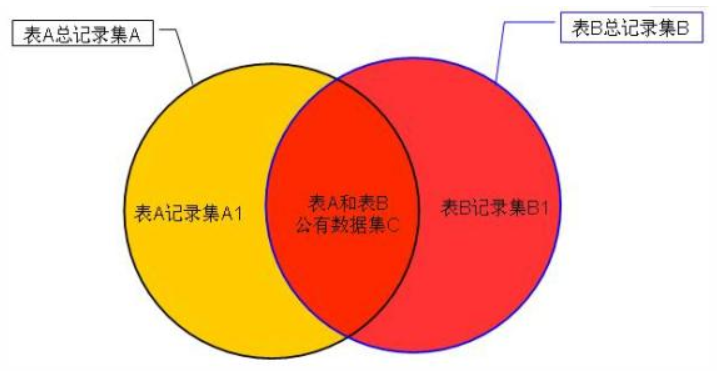

> 对MySQL的数据进行操作

<!-- more -->

### 插入数据

```sql
--为表的所有字段插入数据
INSERT INTO 表名 VALUES(值1，值2，……，值n)              --不指定具体的字段名
INSERT INTO 表名(字段名1，字段名2，……，字段名n) VALUES(值1，值2，……，值n)        --列出所有字段，每个值必须与相应字段对应
--为表的指定字段插入字段
INSERT INTO 表名(字段名1，字段名2，……，字段名m) VALUES(值1，值2，……，值n)
--同时插入多条记录
INSERT INTO 表名[(字段名列表)] VALUES(取值列表1)，(取值列表2)，……，(取值列表n)   
--从目标表中插入值
INSERT INTO 表名[列名列表] SELECT 列名列表 FROM 表名 
--REPLACE语句
REPLACE [INTO] 表名 VALUES(值列表)     --若新纪录的主键值或唯一性约束字段值已有记录相同，则已有记录被删除后再添加新纪录
```

### 修改数据

```sql
UPDATE 表名 SET 字段名1=取值1，字段名2=取值2，……，字段名n=取值n  where 条件表达式
```

### 删除数据

```sql
--使用DELETE删除表数据
DELETE FROM 表名 [WHERE 条件表达式]      --DELETE 语句不加上“WHERE 条件表达式” ，数据库系统会删除指定表中的所有数据
--使用TRUNCATE清空表数据
TRUNCATE [TABLE] 表名                  --TRUNCATE TABLE不带WHERE子句与DELETE语句相同
--TRUNCATE TABLE清空表记录后会重新设置自增型字段的计数起始值为1，DELETE会依次递增
```

- `TRUNCATE TABLE`：删除内容、释放空间但不删除定义
- `DELETE TABLE`：删除内容不删除定义，不释放空间
- `DROP TABLE`：删除内容和定义，释放空间

### 单表查询

#### SELECT语法

```sql
SELECT 字段列  		--指定要查询的列名称，列与列之间用逗号隔开。 ALL显示所有行包括重复行，DISTINCT显示所有行(无重复)
FROM <表名或视图名>	  --指定表，表与表之间用逗号隔开			
[WHERE <条件表达式>]    --指定查询条件，无WHERE子句，查询所有记录
[GROUP BY<列名1>]      --对查询结构进行分组
[HAVING <条件表达式>]   --指定分组条件
[ORDER BY<列名2>[ ASC|DESC]]         --对查询结果排序。ASC升序，DESC降序，默认为ASC
[LIMIT 子句]           --限制查询输出结果的行数


--查询所有记录
SELECT *FROM 表名
--避免重复数据查询
SELECT DISTINCT 字段列 FROM 表名
--为表和字段取别名
SELECT 字段名 [AS] 别名，字段名 [AS] 别名…… FROM 表名
```

#### 条件查询

```sql
SELECT * FROM 表名 WHERE 条件;	
--带IN关键字的查询
[NOT] IN (元素1，元素2，……)			--判断字段的值是否在集合内
--带BETWEEN AND关键字的查询
[NOT] BETWEEN 取值1 AND 取值2         --判断字段的值是否在指定范围内         范围包含两端    NOT范围小于取值1，大于取值2
--带IS NULL关键字的查询
IS [NOT] NULL 						--判断字段的值是否为空值
--带LIKE关键字的查询
[NOT] LIKE '字符串'                  --匹配字符串是否相等      '字符串'可以是一个完整的字符串，也可以是通配符
									--% 代表任意长度的字符串，长度可以为0
									--_ 只能表示单个字符
									--正则匹配  REGEXP关键字    属性名 REGEXP '匹配方式'
	--LIKE与REGEXP的区别：
			LIKE匹配整个列，如果被匹配的文本仅在列值中出现，LIKE并不会找到它，相应的行也不会返回
			REGEXP 在列值内进行匹配，如果被匹配的匹配的文本在列值中出现，REGEXP将会找到它，相应的行将被返回
			Like必须这个字段的所有内容满足条件，而REGEXP只需要有任何一个片段满足即可
```

#### 高级查询

##### 分组查询

```sql
GROUP BY 字段名				--将查询结果按字段分组，字段值相等的为一组，单独使用只显示一个分组的一个记录  
[HAVING 条件表达式]			   --限制分组后的显示，满足条件表达式的结果显示			 
[WITH ROLLUP] 				  --在所有记录最后加上一条记录，为上面所有记录的总和
```

`HAVING`，`WHERE`都是用来限制显示的

- `WHERE`：作用于表或者视图，是表和视图的查询条件
- `HAVING`：作用于分组后的记录，用于选择满足条件的组

##### 对查询结果排序

```sql
ORDER BY 字段名[ASC|DESC]
```

##### 限制查询结果数量

```sql
LIMIT {[OFFSET,] row_count|row_count OFFSET OFFSET}   --OFFSET默认为0
例：返回第3条记录后3条记录
SELECT *FROM 表名 ORDER BY 字段名 LIMIT 2,3
```

##### 聚合函数

聚合函数与`GROUP BY` 联合使用

- `COUNT`：统计记录的条数
- `SUM`：计算字段值的总和
- `AVG`：计算字段值的平均值
- `MAX`：查询字段的最大值
- `MIN`：查询字段的最小值

`SUM`、`AVG`、`MAX`、`MIN`规则

> 列只有`NULL`，函数值为`NULL`
>
> 列某些值为NULL，则函数值为非`NULL`值得平均值除以非`NULL`值的数量

`COUNT`

> ```sql
> COUNT ({[ALL | DISTINCT] <表达式>} | *)     --统计列中非NULL的数量
> 例：统计表中不同字段值的记录数
> SELECT 字段名,COUNT(*) AS '别名'  FROM  表名  GROUP BY  字段名
> ```

`SUM`

> `SUM`函数只能计算数值类型的字段
>
> 使用`SUM`函数计算字符类型字段时，计算结果都为0

##### 合并查询结果

```sql
SELECT ……
UNION [ ALL | DISTINCT]
SELECT ……
[UNION [ ALL | DISTINCT]
SELECT ……
```

不使用ALL关键字，则返回所有行都是唯一的

### 多表查询

- `INNER JOIN`操作：用于组合两个表中的记录。只要公共字段有相符的值，内部链接组合两个表的记录
- `LEFT JOIN`操作：用于在任何`FROM`子句中组合来源表的记录。左边外部连接包含从第一个开始的两个表中的全部记录，即使第二个表中并没有相符的值
- `RIGHT JOIN`操作：用于在任何`FROM`子句中组合来源表的记录。右边外部连接包含从第二个开始的两个表中的全部记录，即使第一个表中并没有相符的值

多表查询使用连接查询，操作效率较低

#### 内连接查询

两表关系的笛卡尔积数据记录中，保留匹配数据，删除不匹配数据

1. 等值连接(INNER JOIN)：连接条件的连接运算符为=时，为等值连接

   ```sql
   SELECT *FROM 表1 INNER JOIN 表2  ON 表1.字段=表2.字段   LIMIT 显示行数
   ```

2. 自然连接(NATURAL JOIN)：在等值连接中把重复列删去

   ```sql
   SELECT *FROM 表1 NATURAL JOIN 表2  LIMIT 显示行数
   ```

 3. 不等值连接(INNER JOIN)：连接条件的连接运算符不为=时，为不等值连接

    ```sql
    SELECT *FROM 表1 INNER JOIN 表2  ON 表1.字段!=表2.字段   LIMIT 显示行数
    ```

#### 外连接查询

外连接查询可以查询**两个或两个以上**的表

1. 左外连接(LEFT JOIN)：左表记录中按照条件与右表进行连接，右表无响应数据返回`NULL`
2. 右外连接(RIGHT JOIN)：右表记录中按照条件与左表进行连接，左表无响应数据返回`NULL`



> 左外连接：其运算方式为：A左连接B的记录=图公共部分记录集C＋表A记录集A1。
>
> 右外连接：其运算方式为：A右连接B的记录=图公共部分记录集C＋表B记录集B1 。

#### 子查询

```sql
--带IN关键字的子查询
SELECT * FROM 表1 WHERE 字段1 [NOT] IN (SELECT 字段1 FROM 表2)
--带EXISTS关键字的子查询
SELECT * FROM 表1 WHERE EXISTS (SELECT *FROM 表2 WHERE 字段='给定值')
		--EXISTS内循环返回一个真假值，真执行外查询，假不执行
--带ANY关键字的子查询
SELECT * FROM 表1 WHERE 字段1 运算符 ANY(条件)    --满足任何一个条件
--带ALL关键字的子查询
SELECT * FROM 表1 WHERE 字段1 运算符 ALL(条件)     --满足所有条件
```

> `ALL`、`ANY`：
>
> 大于`ALL`表示大于条件内最大值
>
> 小于`ALL`表示小于条件内最小值
>
> 大于`ANY`表示大于条件内最小值
>
> 小于`ALL`表示小于条件内最大值
