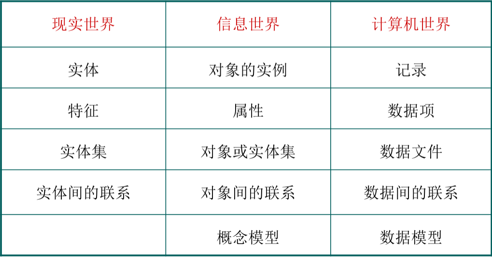

数据库系统的核心是数据模型。为一个数据库建立数据模型，需经过以下过程：

1. 要深入到现实世界中进行系统需求分析
2. 用概念模型真实地、全面地描述现实世界中地管理对象及联系
3. 通过一定地方法将概念模型转换为数据模型

<!--more-->

常见地数据模型有层次模型、网状模型、关系模型和面向对象模型

### 信息地三种世界及描述

将客观事物抽象为能用计算机存储和处理地数据需经历三个阶段：现实世界，信息世界，计算机世界（数据世界）

##### 现实世界：

现实世界客观存在的世界，在数据库中指的是对某一事物的描述，描述其各方面特征以及是否与其他事物存在联系

##### 信息世界：

信息世界是对客观事物的抽象描述，是对现实世界经过分析、归纳和抽象得到的信息，这样的信息具有一定的格式。

##### 计算机世界：

计算机世界是对信息世界的再一次抽象，将其信息化，使得信息能够存储在计算机中

这三个领域是由客观到认识，由认识到使用管理地3个不同层次，后一领域是前一领域地抽象描述

现实世界地事物及联系，通过需求分析转换成为信息世界地概念模型，这个过程由数据库设计人员完成；然后再把概念模型转换为计算机上某个DBMS所支持地逻辑模型，这个过程由数据库设计人员和DBMS共同完成；最后逻辑模型再转换为最底层地物理模型，最终实现，这个过程由DBMS自行完成

### 数据模型

#### 数据模型的概念：

数据模型是对现实世界中数据特征及数据之间联系的抽象。

数据模型用来描述数据组成、数据关系、数据约束的抽象结构及其说明和对数据进行操作。

数据模型是实现数据抽象的主要工具。

数据模型是数据库系统的核心和基础，决定了数据库系统的结构、数据定义语言和数据操作语言、数据库设计方法、数据库管理系统软件的设计和实现。

数据模型应满足：

1.能比较真实地模拟现实世界

2.容易为人所理解

3.便于在计算机上实现

#### 数据处理三层抽象描述：

##### 概念层：

概念层是数据抽象级别的最高层，其目的是按用户的观点来对现实世界建模

常用的概念模型有E-R模型

##### 逻辑层：

逻辑层是数据抽象的中间层，描述数据库数据整体的逻辑结构

常见的数据模型有层次模型、网状模型、关系模型和面向对象模型

##### 物理层：

物理层是数据抽象的最底层，用来描述数据物理存储结构和存储方法

#### 数据模型的要素：

数据模型通常由数据结构、数据操作和完整性约束组成

##### 数据结构：

数据结构描述数据库的组成对象以及对象之间的联系。

数据结构是所描述的对象类型的集合，是对系统**静态特性**的描述

静态特性：数据对象的数据类型、内容、属性以及数据对象之间的联系

##### 数据操作：

数据操作是指对数据库中各种对象的实例允许执行的操作的集合，包括操作及有关的操作规则。

数据操作是对系统**动态特性**的描述。

##### 数据的完整性约束条件：

数据的完整性约束条件是一组完整性规则。

完整性规则主要描述数据结构中数据之间的语义联系、数据之间的制约和依存关系，以及数据动态变化规则。

数据约束主要用于保证数据的**完整性**、**有效性**、**相容性**

#### 数据模型与数据模式的区别：

数据模式：以一定的数据模型对一个单位的数据的类型、结构及其相互间的关系所进行的描述。  有型与值之分。

数据模型和数据模式的主要区别在于数据模型是描述现实世界的手段和工具；数据模式是利用这个手段和工具对相互间的关系所进行的描述。

### 概念模型

#### 基本概念：

实体（Entity）：客观存在并相互区别的事物

属性（Attribute）：实体所具有的某一特性，一个实体由若干个属性刻画

实体型（Entity Type）：用实体类型名和所有属性来共同表示同一类实体

实体集（Entity Set）：同型实体的集合

码（Key）：唯一标识实体的属性集

域（Domain）：属性的取值范围

联系（Relationship）：实体内部的联系（各属性之间的联系）和实体之间的联系（不同实体集之间的联系）

#### E-R模型：

##### 基本概念：	

实体用矩形框表示																					

属性用椭圆框表示

联系用菱形框表示

联系分为：

一对一联系（1：1）；一对多联系（1：n）；多对多联系（m：n）

##### E-R模型设计原则与设计步骤：

###### 设计原则：

1.属性应该存在于且只存在于某一个地方（实体或者关联）

2.实体是一个单独的个体，不能存在于另一个实体中成为其属性

3.同一个实体在同一个E-R图内仅出现一次

###### 设计步骤：

1.划分和确定实体

2.划分和确定联系

3.确定属性：能够作为属性的“事物”尽量作为属性处理

4画出E-R模型：重复1~3，找出所有实体集、关系集、属性和属值集，绘制E-R图。

5.优化E-R模型：消除数据实体间冗余的联系及属性

### 逻辑模型

#### 层次模型：

用**树形结构**表示各类实体以及实体间的联系

适用于表示记录类型之间的一对多联系，而对于多对多的联系难以直接表示

优缺点：

1.数据结构简单，查询效率高

2.提供良好的完整性支持

3.不易表示多对多的联系

4.数据操作限制多、独立性较差

5.节点的双亲是唯一的（每节点只有一个副节点）

#### 网状模型：

用**图结构**表示各类实体集以及实体集间的联系

网状模型允许节点由多个双亲节点，允许多个节点没有双亲节点

一个子节点可以有多个父节点；在两个节点之间可以有多种联系

对于多对多的联系难以直接表示

优缺点：

1.较为直接地描述现实世界

2.存储效率较高

3.结构较复杂、不易使用

4.数据独立性较差

#### 关系模型：

是最重要的一种基本模型，也是目前应用最广泛的数据模型

关系就是一张二维表，有行和列组成

在关系模型中实体以及实体之间的联系都用关系即**二维表**表示

优缺点：

1.有坚实的理论基础

2.结构简单、易用

3.数据具有较强的独立性及安全性

4.查询效率较低

#### 面向对象模型：

是用**面向对象**的观点来描述现实世界中的事物（对象）的逻辑结构和对象间的联系等的数据结构

对象：对现实世界中的事物的高度抽象，每个对象是状态和行为的封装

对象的状态是属性的集合，行为是在该对象上操作方法的集合

优缺点：

1.适合处理各种各样的数据类型：面向对象数据库适合存储不同类型的数据，例如图片、声音、视频，包括文本、数字等

2.面向对象程序设计于数据库技术相结合

3.提高开发效率：面向对象数据模型提供强大的特性，例如继承、多态和动态绑定，允许用户不用编写特定对象的代码就可以构成对象并提供解决方案

4.改善数据访问：支持导航式和关联式两种方式的信息访问，比基于关系值得联系更能提高数据访问性能

5.没有准确的定义

6.维护困难

7.不适合所有的应用

### 概念模型向逻辑模型的转换

#### 实体的转换：

实体转换为关系模型，一个实体对应一个关系模型，实体的名称即是关系模型的名称，实体的属性就是关系模型的属性，实体的码就是关系模型的码

#### 联系的转换：

##### 1   ：1转换：

方法一：将1：1联系转换成一个独立的关系模式，与该联系相连的各实体的码以及联系本身的属性均转换为关系模式的属性，**每个实体的码均是该关系模式的码**

方法二：与任意一端对应的关系模式合并。合并时，在该关系模式的属性中应加入**另一个关系模式的码**和**联系本身的属性**

例：学生（<u>学号</u>，姓名）

​		校园卡（<u>卡号</u>，余额）

​		学生办卡有办卡日期

方法一转换后：

​		实体转换：学生（<u>学号</u>，姓名）   校园卡（<u>卡号</u>，余额）

​		联系转换：办卡（<u>学号</u>，<u>卡号</u>，办卡日期）

方法二转换后：

​		学生（<u>学号</u>，<u>卡号</u>，姓名，办卡日期）或

​		校园卡（<u>卡号</u>，<u>学号</u>，余额，办卡日期）

##### 1   ：n转换：

方法一：转换为一个独立的关系模式，与该联系相连的各实体的码以及联系本身的属性均转换为关系模式的属性，而**关系模式的码为n端实体的码**

方法二：与n端对应的关系模式合并，在该关系模式中加入**1端实体的码**和**联系本身的属性**

例：学生（<u>学号</u>，性别，姓名）

​		班级（<u>班号</u>，班名）

​		一个学生只能在一个班级学习，一个班级包含多个学生，班级：学生=1：n

方法一转换后：

​		实体转换：学生（<u>学号</u>，性别，姓名）   班级（<u>班号</u>，班名）

​		联系转换：组成（<u>学号</u>，班号）

方法二转换后：
		实体转换：学生（<u>学号</u>，性别，姓名）   班级（<u>班号</u>，班名）

​		联系转换：与学生一端合并，学生（<u>学号</u>，<u>班号</u>，性别，姓名）

##### m  ：n转换：

将联系单独转换为一个独立的关系模式，与该联系相连的各实体的码以及联系本身的属性均转换为关系模式的属性，每个实体的码组成关系模式的码或关系模式的码的一部分

例：学生（<u>学号</u>，性别，姓名）

​		课程（<u>课程号</u>，课程名）

​		一个学生可以选修多门课程，一门课程可以由多个学生选修。   学生：课程=m：n

​		转换后：

​		实体转换： 学生（<u>学号</u>，性别，姓名）	课程（<u>课程号</u>，课程名）

​		联系转换：选修（<u>学号</u>，<u>课程号</u>，成绩）

具有相同码的关系模式将其中一个关系模式的属性都加到另一个关系模式中，去掉同义属性

### 关系模型

关系模型的数据结构为具有一定特征的二维表。

在关系数据库中，数据以关系表形式存储实体数据，关系是一个由行和列组成的二维表

#### 关系数据结构：

##### 基本术语：

###### 表（Table）

表，也称为关系，是一个二维的数据结构，由表名、构成表的各个列及若干行数据组成

###### 关系（Relation）

一个关系逻辑上对应一张二维表，可以为每个关系取一个名称进行标识，即表名

###### 列（Column）

列，也称为字段或属性，每一列有一个名称，每一列表示实体的一个属性，具有相同的数据类型

###### 属性（Attribute）

一列即一个属性，表中属性的个数称为关系的元或度，列的值称为属性值，属性值得取值范围为值域

###### 行（Row）

行即元组或记录

###### 元组（Tuple）

表中得一行即为一个元组

###### 分量（Component）

元组中的一个属性值，组成元组的元素

###### 码或键（Key）

在一个关系中，存在这样的属性（或属性组）使得在该关系的任何一个关系状态中的两个元组，在该属性（或属性组）上值得组合都不相同，即这些属性（或属性组）的值都能用来**唯一标识该关系的元组**，这属性（或属性组）即为码

###### 超码或超键（Super Key）

如果在关系的一个码中移去某个属性，它仍然是这个关系的码，即为超键

###### 候选码或候选键（Candidate Key）

若关系中的某一属性（或属性组）的值能唯一标识一个元组，则称该属性（或属性组）为候选码

###### 主码（Primary Key）

在一个关系的若干个候选码中指定一个用来唯一标识关系的元组，则指定的即为主码

当包含两个或多个的键称为**复合码**

主码的作用：

- 唯一标识关系的每行
- 作为关联表的外键，链接两个表
- 使用主码值来组织关系的存储
- 使用主码索引快速检索数据

###### 全码（All-Key）

一个关系模式的所有属性集合是这个关系的主码，则这样的主码为全码

###### 主属性（Primary Attribute）和非主属性（Nonprimary Attribute）

关系中包含在任何一个候选码中的属性称为主属性，不包含在任何一个候选码中的属性称为非主属性

###### 代理键

代理键是具有DBMS分配的唯一标识符，每次创建行时由DBMS分配代理键的唯一值

###### 外码或外键（Foreign Key）

当关系中的某个属性（或属性组）不是这个关系的主码或候选码，而是另一关系的主码时，则该属性为外键

外码并不一定要与相应的主码同名

###### 参照关系（Referencing Relation）和被参照关系（Referenced Relation）

参照关系即从关系，被参照关系即主关系，值以外码相关联的两个关系。以外码作为主键的关系称为被参照关系；外码所在的关系称为参照关系，被参照关系与参照关系是通过外码相联系的，这种联系通常时一对多的联系

###### 域（Domain）

属性的取值范围

###### 数据类型（Data Type）

表中每列都有相应的数据类型，它用于限制该列中存储的数据

##### 关系类型(Relation Type)

关系类型有三类：**基本关系**（基本表或基表）、**查询表**和**视图表**

基本表：是实际存在的表，是实际存储数据的逻辑表示

查询表：是查询结果表或查询中生成的临时表

视图表：是由基本表或其他视图表导出的表，是**虚表**，不对应实际存储的数据

##### 关系模式（Relation Schema）

数据库有型和值之分。在关系数据库中，关系模式是型，关系是值，即关系模式是对关系的描述。关系模式是对关系的描述。关系模式是静态的，稳定的，而关系是动态的、随时间不断变化的。

关系模式可以表示为五元组R(U,D,Dom,F)

- R：关系名
- U：组成该关系的属性的集合
- D：属性组U中的属性所来自的域
- Dom：属性向域的映像集合
- F：属性间数据依赖关系的集合

五元组可以简化为二元组R(U)

##### 关系数据库（Relation Database）

关系数据库是以关系模型作为数据的逻辑模型

#### 关系操作

##### 基本的关系操作

关系操作包括**数据查询**、**数据维护**和**数据控制**

数据控制是为了保证数据的安全性和完整性而采用的**数据存取控制**和**并发控制**等功能

###### 查询

选择、投影、连接、除、并、交、差、笛卡尔积

###### 数据更新

插入、删除、修改

查询的表达能力很强，是其中最主要的部分

###### 关系操作的特点

集合操作方式，即操作的对象和结果都是集合

#### 关系操作语言的分类

关系操作的能力可以用两种方式来表示：**代数方式**和**逻辑方式**

代数方式主要有**关系代数**，它是通过对关系的操作来表达查询要求的方式

逻辑方式主要有**关系演算**，它是用谓词来表达查询要求的方式

具有关系代数和关系演算双重特点的语言 如SQL

这些语言都具有的特点：

- 具有完备的表达能力
- 是非过程化的集合操作语言
- 功能强
- 能够嵌入高级语言使用

#### 关系的完整性约束

##### 实体完整性约束

实体完整性约束是指关系的主属性，即主码的组成不能为空，即主属性不能是空值NULL

##### 参照完整性约束

现实世界中的实体之间往往存在的某种联系

若属性（或属性组）F是基本关系R的外码，它域基本关系S的主码Ks相对应（R和S有可能是同一关系），则对于R中每个元组在F上的值必须为

- 空值
- 等于S中某个元组的主码值

##### 用户完整性约束

用户定义的完整性约束是针对某一应用环境的完整性约束条件，它反映了某一具体应用所涉及的数据应满足的要求
