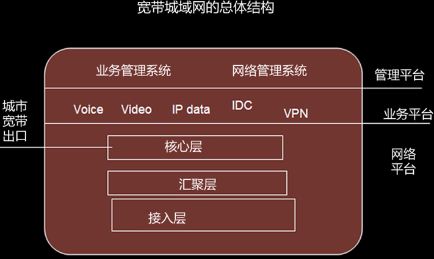

## 计算机网络的分类

- 局域网（LAN）

  特点

  - 覆盖有限的地理范围
  - 提供高数据传输效率（10Mbps~10Gbps）
  - 易于建立、维护与扩展

  分类：

  - 介质访问方法可分为介质式局域网与交换式局域网
  - 传输介质类型可分为有线局域网与无线局域网

<!--more-->

- 城域网（MAN）

  介于广域网与局域网之间的一种高速网络，覆盖范围为几十公里

- 广域网

  也称远程网，覆盖范围从几十公里到几千公里

  因特网是广域网中最大的一个，广域网包含因特网

## 计算机网络结构的特点

早期的广域网

逻辑功能上分为两部分：资源子网和通信子网

用户计算机接入

用户计算机可以通过局域网方式连入，也可以通过电话交换网（**PSTN**）、有线电视网（**CATV**）、无线城域网（**WMAN**）、或无线局域网（**WLAN**）接入地区级主干网的城域网

## 广域网技术的发展（了解）

1. 广域网是一种公共数据网络

2. 构建广域网的核心交换技术
   - 公共电话交换网PSTN
   - 综合业务数字网ISDN
   - 数字数据网DDN
   - X.25 分组交换网
   - 帧中继（Frame Replay，FR）网
   - 异步传输模式（Asynchronous Transfer Mode，ATM）网
   - GE（Gigabit Ethernet，千兆以太网）与10GE的光以太网（Optical Ethernet）

## 局域网技术的发展（了解）

三个方向：

1.提高以太网的数据传输速率

2.将一个大型局域网划分成多个用网桥或路由器互联的网络

3.将共享介质方式改为交换方式。

​    在交换式局域网的基础上，出现了虚拟局域网（Virtual LAN，VLAN）

## 城域网技术的发展

宽带城域网的出现，使得传统的通信网络在概念、技术与应用上都发生了很多的变化。这些变化主要表现在

- 局域网、城域网与广域网在技术上的界限变得越来越模糊了
- 电信传输网技术与计算机网络技术的界限变得越来越模糊了
- 电信服务业务与Internet应用的界限变得越来越模糊了
- 电信传输网、计算机网络与广播电视网的界限变得越来越模糊了

## 宽带城域网的结构

### 逻辑结构

设计一个宽带城域网将涉及“三个平台和一个出口”，即**网络平台**、**业务平台**、**管理平台**与**城市宽带出口**等问题

### 网络平台的层次结构

#### 核心交换层的基本功能

- 核心交换层将多个汇聚层连接起来，**为汇聚层的网络提供高速转发**，为整个城域网提供一个高速、安全与**具有 QoS 保障能力**的数据传输环境
- 核心交换层实现与主干网络的互联，**提供城市的带宽 IP 数据出口**
- 核心交换层提供带宽城域网的用户**访问 Internet 所需要的路由服务**

#### 汇聚层的基本功能

- **汇聚接入层的用户流量**，进行数据分组传输的汇聚、转发、与交换
- 根据汇聚接入层的用户流量，进行**本地**路由、过滤、流量均衡、Qos 优先级管理，以及安全控制、IP 地址转换、流量整形等处理
- 根据处理结果把**用户流量转发到核心交换层**或**本地进行路由处理**

#### 接入层的基本功能

- 接入层解决的是“最后一公里”的问题。通过各种接入技术，**连接最终用户**，为它所覆盖范围内的用户提供访问 Internet 以及其他的信息服务

#### 三层结构思想：

- 上层负责下层的数据汇聚
- 核心层提供出口与 QoS、汇聚本地路由，接入服务用户 
- 核心层：主要承担高速数据交换的功能
- 汇聚层：主要承担路由与流量汇聚的功能
- 接入层：主要承担用户接入与本地流量控制的功能
- 核心交换层 => 汇聚层 => 接入层

## 宽带城域网组建的基本原则（了解）

可运营性、**可管理性**、可盈利性、可扩展性

宽带的城域网设备必须支持对用户的**身份认证**、**使用权限认证**和**计费功能**。业务管理要支持多ISP、基于IP的虚拟专网VPN等多种增值业务

宽带城域网必须具备**IP地址分配**能力，能够支持动态和静态地址分配，支持网络地址转换**NAT**功能

宽带城域网必须能够为用户提供**带宽保证**，实现**流量工程**，提供个性化用户策略的**Qos保证**。

## 管理和运营宽带城域网的关键技术

### 关键技术

1. 宽带管理
2. **网络管理**
3. **服务质量QoS**
4. **用户管理**
5. **IP 地址的分配与地址转换**
6. 多业务接入
7. 统计与计费
8. 网络安全

### 网络管理

1. **带内网络管理是指利用传统的电信网络，通过数据通信网（ DCN ）或公共交换电话网（ PSTN ）拨号，对网络设备进行数据配置；**
2. **带外网络管理是指利用 IP 网络及协议进行网络管理，是利用简单网络管理协议（ SNMP ）建立网络管理系统；**
3. **对汇聚层一下采用带内管理，而对汇聚层及其以上设备采取带外管理；**

### **服务质量QoS**

- **在带宽城域网业务中有多媒体业务、数据业务与普通话的语音服务；网络服务质量表现在延时、抖动、吞吐量和丢包率等几个方面；**
- 目前宽带城域网保证 QoS 要求的技术主要有：**资源预留(RSVP)**、**区分服务(DiffServ)**、与**多协议标记交换(MPLS)**。

### 用户管理

宽带城域网的用户管理应该包括用户认证与接入管理、计费管理等，**能够为用户提供宽带保证，实现流量工程**。

### IP 地址分配与地址转换

为了解决 IP 地址不足的问题，目前的**基本方案是使用内部专用 IP 地址与网络地址转换（ NAT ）技术，只为宽带城域网的关键设备与特殊用户分配固定的公用 IP 地址**。

## 构建宽带城域网的基本技术与方案

### 基于SDH的城域网方案

早期的SONET/SDH是为传统电信业务服务的，它并不适合于传输IP分组

### 基于10GE的城域网方案

光以太网是以太网与 DWDM 技术相结合的产物，其**造价是SONET的1/5，是ATM的1/10**。可运营光以太网的设备和线路必须符合典型网络 99.999% 的高运行可靠性，并具备以下特征

1. 能供**根据终端用户的实际应用需求分配带宽**，保证带宽资源充分、合理的应用
2. **具有认证与授权功能**，用户范文网络资源必须经过认证和授权，确保用户和网络资源的安全及合法使用
3. **支持 MPLS（ 多协议标签交换 ）**，具有一定的质量保证，**提供分等级的 Qos 网络服务**
4. **提供计费功能**，能及时获得用户的上网时间记录和流量记录，支持按上网时间、用户流量计费，或提供包月计费方式，支持实时计费
5. **支持 VPN 和防火墙**，可以有效的保护网络安全
6. 能够方便、快速、灵活的适应用户和业务的扩展

### 基于弹性分组环RPR技术的城域网（掌握）

弹性分组环是一种直接**在光纤上高校传输IP分组**的传输技术，它的工作基础是**Cisco公司**提出的**动态分组传送**（Dynamic Packet Transport, DPT）技术

RPR 采用**双环结构**，有**内环**和**外环**。**顺时针传输**的光纤为**外环**，**逆时针传输**的光纤为**内环**。两环均可以用**统计复用**的方法传输 IP 分组，且可以实现“自愈环”的功能，**均可以传输数据分组与控制分组**

每一个结点都可以使用两个方向的光纤与相邻结点通信。这样做的目的除了**高效地利用光纤带宽**之外，还有一个目的是**加速控制分组传输**，**提高环的可靠性**，**实行“环自愈”功能**，保证城域网的系统可靠性与服务质量

两个 RPR 节点之间的裸光纤的最大长度可达到 **100km**

1. **公平性好：**RPR 环中**每个节点都执行** **SRP 公平算法**，是的节点之间能供获得平等的带宽，防止个节点因流量过大而照成环拥塞。同时，RPR 环还支持加权公平法则和入口、出口峰值速率限制，用于保证能够根据用户购买的宽带提供相应的服务
2. **带宽的利用率高：RPR 采用双环结构传输数据分组和控制分组**，**并限制数据帧只在源结点与目的结点之间的光纤段上传输，当源节点成功发送一个数据帧之后，这个数据帧要由目的节点从环中收回**。如此，该数据帧将不再占用下游段的环带宽，从而提高环带宽的利用率
3. **保证服务质量：**RPR 环对不同的业务数据分配不同的优先级，以保证高优先级信息的可靠传输，从而保证了网络服务质量
4. **快速保护和恢复能力：**RPR 有**自愈环**的功能，能够在**50ms**时间内，**隔离出故障节点和光纤段**，并可在没有专用带宽的前提下即能够提供 SDH 及的快速保护和恢复

## 网络接入技术与方法

目前，可以用作用户接入网的主要有三类：计算机网络、电信通信网与广播电视网

“三网融合”——计算机网络、电信通信网与电视通信网

- 从用户接入角度：用户接入可以分为接入技术与接入方式两种类型，其中接入方式与用户工作环境与需求相关
- 从技术实现的角度，目前宽带接入技术主要有：**数字用户线（ xDSL ）技术**、**光纤同轴电缆混合网（ HFC ）技术**、**光纤接入技术**、**局域网接入技术**以及**无线接入技术**。其中，无线接入又可以分为无线局域网接入、无线城域网接入与无线 AD hoc 接入

##  各种接入技术的特点

### 数字用户线 xDSL 接入技术

xDSL 中 x 的意思是表示它的不同类型,例如，可以理解 x 是 A、H 或 RA 等，他们对应于不同的数字用户线技术。xDSL 技术根据上行（ 用户到交换局 ）和下行（ 交换局到用户 ）的速率是否相同可分为**速率对称型**和**速率非对称型**两种

- 非对称数字用户线（ Asymmetric Digital Subscriber Line , **ADSL** ）
- 过比特率数字用户线（ High bitrate DSL, **HDSL** ）
- 速率自适应数字用户线（ Rate adaptive DSL, **RADSL** ）
- 甚高比特率数字用户线（ Very high bit rate DSL, **VDSL** ）

ADSL 的技术特点主要表现在如下几个方面

- 能够利用现有的用户电话铜双绞线，以重叠和不干扰传统模拟电话业务的方式，即普通电话业务（POTS）的方式，提供高速数字业务。**ADSL 允许用户在保留已有的模拟电话业务**的同时，进行 Internet 在线访问、视频点播（VOD）的新型矿带业务
- 该技术与本地环路由的实际参数以及用户电话铜双绞线的特性关系都不大，所以用户**不需要进行电缆的重新铺设**
- **上行速率在 64 ~ 640Kbit/s，下行速率在 5000kbit/s ~ 7Mbit/s。用户根据需要自行选择**

数据用户线 xDSL 接入技术的上行与下行速率：

| xDSL     | 上/下行速率（距离 5.5km） | 上/下行速率（ 距离 3.6km ） | 是否对称 | 线对称 |
| -------- | ------------------------- | --------------------------- | -------- | ------ |
| ADSL     | 64kbps/1.5Mbps            | 640kbps/6Mbps               | 否       | 1      |
| **HDSL** | **1.554Mbps**             | **1.5554Mbps**              | **是**   | 2      |
| VDL      | 2.3Mbps/51Mbps            | 2.3Mbps/51Mbps              | 否       | 2      |
| RADSL    | 64kbps/1.5Mbps            | 640kbps/6Mbps               | 否       | 1      |

### 光纤同轴电缆合网接入技术

光纤同轴混合网HFC是**新一代有线电视网络**。光纤同轴电缆混合网HFC是一个**双向传输系统**。光纤结点将光纤干线和同轴分配线相互连接

- 光纤同轴电缆合网的基本结构
  - 是由电视头端、放大器、馈线与下引线组成。
  - 新一代的有限电视网络，是一个 **双向传输系统** ，光纤节点通过电缆下引线可以为 **500 ~ 2000 个用户服务**
  - 改善了信号质量，提高了可靠性**，线路可以使用的宽带甚至可以达到 **1GHz**
  - 从用户接入的角度来看，管线到 HFC 是经过双向改造的有限电视网络，是用户通过有线电视宽带接入 Internet 的一种重要的方式
  - 是使用 Cable Modem，通过有限电视宽带接入 Interent 的，数据传输速率可达 10 ~ 36Mbit/s

- 电缆调制解调器（Cable ModeM)

  **Cable Modem 把用户计算机与有线电视同轴电缆连接起来**，不仅有调制解调功能，也带有加密解密和协议适配，以及网桥、路由器与集线器的部分功能。Cable Modem 利用 **频分复用** 的方法，**将双向信道分为：从计算机终端到网络方向称为上行信道，从网络到计算机终端方向称为下行信道**。上行信道带宽一般在**200 kbps ~ 10 Mbps**

  - 从 **数据传输** 方向上，Cable Modem 可分为单向、双向两类
  - 从 **传输方式** 上，Cable Modem 可以分为**双向对称式传输**和**非对称式传输两类**
  - 从 **同步方式** 上，Cable Modem 可分为类似于 Etheme 的同步交换和类似于 ATM 技术的一部交换两类
  - 从 **接入的角度**，Cable Modem 可分为个人 Cable Modem 和宽带多用户Cable Modem
  - 从 **接口角度**，Cable Modem 可分为外置式，内置式和交互式机顶盒 3 种

### 光纤接入技术

APON（宽带无源光网络）是 ATMPON 的简称。**ATM 是一种基于信元的传输协议**，能为接入网 **提供动态的宽带分配**，从而更适合宽带数据业务的需求

EPON（以太网无源光网络）是级语以太网的 PON 技术。EPON 采用点到多点结构、无源光纤传输，在以太网之上提供多种业务，**EPON 是一种实现光纤到户的重要技术**

- 无线光纤网（PON）是 ITU “基于无源光纤网的高速光纤接入系统”下进行标准化的
- **OC-3, 155.520Mbit/s 的对称业务**
- **上行 OC-3, 155.520Mbit/s; 下行 OC-12, 622.020Mbit/s 的不对称业务**
- **OC-(n) = 51.84 \* n Mbps**
- 传输介质可以是一根或两根单模光纤，双向传输通过波分复用（一根或两根光纤）实现

### 宽带无线接入技术

1. 无线接入技术的分类与应用

   **近距离使用可以采用 IEEE802.11 标准的无线局域网技术**（WLAN），它可以满足一定地理范围内的用户无线接入需求；**远距离使用则采用 IEEE802.16 标准的 WiMAX**，该技术可以在 50km 范围内提供最高 70Mbit/s 的传输速率

   IEEE802.11 标准于 IEEE802.16标准均针对无线环境，但由于适用对象不同，采用的技术于协议解决问题的重点也不相同IEEE802.11 标准的重点在解决局域网范围的移动节点通信问题，而 IEEE802.16 标准的重点是解决建筑物之间的数据通信问题**

2. IEEE802.11 标准与无线局域网

   - IEEE802.11 定义了使用**红外**、**调频扩频**与**直接序列扩频**技术，数据传输速率为 1Mbit/s 或 2Mbit/s
   - **IEEE802.11a 将传输速率提高到 53Mbit/s**
   - IEEE802.11b 定义了使用直序扩频技术，传输速率为 1Mbit/s、2Mbit/s、5.5Mbit/s 与 11Mbit/s

3. IEEE802.16 标准与无线城域网

   - 按 IEEE802.16 标准建立采用 **全双工、宽带通信方式** 工作的基站
   - IEEE802.16 标准规定了无线网络使用更高的、毫米波 **10 ~ 66GHz** 波段的频率
   - 在 IEEE802.16 标准上增加了两个物理层标准 IEEE802.16d 与 IEEE802.16e;
   - **与 IEEE802.16 标准工作组对应的论坛组织是 WiMAX，最高的速率为 134Mib/s**

| 协议标准         | 使用频段          | 信道条件      | 固定/移动        | 行到带宽（MHz） | 传输速度（Mbit/s） | 额定小区半径（Km） |
| ---------------- | ----------------- | ------------- | ---------------- | --------------- | ------------------ | ------------------ |
| IEEE802.16       | 10~66GHz          | 视距          | 固定             | 25/28           | 32~134             | <5                 |
| IEEE802.16a      | <11GHz            | 非视距        | 固定             | 1.25/20         | 75                 | 5~10               |
| IEEE802.16d-2004 | 10~66GHz < 11GHz> | 视距 + 非视距 | 固定             | 1.25/20         | 75                 | 5~10               |
| IEEE802.16e-2005 | <6GHz             | 非视距        | 固定 移动 + 漫游 | 1.25/20         | 75                 | 若干               |

