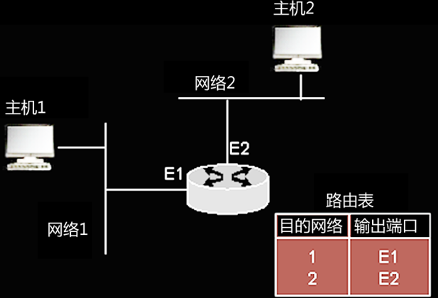

## 路由器基础与基本命令

- 路由器是工作在**网络层**的设备。路由器负责将数据分组从源端主机经**最佳路径**传送到目的端主机
- 路由器主要用于同类或异类局域网以及局域网与广域网之间的互联
- 是连接不同逻辑子网的网络互连设备
- 路由器具有异构网络互连、广域网互连、和**隔离广播信息**的能力。

<!--more-->

### 路由器的基本功能

1. 路由选择
   - 路由选择就是路由器依据目的IP地址的网络地址部分，通过路由选择算法确定一条从源结点到达目的结点的最佳路由
   - 路由器通过路由协议、网络连接的情况及网络的性能来建立网络的拓结构
   - 路由算法为网络上的路由产生一个权值，路由器通过权值来选择最佳路由，权值越小，路由越佳
2. **分组转发**
   - 对于一台路由器，其分组转发的任务即是在收到数据包后，根据**路由表**所提供的最佳路径的信息，将其转发给下一跳的路由器、目的端口或是缺省路由器
   - 缺省路由也称为缺省网关，它是与主机在同一个子网中的路由器端口的IP地址。
   - 路由器也有它的缺省网关。如果目标网络没有直接显示在路由表里的时候，那么就将数据分组传送给缺省网关。它一般指向与该路由器的一个端口的直接相连接的，并且通往Internet的出口路由器。
   - **分组转发的思想**
     - **目的IP地址，全程不变。**
     - **目的MAC地址，逐跳修改。**


### 路由表

路由器通过对路由表的查询来选择最佳路径的策略，路由表中保存着各种传输路径的相关数据，供路由选择时使用

路由表的内容主要包括

- 目的网络地址及其所对应的目的端口
- 下一跳路由器的名字
- 缺省路由的信息。

路由表可以是由系统管理员固定设置好的，也可以由系统动态修改，可以由路由器自动调整，也可以由主机控制


#### 路由表实例一 （cisco12000上的路由表）

```shell
C   212.112.7.0/24 is directly connected, FastEthernet2/5
​   212.112.37.0/30 is subnetted, 1 subnets
C   212.112.37.16/24 is directly connected, POS3/0
S   167.105.125.128 [1/0] via 202.112.7.1
S*  0.0.0.0/0 [1/0] via 202.112.41.217
```



路由表项

- 路由源码
  - “C”: 直连
  - “S”: 静态
  - “I” : IGRP
  - “O”: OSPF
  - “R”: RIP
  - “i”: IS-IS
  - “B”: BGP
  - “E”: EGP
- 第2列是目的网络地址和掩码
- 第3列是目的端口或下一跳路由器地址，如果有下一跳路由器，则为下一跳路由器的IP地址
- 缺省路由的路由表项
  - 网络地址和掩码全是0


#### 路由表实例二 （三层交换机上的路由表）

```shell
O    222.29.2.0/24 [110/3] via 162.105.1.145,00:13:43,vlan1
O    222.29.32.0/24 [110/3] via 162.105.1.145,00:13:43,vlan1
     202.37.140.0/24 is variably subnetted, 3 subnets,2 masks
O E2 202.37.140.40/289 [110/20] via 162.105.1.145,00:13:43,Vlan1
O E1 202.37.140.0/28 [110/22] via 162.105.1.145,00:13:43,Vlan1
```

第2列表示路由类型

- E1：OSPF外部路由类型1
- E2：OSPF外部路由类型2

第4列，如 [110/22]：**110是管理距离，22是权值（metric）或成本**

**管理距离**用于衡量路由表中给定的路由信息源的“**可信度**”

| 路由协议  | 管理距离 | 路由协议  | 管理距离 |
| --------- | -------- | --------- | -------- |
| 直接连接  | 0        | 静态路由  | 1        |
| 外部BGP   | 20       | 内部EIGRP | 90       |
| IGRP      | 100      | OSPF      | 110      |
| IS-IS     | 115      | RIP       | 120      |
| 外部EIGRP | 170      | 内部BGP   | 200      |
| 未知      | 255      |           |          |


权值是路由器通过路径选择算法为网络上的路径产生的一个数字。路由器根据这个值确定最佳路径

路由器常用的权值： （了解）

- 带宽：链路的数据能力
- 延迟：数据包从源送到目的所需的时间
- 负载：链路上的活动数量
- 可靠性：链路的差错率
- 跳数：通过路由器的数量
- 滴答数：用IBM PC的时钟滴答计数延迟
- 花费：cost，一般由管理员指定。


### 路由器的结构


- 中央处理器
  - CPU是路由器的处理中心，CPU负责实现路由协议、路径选择计算、交换路由信息、查找路由表、分发路由表和维护各种表格，以及转发数据包等功能
  - CPU的处理能力直接影响路由表查找事件、吞吐量和路由器的性能
- 内存
  - 只读内存（Read Only Memory，ROM） 
    - ROM中包括开机开机诊断程序、引导程序和操作系统软件
    - 不能修改其中保存的内容
  - 随机存储器（RAM）
    - RAM是可读可写存储器。用来存储用户的数据包队列以及路由器在运行过程中产生的**中间数据**，如路由表、ARP缓冲区等
    - RAM还用来存储路由器的运行配置文件
    - 当**路由器被关闭或重新启动时，RAM中的内容都将丢失**
  - 非易失性随机存储器（NVRAM）
    - NVRAM是可读可写存储器。是用来**存储路由器的启动配置文件**
    - 在路由器断电时，其内容仍能保持
  - 闪存（FLASH）
    - 是可擦写的ROM。它主要负责**保存操作系统的映像文件和一些微代码**
    - 在路由器断电时，其内容仍能保持。


### 路由器的工作模式

1. 用户模式（User EXEC）

   - 当通过控制台或Telnet成功登录到路由器后，将会看到
   - 它是一种只读模式，用户可以浏览关于路由器的某些信息，但不能进行任何修改
   - 该模式默认的提示符为：`router>`

2. 特权模式（Priviledged EXEC）

   - 在用户EXEC模式提示符后键入enable命令并按提示输入使能口令后将进入特权模式
   - 可以管理系统时钟、进行错误检测、查看和保存配置文件、清楚闪存、处理并完成路由器的冷启动等操作
   - 该模式不能对端口及网络协议进行配置
   - 该模式默认的提示符为：`router#`

3. 全局配置模式（Global Configuration）

   - 在特权EXEC模式下，通过键入`configure terminal`命令可以进入
   - 全局配置模式用于配置路由器的全局性的参数（主机名、口令、TFTP服务器、静态路由、访问控制列表等），更改已有配置等
   - 全局配置模式的默认提示符为:`router(config)#`

4. 其他配置模式：包括接口配置模式、虚拟终端配置模式、路由配置模式等

   - 接口配置模式

     ```shell
     router (config)#interface f0/12
     router（config-if）#
     ```

   - 虚拟终端配置模式

     ```shell
     router (config)#line vty 0 15
     router（config-line）#
     ```

   - 路由配置模式

     ```shell
     router (config)#router rip
     router（config-router）#
     ```

5. 设置模式（Setup）

   - 当通过console端口进入一台刚出场的没有任何配置的路由器启动时会进入设置模式
   - 系统以对话框提示用户设置路由器，协助用户建立第一次的配置文件

6. RXBOOT模式

   - RXBOOT模式是路由器的维护模式
   - 在密码丢失时，可以进入RXBOOT模式，以**恢复密码**


### 路由器的基本操作与配置方法

- 路由器的配置方式

  - **AUX**，通过**远程拨号配置**路由器

- 使用控制端口(Console)配置路由器

- 使用telnet配置路由器

  - 必备条件

    1. 作为模拟终端的计算机与路由器都必须与网络连通，它们之间能够相互通信
    2. 计算机必须有访问路由器的权限
    3. 路由器必须预先配置好远程登录的密码

  - 路由器的配置（08下）

    ```shell
    router (config)#line vty 0 15
    router（config-line）#password 7 zzz307
    ```

  - 远程登录的具体步骤
    - 进入“运行串口”，输入 `telnet 202.112.7.4`

- 使用TFTP配置路由器（了解）

  1. 在网络上必须配备一台计算机作为TFTP server,且必须安装并运行TFTP server软件。

  2. 路由器的操作步骤

     - 拷贝配置文件到TFTP server

       ```shell
       Router#write network
       Remote host [ ]? 202.105.130.120  
       Name of configuration file to write [router-config]?   
       Write file router-config on host 202.105.130.120 ? [confirm] 
       \################
       Writing router-config ……
       ```


## 路由器基本配置

- 配置主机名

  ```sh
  Router（config）#hostname router-phy
  ```

- 配置超级用户口令

  ```shell
  Router（config）#enable secret phy123
  Router（config）#enable password 7 phy123
  ```

- 配置系统时钟

  ```shell
  Router# calendar set hh:mm:ss <1 -31> MONTH <1993-2035>
  如：Router# calendar set 10:24:00 22 march 2007
  ```

  


## 路由器公用命令

- 退出命令（exit）

   ```shell
   Router（config-if）#exit
   Router（config）#exit
   Router#
   Router（config-if）#end
   Router#
   ```

- 保存配置

   ```shell
   Router# write memory            //保存到路由器的NVRAM中
   Router# write network tftp      //保存到TFTP服务器中
   ```

- 删除配置

   ```sh
   Router# write erase
   ```

- 网络的基本检测命令

   - telnet

     ```sh
     Router> telnet paris (或IP地址)
     ```

   - ping

   - trace

   - show命令

     ```shell
     Router>show flash
     Router>show clock
     Router>show version
     Router>show configuration
     Router# show ip route          //注意模式与命令的拼写
     Router# show ip protocols
     ```

     


## 接口配置、 Pos接口配置

- 路由器接口的基本配置 

  1. 配置接口描述信息

     ```shell
     Router（config）#int g6/0
     Router（config-if）#description to-beijing 
     ```

  2. 配置接口带宽

     ```shell
     Router（config）#int POS3/0
     Router（config-if）#bandwidth 2500000 (设置接口带宽为2.5Gbps)
     ```

  3. 配置接口的IP地址

     ```sh
     Router（config-if）#ip add 202.112.7.249 255.255.255.252
     ```

  4. 接口的开启与关闭

     ```sh
     Router（config-if）#shutdown
     Router（config-if）#no shutdown
     ```

- 局域网接口配置

  1. 配置标准以太网接口（Ethernet）

     ```shell
     Router（config）# interface Ethernet0 
     Router（config-if）# description TO Beijing 
     Router（config-if）# ip address 202.112.7.4 255.255.255.0 
     Router（config-if）# bandwidth 10000 
     Router（config-if）# no shutdown 
     Router（config-if）# exit
     ```

  2. 配置快速以太网接口（Fast Ethernet)

     ```shell
     Router（config）# interface f2/1 
     Router（config-if）# description TO BEIJING 
     Router（config-if）# ip address 202.111.41.145.255.255.255.240 
     Router（config-if）# bandwidth 100000
     Router（config-if）# duplex full 
     Router（config-if）# no ip directed-broadcast 
     Router（config-if）# no ip proxy-arp 
     Router（config-if）# no shutdown 
     Router（config-if）# exit 
     ```

- 广域网接口配置

  1. 配置异步串行口(用于连接modem，为用户提供**拨号上网服务**)

     ```sh
     Router（config）# interface a1（异步口，以a开头）
     Router（config-if）# ip unnumbered ethernet0 
     Router（config-if）# Encapsulation ppp （不能封装为HDLC）
     Router（config-if）# Async default ip address 202.112.7.129 
     Router（config-if）# Async dynamic routing 
     Router（config-if）# Async mode interactive 
     Router（config-if）# no shutdown 
     Router（config-if）# Exit 
     ```

  2. **配置同步串行口**

     高速同步串行接口类型是Serial，可简写为s。它主要用于**DDN专线、帧中继、卫星、微波等广域网连接**

     需要配置的参数主要有接口带宽、接口协议和接口的IP地址

     ```shell
     Router（config）# Interface s1/1 （同步口，以s开头）
     Router（config-if）# Description TOBEIJING 
     Router（config-if）# Bandwidth 2048 （带宽为2M）
     Router（config-if）# Ip address 212.112.41.81 255.255.255.252 
     Router（config-if）# Encapsulation hdlc （封装HDLC或PPP协议，HDLC为缺省）
     Router（config-if）# No ip directed-broadcast 
     Router（config-if）# No ip proxy-arp 
     Router（config-if）# No shutdown 
     Router（config-if）# Exit 
     ```

  3. **配置POS接口**（综合题）

     ```shell
     Router（config）# Interface POS3/0 
     Router（config-if）# Description TO BEIJING 
     Router（config-if）# Bandwidth 2500000 （单位是Kbps）
     Router（config-if）# Ip address 212.14.37.18 255.255.255.252 
     Router（config-if）# Crc 32 （可选的CRC校验位是16和32）
     Router（config-if）# Pos framing sdh （可选帧格式是SDH和SONET）
     Router（config-if）# No ip directed-broadcast 
     Router（config-if）# Pos flag sls0 2
     ```

      **（sls0=00表示是SONET帧数据，sls0＝10（十进制2）表示是SDH帧）**

  4. loopback接口配置

     loopback接口没有一个实际的物理接口与之相对应，也没有与其他网络节点相连接的物理链路

     它是一个**虚拟的接口**，loopback接口号的有效值为**0~2147483647**

     主要作用是他作为一台路由器的管理地址，使网络管理员可以随时登录到路由器上，对路由器进行配置管理

     它还可以作为动态路由协议ospf和bgp的router id ，使路由器功能更加稳定可靠

     每台路由器上都配置一个环回接口，它**永远处于激活状态**

     网络管理员为loopback接口分配一个IP地址作为管理地址，其**掩码应为255.255.255.255**

     ```sh
     Router（config）# Int loopback 0 
     Router（config-if）# Ip address 192.168.1.1 255.255.255.255 （掩码一定为255.255.255.255）
     Router（config-if）# No ip route-cache 
     Router（config-if）# No ip mroute-cache 
     ```


## 访问控制列表

- IP访问控制列表的主要功能
  - 通过灵活地增加访问控制列表，ACL可以当作一种网络控制的有力工具，用来过滤流入和流出路由器接口的数据包
- IP访问控制列表的过滤准则
  - 过滤源地址或目的地址
  - 过滤端口号
  - 过滤协议（ICMP、TCP、UDP）
- 访问控制列表的分类
  - 标准访问控制列表：只能检查数据包的**源地址**。表号的范围是：**1-99**，**扩展后是1300-1999**
  - 扩展访问控制列表：检查数据包的**源地址与目的地址**。根据源网络，目的网络，子网掩码，主机的ip地址决定数据包的过滤
  - 该列表还可以检查指定的**协议**以及**端口号**，表号范围是**100-199**，**扩展后是2000-2699**


#### 配置IP访问控制列表

1. 首先在全局配置模式下定义访问列表，然后将其应用到接口中，使通过该接口的数据包需要进行相应的匹配，然后决定被通过还是拒绝
2. 并且访问列表语句按顺序自上向下开始匹配数据包
3. 如果一个数据包头与访问权限表的某一语句不匹配，则继续检测列表中的下一个语句
4. 在执行到访问列表的最后，还没有与其相匹配的语句，数据包将被隐含的“拒绝”语句所拒绝


ACL语句的顺序非常重要。若要允许除202.204.4.2意外的所有源地址通过路由器，需要先配置“deny 202.202.4.2”再配置“permit any”

- 配置访问控制列表的两个重要参数
  - 表号和名字
    - 表号是用来标识或是引用某个访问控制列表
    - 访问控制列名的名字用字符串来表示
  - 通配符掩码
    - 访问控制列表的通配符掩码是一个32bit的数字字符串，它点分成4个8位，每组包含8bit
    - 在通配符掩码位中，表示形式与IP地址的子网掩码相同
    - 它实际上即是**子网掩码的反码**。

- **配置IP访问控制列表**

  - **配置标准访问控制列表**

    在全局模式下，命令格式

    ```shell
    access-list access-list-number {permit | deny} source wildcard-mask
    ```

  - 配置扩展访问控制列表

    1. 使用access-list命令

       在全局配置模式下，命令格式：

       ```shell
       access-list access-list-number {permit | deny} protocol source wildcard-mask destination wildcard-mask [operator] [operand]
       ```

       其中：operator(操作)，操作有“lt"（小于）、“gt”（大于）、“eq”（等于）、“neq”(不等于)、operatand（操作数），指的是端口号

    2. 使用ip access-list命令

       在全局配置模式下，命令格式：

       ```sh
       ip access-list extended | standard access-list-number | name
       ```

       在扩展或标准访问控制列表模式下(如：Router(config-ext-nacl)#)，配置过滤规则，命令格式：

       ```shell
       permit | deny protocol source wildcard-mask destination wildcard-mask [operator] [operand]
       ```

    3. 用名字标识访问控制列表的配置方法

       在全局配置模式下，命令格式：

       ```shell
       ip access-list extended | standard access-list-number | name
       ```

       在扩展或标准访问控制列表模式下（如：Router(config-ext-nacl)#）,配置过滤准则，命令格式：

       ```sh
       permit|deny protocol source wildcard-mask destination wildcard-mask [operator] [operand]
       ```


## 静态路由配置

- 静态路由的配置方法

  Router（config）# **ip route** <**目的网络地址**><**子网掩码**><**下一跳路由器的IP地址**> 

  如：`Router（config）# ip route 59.65.96.0 255.255.240.0 222.112.37.1`

- 静态默认路由的配置方法

  默认路由指路由器对接收的数据包找不到匹配路由表项时，如果路由表中有默认路由，路由器按默认路由的下一跳地址转发数据包

  Router（config）# ip route **0.0.0.0 0.0.0.0** <下一跳路由器的IP地址>


## 动态路由配置

### RIP动态路由协议的配置

RIP路由协议只依据路由器**跳数**（hop数）决定最佳路径，不考虑带宽、延时和其他因素

具有**最小跳数值的路径为”最优”路径**。RIP限制最大跳数为**15**，如果为16，意味着路径不可达

另外，RIP在路由更新报文中部携带子网掩码信息，不支持VLSM。RIP定时更新路由周期为30秒。

RIP有两个版本：v1和v2。版本2提供了VLSM，多点广播路由更新和路由更新认证等新功能

- **RIP的基本配置**

  ```shell
  Router(config)#router rip
  Router(config-router)#network 159.105.0.0
  Router(config-router)#network 212.112.7.0（网络地址写类地址，主机号都为0）
  ```

- RIP的高级配置

  - 配置被动接口

    ```sh
    Router(config)#router rip 
    Router(config-router)#passive-interface ethernet 0
    ```

  - **配置路由过滤**

    ```sh
    Router(config)#access-list 12 deny any
    Router(config)#router rip
    Router(config-router)#distribute-list 12 in ethernet0
    ```

  - 配置管理距离

    ```shell
    Router(config)#router rip 
    Router(config-router)#distance 50
    ```

  - 定义邻居路由器

    ```shell
    Router(config)#router rip 
    Router(config-router)#neighbor 202.112.7.2
    ```


### OSPF动态路由协议的配置

- OSPF的基本配置

  - 使用network命令定义参与OSPF的子网地址

    配置单个IP地址参与OSPF 

    ```shell
    Router (config) # router ospf 63 （进程号）
    Router (config-router) # network 131.107.25.1 0.0.0.0（反掩码） area 0 
    ```

    网络地址参与OSPF 

    ```shell
    Router (config-router) # network 133.181.0.0 0.0.255.255 area 0
    ```

  - 定义参与OSPF的子网地址

    ```shell
    Router (config-router) # area 0 range 212.37.123.0 255.255.255.0 （正掩码）
    ```

- 常用OSPF参数的配置（了解）

  - 配置被动接口(包括路由器和第三层交换机的配置) 

    ```shell
    Router (config-router) # passive-interface Ethernet 0 
    Router (config-router) # passive-interface vlan37 
    ```

  - 配置路由过滤

    ```shell
    Router (config) # access-list 12 deny any 
    Router (config) # router ospf 63 
    Router (config-router) # distribute-list 12 in serial 0 
    ```

  - 配置管理距离

    ```shell
    Router (config-router) # distance 10 
    ```

  - 配置引入外部路由到OSPF的参数

    配置OSPF引入外部路由的花费值

    ```shell
    Router (config-router) # redistribute metric 100 
    ```

    配置引入外部路由时缺省的标记值

    ```sh
    Router (config-router) # redistribute tag 10 
    ```

    配置引入外部路由时缺省的外部路由类型

    ```shell
    Router (config-router) # redistribute connected metric-type 1 subnets 
    ```


## 路由器的DHCP配置

IP地址分配有**静态分配**和**动态分配**两种分配方式

动态分配是使用动**态主机配置协议（DHCP）**，由网络站点提出DHCP请求，从DHCP服务器上自动获取一个IP地址与缺省网关、域名及域名服务器的IP地址等相关的TCP/IP属性的信息

1. 配置IP地址池的名称，并进入DHCP Pool配置模式

   ```shell
   Router (config) # ip dhcp pool ttt 
   ```

2. 配置IP地址池的子网地址和子网掩码

   - 在DHCP Pool配置模式下，命令格式

     ```shell
     - network <network-number> [mask | /prefix-length]
     Router(dhcp-config)#network 201.23.98.0 255.255.255.0
     Router(dhcp-config)#network 201.23.98.0/24
     ```

   - 配置不用于动态分配的IP地址（除外地址），命令格式：

     ```sh
     ip dhcp excluded-address low-address [high-address]
     ```

     - 排除从201.23.98.2到201.23.98.10的一段IP地址

       ```shell
       Router(config)#ip dhcp excluded-address 201.23.98.2 201.23.98.10
       ```

     - 排除单个IP地址201.23.98.193

       ```shell
       Router(config)#ip dhcp excluded-address 201.23.98.193
       ```

3. 配置IP地址池的缺省网关，命令格式

   ```shell
   - default-router address [address2 ... address8]
   Router(dhcp-config)#default-router 201.23.98.1
   ```

4. 配置IP地址池的域名系统

   - 配置IP地址池的域名

     在DHCP Pool配置模式下：

     命令格式：domain-name <name>

     Router(dhcp-config)#domain-name pku.edu.cn

   - 配置IP地址池的域名服务器的IP地址

     在DHCP Pool配置模式下：

     命令格式：dns-server address [address2 ... address8]

     Router(dhcp-config)#dns-server address 212.105.129.27 212.105.129.26

5. 配置IP地址池的地址租约时间

   在DHCP Pool配置模式下： （注意单位）

   命令格式：lease {days [hours][minutes]|infinite}

   例：设置租约时间为5小时

   Router(dhcp-config)#lease 0 5

6. 取消地址冲突记录日志

   在全局配置模式下：

   Router(config)#no ip dhcp conflict logging


一个完整的DHCP配置信息：

```http
no ip dhcp conflict logging
ip dhcp exeluded-address 182.105.246.2 182.105.246.10
ip dhcp exeluded-address 182.105.247.200 182.105.247.254 
ip dhcp pool 246
network 182.105.246.0 255.255.255.0
 default-router 182.105.246.1
 domain-name pku.edu.cn
 dns-server 182.105.129.26 182.105.129.27 222.112.7.13
 lease 0 5
ip dhcp pool 247
```

