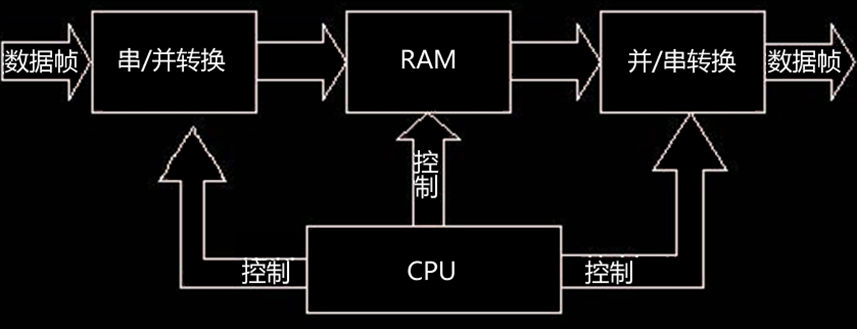
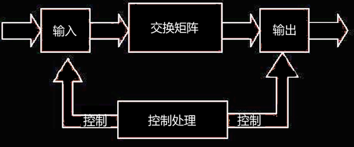
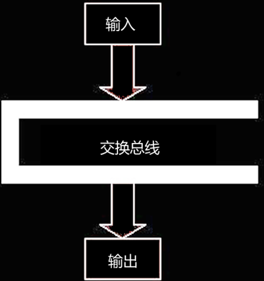
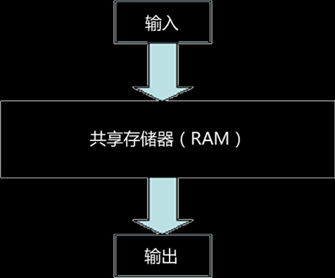
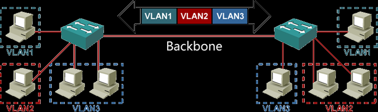

## 交换机的基本概念

基本概念

- 局域网交换机是一种 **基于 MAC 地址** 识别，完成转发数据帧功能的一种网络连接设备
- 工作在数据链路层，**根据端口数据帧中的 MAC 地址进行数据帧的过滤、转发（也是交换机的工作原理）**
- 交换机作为汇聚中心，能将多台数据终端设备连接在一起，构成**星状的网络**
- 交换式局域网具有**独占**传输通道、**独享**信道带宽，**同时允许多对站点**进行通信、**系统带宽等于所有端口带宽之和**等特性

<!--more-->


基本功能

- 建立和维护一个表示 **MAC 地址与交换机端口对应关系的交换表**
- **在发送节点和接受节点之间建立一条虚拟连接** [即发送方所连的交换机端口（源端口）到接收方所连的交换机端口（目的端口）之间建立虚连接]
- **完成数据帧的转发或过滤**


## 交换表的内容

交换表主要包括**目的 MAC 地址**、与目的 MAC 地址**对应的交换机端口号**以及它**所属的虚拟子网**。其中，虚拟子网用 VLAN ID 标识。


小型交换机的交换表（cisco-3XXX及以下型号）

- 交换机通过在超级用户模式下，**使用 show mac-address-talbe 命令查看**

- 该交换表的第一列为目的MAC地址，第二列为地址类型，第三列为VLAN的ID号，第四号为该目的MAC地址所对应的交换机的端口号

  


大型交换机的交换表（cisco-4000及以上型号）

- 交换机通过在超级用户模式下，**使用 show cam dynamic 命令查看**

- 第一列是VLAN的ID号，第二列是目的MAC地址，第三列是该地址相对应的交换机的端口号。

  


## 交换机的交换结构

- 软件执行交换结构
  - 交换机接收到数据帧后，先将其由**串行代码转化为并行代码**，暂时存储在交换机的快速缓存RAM中
  - 交换机的CPU开始根据数据帧中的目的MAC地址进行查询交换表
  - 确定了目的端口后，交换机在源端口与目的端口之间建立起虚连接，然后将以并行代码形式存储在**RAM**中的数据帧**转化为串行代码**，发送到目的端口
  - 上述的步骤都是**由软件控制完成**的。 

- 矩阵交换结构
  - 在矩阵交换结构中，交换机确定了目的端口后，根据源端口与目的端口打开**交换矩阵**中相应的开关，在两个端口之间建立连接
  - 通过建立的这个传输通道来完成数据帧的传输
  - 优点：交换速率快、时延小、易于实现
  - 缺点：扩展与可管理性较差

- 总线交换结构
  - 总线交换结构的交换机拥有一条很高带宽的背部总线
  - 交换机的所有的端口都挂接在这条背部总线上，总线按时隙分为多条逻辑通道，各个端口都可以往该总线上发送数据帧，这些**数据帧都按时隙在总线上传输**，并从各自的目的端口中输出数据帧
  - 总线交换结构对总线的带宽有较高的要求，**设交换机的端口数为M，每个端口的带宽为N，则总线的带宽应为M×N**。

- 共享存储器交换结构
  - 共享存储交换结构将**共享存储RAM**代替了总线交换结构中的总线，数据帧通过共享存储器实现从源端口直接传送到目的端口，它是总线交换结构的改进。
  - 优点：**结构简单、易于实现**
  - 缺点：当交换机的端口数量不断增加，存储容量不断扩大的同时，数据交换的时延也会越来越大。而且共享存储交换结构的成本比较高。**适合小型交换机**采用。




## 交换机的交换模式

交换机的交换方式有 **静态交换和动态交换** 两种

- 静态交换时由人工完成端口之间传输通道的建立
- **动态交换方式中依据目的 MAC 地址查询交换表，根据表中给出的输出端口来临时建立传输通道，这个传输通道在一个数据帧传送完成后自动断开**。

**交换机最常采用的交换方式是动态交换方式**。动态交换模式组要由存储转发和直通两种模式。而直通模式又有快速转发交换和碎片丢弃交换两种，归纳起来，交换机主要有**快速转发**、**碎片丢弃**和**存储转发**三种交换模式。

- 快速转发交换模式
  - **快速转发交换模式，也称作直通交换模式**，它是在交换机接收了帧的前 14 个字节，即 **接收到帧中 6 个 字节的目的地址后便理机转发数据帧**。该交换模式会在整个数据帧到之前就开始转发
  - 优点：端口交换时间短、延时小和交换速度快
  - 缺点：不能进行检查纠错、速度匹配和流量控制，可靠性较差
  - **适合小型交换机**
- 碎片丢弃交换模式
  - 碎片丢弃交换模式也被称为无分段交换模式
  - **这种交换模式实在开始转发数据帧前，先过滤掉造成大部分数据报错误的冲突片**
  - **采用这种交换模式的交换机在转发数据时，先检查数据包的长度是否够 64 字节**。如果帧的长度小于 64， 则被视为碎片，交换机直接丢弃；而任何大于 64 字节的数据帧都被交换机视为有效帧，进行转发
  - 优点：过滤掉了冲突碎片，提高了网络传输的效率和宽带的利用率
- 存储转发交换模式
  - 存储转发交换模式 **将接收到的整个数据帧保存在缓冲区**中，然后进行**循环冗余码校验检查，在对错误数据帧进行处理后，才取出数据帧的目的地址，进行转发操作**
  - 缺点：进行数据处理的**延时大**、交换速度相对较慢
  - 优点：对数据帧进行链路差错校验，可靠性较高，能有效的改善网络性能；同时它可以**支持不同速率的端口**，保持高速端口与低速端口之间协同工作。


## 虚拟局域网技术

- 虚拟网 VLAN 是以交换式网络为基础，把用户的终端设备划分为若干个逻辑工作组，每个逻辑工作组就是一个 VLAN
- 该逻辑组**都是一个独立的逻辑网段和广播域**
- 这个逻辑组的设定不受实际交换机区段的限制，也**不受用户所在的物理位置和物理网段的限制**
- 逻辑组的设定在交换机中是**通过软件完成**的


VLAN 的特征

- VLAN 工作在数据链路层**，即OSI 参考模型的第二层**
- VLAN 可隔离广播信息，每个 VLAN 为一个广播域，**VLAN 中的广播信息只能发送给这一个 VLAN 内部的成员，并不发送给其他 VLAN 成员**
- 一个 VLAN 就是一个独立的逻辑网络，每个 VLAN 都具有唯一的子网号。**不同 VLAN 中的主机之间必须通过路由器或者三层交换机，才能实现相互通信**


VLAN 的标识

- VLAN 通常用 **VLAN ID （Vlan 号）和 VLAN name（Vlan 名）** 标识
- IEEE 802.1Q 协议规定，**VLAN ID 用 12 位（bit）表示**，可以支持 4096 个 VLAN。其中 **1 ~ 1005 是标准范围，1006 ~ 1024 为保留范围，1025 ~ 4096 是扩展范围**。但并不是所有交换机都能支持 4096 个 VLAN
- 一部分交换机只支持标准范围 1 ~ 1005，其中能 **用与以太网的 VLAN ID 为 1 ~ 1000**, 而 **1002 ~ 1005 为 FDDI 和令牌环网使用的 VLAN ID**
- VLAN name 用 **32 个字符表示**，可以是**字母和数字**。若创建一个 VLAN 时，没有给定名字，则系统按默认方式，自动给出命名，**默认为 VLAN00xxx(xxx 即为该 VLAN 的 VLAN ID)**


VLAN Trunk

- VLAN Trunk（虚拟网中继）技术即是实现在多个交换机之间或是在交换机与路由器之间进行多个VLAN信息传输的技术

- Trunk是一种**封装技术**，它是一条点到点的链路，主要功能就是仅通过一条链路就可以连接多个交换机从而扩展已配置的多个VLAN

- VLAN Trunk的标准机制是**帧标签**

  > 帧标签卫每一个数据帧指定一个唯一的VLAN ID，这样即可表示该数据帧是属于哪一个VLAN的



​    在主干线路上要传输多个VLAN（VLAN1、VLAN2、VLAN3）的信息，则连接主干线路的两台交换机端口应具有Trunk功能。


划分VLAN的方法

- 基于端口划分VLAN
  - 由网络管理员根据交换机端口进行静态的VALN 分配，每个端口属于一个VLAN
  - 当在交换机上将其某一个端口分配给一个VLAN 时，将一直保持不变直到网络管理员改变这种配置
- 基于MAC地址
- 基于第三层协议类型或地址
  - 按照网络层协议类型（TCP/IP、IPX、DECNET等）或按网络地址定义VLAN成员。


## 生成树协议STP

STP 的基本概念

- 生成树协议（STP）时一个 **二层链路管理协议**。它主要功能时在保证网络中没有回路的基础上，**允许在第二层链路中提供冗余路径**，以保证网络可靠、稳定的运行
- **IEEE 802.1D 是最早的 STP 的标准**，它提供了动态冗余切换机制，是目前最为流行、应用最广泛的 STP 标准
- **STP 运行在交换机和网桥设备上**，通过计算机建立一个稳定的树状结构网络，来避免网络中回路的产生


STP 的工作原理：**通过在交换机之间传递网桥协议数据单元（BPDU），并运用生成树算法（STA）**对其进行比较计算

- 首先进行根网桥选择（根网桥为整个生成树拓扑结构的核心，所有数据传输均通过根网桥）
- 然后确定交换机冗余链路端口的工作状态，让一些端口进入**阻塞工作模式**，另一些端口进入转发工作模式
- 其中设置为阻塞模式的端口不能进行数据流的转发和接收，但仍作为一个激活的端口，可进行 BPDU 的接收和读取
- 如果**网络拓扑发生变化**或是生成树中的一个路径因故障而失效时，**生成树就会重新计算**，激活其他的备份链路，生成新的树拓扑，并强制将原来的故障链路变为备份链路，这时端口状态也会随之改变，以保证数据的传输路径是唯一的
- **交换机与网桥在STP的工作过程中是有区别的**。交换机要对VLAN进行处理，它指定一个根交换机，并为每一个VLAN选择一个根网络，然后再确定各个冗余端口的阻塞或转发状态，保证唯一的传输路径，并将其他的冗余链路作为备份链路，生成无回路的拓扑结构


BPDU 中携带了实现生成树算法的有关信息，包括：**Root Id、Root Path Cost、Bridge ID、Port ID、Hello time、Max Age**

- BPDU 数据包有两种类型，一种是包含 **配置信息的配置 BPDU（不超过 35 个字节）**，另一种包含 **拓扑变化信息的拓扑变化通知 BPDU （不超过 4 个字节）**。
- 在配置 BPDU 包的 Bride ID 信息，是选取根网桥或根交换机的主要依据；
- 一般情况下，Bridge ID 值最小的成为根网桥或根交换机；
- Bridge ID 用 8 个字节表示，后 6 个字节为交换机的 MAC 地址，前 2 个字节为优先级值；
- 优先级值越小，优先级越高（根网桥或根交换机）；
- **优先级取值范围 0 ~ 61440， 增质量为 4096， 交换机的优先级一般默认为 32768**，可以使用命令人工设置；
- 一台交换机的优先级设置 8189，优先级高级其他交换机，会成为根交换机；
- 选择根网桥时，优先级相同，会根据 MAC 地址的值决定根网桥，**MAC 的值最小的为根网桥**；
- 默认情况下，交换机 **每 2 秒定时发送一次 BPDU**，当检测到网络拓扑变化或故障发生时，也会发送新的 BPDU，以及时进行生成树的更新。


## 交换机的配置

### 交换机的配置方式

- 使用Console端口配置
  - 使用控制（**Console**）端口配置交换机，常用于交换机刚出厂并进行第一次配置时所采用的模式
  - Console是一个用来连接配置终端的异步串行口，接口标准为**RJ-45**
  - 是交换机刚出厂时，第一次对其进行配置所用的方法
  - 使用Console端口配置交换机时，需要准备一台已经安装了超级终端软件的计算机作为配置终端，同时还需要一条由厂家提供的RJ-45到9针或25针异步串行接口的信号电缆
  - 使用超级终端软件对异步串行口进行参数配置：**传输速率9600**，**数据位8位**，**停止位1位**。

- 使用telnet命令配置
  - 使用 **Telnet** 配置交换机，常用于远程配置模式，该模式要求交换机已经连接到网上，而且已配置了交换机的设备管理地址

- 使用浏览器配置交换机

  - 使用浏览器（**IE**）配置交换机，主要用于交换机被设置成 WEB 服务器，然后通过网络上的任意一个终端站点使用浏览器对交换机进行配置

- 具体步骤

  1. 交换机的配置

  2. 启用交换机的HTTP Server

     ```shell
     CatOS:    Catalyst6500> (enable)  set ip http server enable
     Cisco IOS:  switch-3548(config)#ip http server
     ```

  3. 配置HTTP用户认证方式:   enable、 local、tacacs

  4. 下载并安装Jave-plugin插件

  5. 使用Web浏览器监控和配置交换机


### 配置交换机的系统信息

- 配置交换机的主机名

  - Cisco IOS

    ```shell
    switch-3548(config)#hostname switch-PHY-3548
    switch-PHY-3548(config) #
    ```

  - CatOS

    ```shell
    CatOS6500 > (enable) set system name switch-PHY-6500
     System name set.  
    switch-PHY-6500 > (enable) 
    ```

- 配置超级用户口令

  - Cisco IOS

    ```shell
    switch-3548(config)# enable password zzz(明文)
    switch-3548(config)# enable password 7 zzz(加密)
    switch-3548(config)# enable secret 5 zzz(加密)
    ```

  - CatOS

    ```shell
    CatOS6500> (enable) set enablepass
    Enter old password:  
    Enter new password:
    Retype new password:
    Password changed.
    ```

- 设置远程登录口令

  - Cisco IOS

    ```shell
    switch-3548 (config)#line vty 0 4
    switch-3548 (config-line)# password 0 zzz (明文) 
    switch-3548 (config-line)# password 7 zzz (加密) 
    switch-3548 (config-line)#
    ```

  - CatOS

    ```shell
    CatOS6500> (enable) set password 
    Enter old password:  
    Enter new password:
    Retype new password:
    ```

- 交换机的基本配置一般都是用过 **使用 Console 端口配置方式** 完成，配置的主要内容哟配置交换机的主机名、超级用户口令、设备管理地址和远程登录口令
- 关于交换机配置命令语句，主要时以 Cisco IOS（35 系类）和 Catalyst OS（65 系列）两种交换机操作系统来讲解
- 那么常考的配置命令语句有 **设置系统时间、配置设备管理 IP 地址**


### 交换机端口配置

- 35 系列
  - 设置时间：`clock set HH:mm:ss DD MM YYYY`
  - 配置 IP：`ip address <IP 地址> <子网掩码>`
  - 缺省路由：`ip default-gateway <缺省路由 IP 地址>`
  - VLAN1 时用于设备管理的缺省 VLAN
  - 配置端口描述信息：
    1. `(config)# interface f0/1` (进入端口配置模式)
    2. `(config-if)# description To-Webserver`（配置端口描述信息）
    3. `(config-if)# shutdown`（关闭端口）
    4. `(config-if)# no shutdown`（开启端口）
    5. `(config-if)# duplex auto`（设置为自动协商，默认）
    6. `(config-if)# duplex full` （设置为全双工）
    7. `(config-if)# duplex half` （设置为半双工）
    8. `(config-if)# speed auto` （自动速率）
    9. `(config-if)# speed 10` （设置速率 10Mbit/s）
- 65 系类
  - 设置时间：`set time ww MM/DD/YYYY HH:mm:ss`
  - 配置 IP：`set interface sc0 <IP 地址> <子网掩码> <直接广播地址>`
  - 缺省路由：`set ip route 0.0.0.0 <缺省路由 IP 地址>`
  - 配置端口描述信息：
    1. `(enable) set port name <mod/port> <name>` （name 为端口描述，一般不超过 240 个）
    2. `(enable) set port disable <mod/port>` （开启端口）
    3. `(enable) set port enable <mod/port>` （关闭端口）
    4. `(enable) set port duplex <mod/port> full` （全双工）
    5. `(enable) set port duplex <mod/port> half` （半双工）
    6. `(enable) set prot speed <mod/port> auto` （自动速率）
    7. `(enable) set prot speed 10` （设置速率 10Mbit/s）


## 交换机 VLAN 的配置

交换机 VLAN 的配置主要任务是：配置 VTP、建立或删除 VLAN、为交换机端口分配 VLAN 和在交换机端口上配置 VLAN Trunk。

### VLAN 配置

- 35 系列
  - 进入 链接：`Switch-3528-TEST> # vlan data`
  - 建立 VLAN： `(vlan) vlan <vlan_ID> name <vlan_name>`
  - 删除 VLAN: `(vlan) no vlan <vlan_ID>`
  - 修改 VLAN： `(vlan) vlan <vlan_ID> name <vlan_name>`
- 65 系列
  - 进入：`Switch-6509-TEST> # enable`
  - 建立 VLAN: `(enable) set vlan <vlan_ID> name <vlan_name>`
  - 删除 VLAN: `(enable) clear vlan <vlan_ID>`
  - 修改 VLAN: `(enable) set vlan <vlan_ID> name <vlan_name>`


### VLAN Trunk 的配置

- 35 系类

  - 进入交换机端口配置模式：

    1. `Switch-3528-TEST> # configure terminal`
    2. `(config) # int fo/24`
    3. `(config-if) #`

  - 配置 VLAN Trunk 模式：`(config-if)# switchport mode trunk`

  - 封装 VLAN 协议

    **Cisco ISL：思科私有协议。**

    **IEEE 802.1Q：俗称“Dot One Q”(dot1q),国际标准。**

    **IEEE 802.1Q可用于不同厂家的交换设备互连，且双方交换机端口上都要封装dot1q协议**，保证协议的一致性，否则不能正确的传输多个VLAN信息。

    1. `(conifg-if)# switchport trunk encapsulation dotl q` (202.1q 模式)
    2. `(conifg-if)# switchport trunk encapsulation isl` (ISL 协议)
    3. `(config-if)# switchport trunk encapsulation negotiate P` (自动协商)

  - 设置允许中继的 VLAN: `(config-if)# switchport trunk allowed vlan` 1,10 | 11-20

  - 设置不允许中继的 VLAN: `(config-if)# switchport trunk allowed vlan except` 1,10 | 11-20

- 65 系列

  - 配置 VLAN Trunk 模式，分装 VLAN 协议：`(enable) set trunk <mod/port> <mode> <type>`
  - 设置允许中继的 VLAN：`(enable) set trunk <mod/port> vlan <vlan_ID>`
  - 设置不允许中继的 VLAN：`(enable) clear trunk <mod/port> <vlan_ID>`


### 交换机 VTP 的配置

VTP 是 VLAN 中继协议，也被称为 VALN 干道协议。他是一个 OSI 参考模型第二层的通信协议，主要用于管理在同一个域的网络范围内 VLANs 的建立 删除和命名

配置 VTP 的任务主要有两个：一是 **建立 VTP 域**，二是 **设置 VTP 的工作模式**；

**注意：** 同一个域的所有交换机，必须运行同版本的 VTP，并具有相同的域名；

- VTP Server：一般，一个 VTP 域内的整个网络只设置一个 VTP Server, 它 **维护该 VTP 域中所有 VLAN 信息列表，可以建立、删除或修改 VLAN**
- VTP Client：也维护所有 VLAN 信息列表，但是它的VLAN 信息是从 VTP Server 学习到的，并且**不具有建立、删除或修改 VLAN 的功能**。
- VTP Transparent：相当于一个独立的交换机，它不参与 VTP 工作，不从 VTP Server 学习 VLAN 的配置信息，二只拥有本设备上自己的 VLAN 信息，因此它也 **只能建立、删除和修改本机上的 VLAN 信息**。
- 35 系列
  - 进入工作模式：`Switch-3528-TEST> # configure terminal`
  - 域名配置：`(config)# vtp domain TEST`
  - 工作模式：`(config)# vtp mode <type>` type="server|client|transparent"
- 65 系列
  - 域名配置：`(enable)# set vtp domain TEST`
  - 工作模式：`(enable)# set vtp mode <type>` type="server|client|transparent"


## 为交换机分配端口

- 35 系列
  - 进入端口配置模式：同上 `交换机 VLAN 的配置 > 3 > 35 系列`
  - 端口 VLAN 分配：`(config-if) switchport access vlan <vlan_ID>`
- 65 系列
  - 端口 VLAN 分配：`(enable) set vlan <vlan_ID> <mod/port>`


## 交换机 STP 的配置

#### 打开或关闭STP

- 35系列

  switch-3548# configure terminal 

  switch-3548 (config)# spanning-tree vlan 3   

  switch-3548 (config)# no spanning-tree vlan 3 

- 65系列

  CatOS6500> (enable) set spanning-tree enable 3 

  CatOS6500> (enable) set spanning-tree disable 3


#### 配置根网桥和备份根网桥

- 35系列

  switch-3548 (config)# spanning-tree vlan 3 root primary

  switch-3548 (config)# spanning-tree vlan 3 root secondary 

- 65系列

  CatOS6500> (enable) set spanning-tree root 1,200-204

  CatOS6500> (enable) set spanning-tree secondary 1,200-204


#### 配置生成树优先级

配置生成树优先级：生成树优先级的取值范围是0~61440，增量是**4096**。优先级的值越小优先级越高，如果优先级为0是最高优先级，61440优先级最低。

- 35 系列
  - 优先级配置：`(config)# spanning-tree vlan <vlans> prioriy <0-61440>`
- 65 系列
  - 优先级配置：`(enable)# set spanning prioriy <0-61440>`


#### 配置生成树可选功能

- BackboneFast：是 **阻塞端口不在等待这段时间**，而是 **直接将端口有侦听和学习状态换为转发状态**；
- UplinkGast：当生成树拓扑结构发生变化和在使用上链路组的冗余链路之间完成负载平衡，**提供快速收敛**；
- PortFast：用于在接入层交换机端口上跳过正常的生成树操作，**加快终端工作站接入网络中的速度**。它的功能是使交换机的端口侦听和学习转台，**直接从阻塞状态进入到转发状态**；
- BPDU Filtering：会是交换机在指定的端口上停止发送 BPDUs，对于进入这个端口的 BPDUs 也不做任何处理，同时 **立刻就昂端口转台转换为转发状态**；
- 35 系列：
  - BackboneFast:`(config)# spanning-tree BackboneFast`
  - UplinkFast：`(config)# spanning-tree uplinkfast`
  - PortFast：`(config)# spanning-tree portfast defalut`
  - BPDU Filtering：`(config)# spanning-tree portfast bpdufilter default`
- 65 系列：
  - BackboneFast:
    1. `(enable)# set spantree backbonefast enable`
    2. `(enable)# set spantree backbonefast disable`
  - UplinkFast：
    1. `(enable)# set spantree uplinkfast enable`
    2. `(enable)# set spantree uplinkfast disable`
  - PortFast：
    1. `(enable)# set spantree portfast <mod/port> enable`
    2. `(enable)# set spantree portfast <mod/port> disable`
    3. `(enable)# set spantree portfast <mod/port> default`
  - BPDU Filtering：
    1. `(enable)# set spantree portfast bpdu-filter enable`
    2. `(enable)# set spantree portfast bpdu-filter disable`
    3. `(enable)# set spantree portfast bpdu-filter <mod/port> enable`
    4. `(enable)# set spantree portfast bpdu-filter <mod/port> disable`
    5. `(enable)# set spantree portfast bpdu-filter <mod/port> default`

