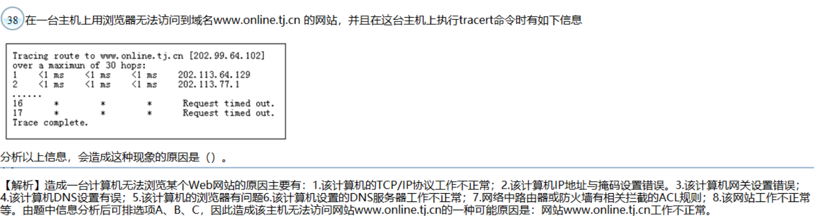
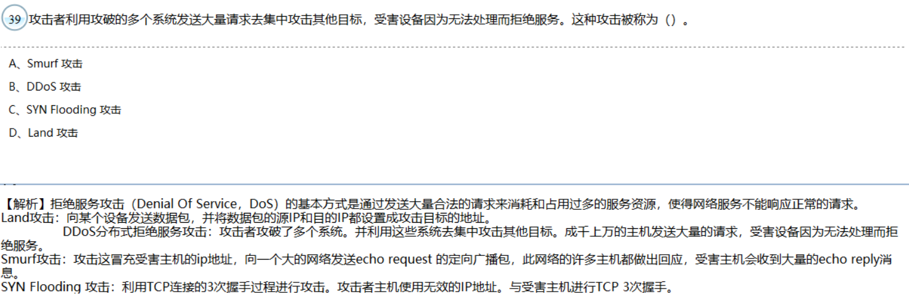
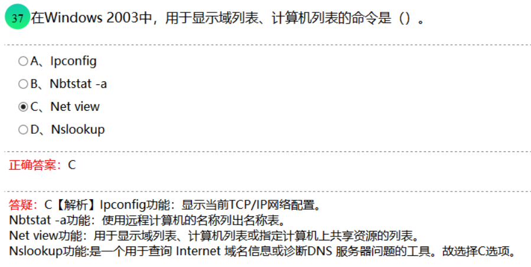
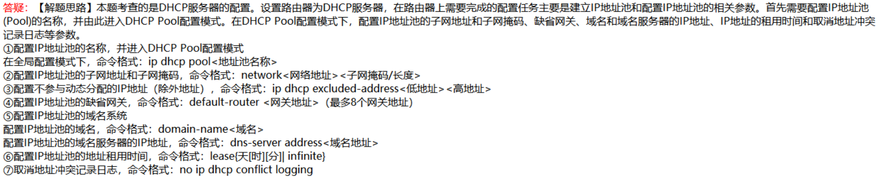
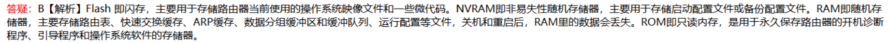
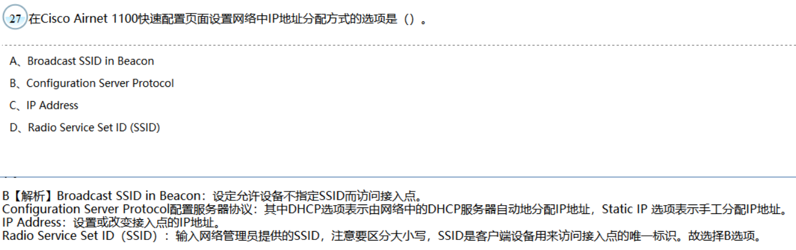
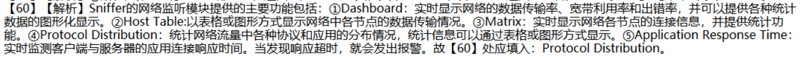

## 路由器配置

静态路由配置

Router（config）# **ip route <目的网络地址><子网掩码><下一跳路由器的IP地址>** 

如：Router（config）# ip route 59.65.96.0 255.255.240.0 222.112.37.1

**<!--more-->**

**默认路由配置**

Router（config）# **ip route 0.0.0.0 0.0.0.0 <下一跳路由器的IP地址>** 

如：Router（config）# ip route 0.0.0.0 0.0.0.0 222.112.37.1

**POS接口配置**

Router（config）# Interface POS3/0 

Router（config-if）# Description TO BEIJING 

Router（config-if）# **Bandwidth 2500000 (单位bps)**

Router（config-if）# Ip address 212.14.37.18 255.255.255.252 

Router（config-if）# **Crc 32 （可选的CRC校验位是16和32）**

Router（config-if）# **Pos framing sdh （可选帧格式是SDH和SONET）**

Router（config-if）# No ip directed-broadcast 

Router（config-if）# **Pos flag s1s0 2** 

  （**s1s0=00表示是SONET帧数据，s1s0＝10（十进制2）表示是SDH帧**）

广域网同步串行接口配置

Router（config）# Interface s1/1 

Router（config-if）# Description TOBEIJING 

Router（config-if）# **Bandwidth 2048 （带宽为2M）注意单位为bps**

Router（config-if）# Ip address 212.112.41.81 255.255.255.252 

Router（config-if）# **Encapsulation** hdlc （**封装HDLC或PPP协议，HDLC为缺省**）

// encapsulation的拼写

 Router（config-if）# No ip directed-broadcast 

Router（config-if）# No ip proxy-arp 

Router（config-if）# No shutdown 

Router（config-if）# Exit 

**OSPF配置**

一、启用OSPF ：

在全局模式下：router ospf <process ID>

二、在OSPF配置模式下，定义参与OSPF的子网地址,使用命令：

**area <区域号> range <子网地址><子网掩码>；和**

**network <子网号> <wildcard-mask> area <区域号>**

​    如果区域中的子网是连续的，则可使用这个子网聚合功能，区域边缘路由器可以将所有连续的子网聚合为一条路由信息传播给其他区域，在其他区域内的路由器看到这个区域的路由就只有一条。 **注意：同区域在定义参与OSPF的子网地址时也可以子网聚合**

