## 概述和传输层服务

传输服务和协议

- 为运行在不同主机上的应用进程提供逻辑通信
- 传输协议运行在端系统
  - 发送方：将应用层的报文分成报文段，然后传递给网络层
  - 接收方：将报文段重组成报文，然后传递给应用层
- 有多个传输层协议可供应用选择
  - Internet：TCP和UDP

<!-- more -->

传输层与网络层的关系

- 网络层服务：主机之间的逻辑通信

- 传输层服务：进程间的逻辑通信

  - 依赖于网络层的服务

    - 延时、带宽

  - 对网络层的服务进行增强

    - 数据丢失、顺序混乱

    - 加密

      > 有些服务是可以加强的：不可靠 -> 可靠；安全 
      >
      > 但有些服务是不可以被加强的：带宽，延迟


Internet传输层协议

- 可靠的、保序的传输：TCP

  - 多路复用、解复用
  - 拥塞控制
  - 流量控制
  - 建立连接

- 不可靠、不保序的传输：UDP

  - 多路复用、解复用

  - 没有为尽力而为的IP服务添加更多的其它额外服务

    > IP的服务模型为尽力而为交付服务（best-effort delivery service），即IP尽“最大努力”在通信主机之间交付报文段，但不做任何确保。因此IP被称为不可靠服务（unreliable service）

- 都不提供的服务

  - 延时保证
  - 带宽保证


## 多路复用/解复用

 在发送方主机多路复用：从多个套接字接收来自多个进程的报文，根据套接字对应的IP地址和端口号等信息对报文段用头部加以封装 (该头部信息用于以后的解复用)

在接收方主机多路解复用：根据报文段的头部信息中的IP地址和端口号将接收到的报文段发给正确的套接字(和对应的应用进程)


多路解复用工作原理

- 解复用作用：TCP或者UDP实体采用哪些信息，将报文段的数据部分交给正确的socket，从而交给正确的进程
- 主机收到IP数据报
  - 每个数据报有源IP地址和目标地址
  - 每个数据报承载一个传输层报文段
  - 每个报文段有一个源端口号和目标端口号 (特定应用有著名的端口号) 
- 主机联合使用IP地址和端口号将报文段发送给合适的套接字


无连接(UDP)多路解复用

1. 创建套接字
2. 在接收端，UDP套接字用二元组标识 (目标IP地址、目标端口号)
3. 当主机收到UDP报文段
   - 检查报文段的目标端口号
   - 用该端口号将报文段定位给套接字
4. 如果两个不同源IP地址/源端口号的数据报，但是有相同的目标IP地址和端口号，则被定位到相同的套接字


面向连接(TCP)的多路复用

- TCP套接字:四元组本地标识
  - 源IP地址
  - 源端口号
  - 目的IP地址
  - 目的端口号
- 解复用：接收主机用 这四个值来将数据报定位到合适的套接字
- 服务器能够在一个TCP 端口上同时支持多个TCP套接字
  - 每个套接字由其四元组标识（有不同的源IP和源Port）
- Web服务器对每个连接客户端有不同的套接字
  - 非持久对每个请求有不同的套接字


面向连接的多路复用：多线程Web Server

- 一个进程下面可能有多个线程：由多个线程分别为客户提供服务
- 在这个场景下，还是根据4元组决定将报文段内容同一个进程下的不同线程
- 解复用到不同线程


## 无连接传输：UDP

“尽力而为”的服务，报文段可能**丢失**或**送到应用进程的报文段乱序**


无连接特点

- UDP发送端和接收端之间没有握手
- 每个UDP报文段都被独立地处理

UDP 被用于流媒体（丢失不敏感， 速率敏感、应用可控制传输速率）、DNS、SNMP


在UDP上可行可靠传输，则

- 在应用层增加可靠性
- 应用特定的差错恢复


**UDP报文段格式：**

.png)

**UDP存在的必要性**

- 不建立连接（会增加延时 ）
- 简单：在发送端和接收端没有连接状态
- 报文段的头部很小（开销小）
- 无拥塞控制和流量控制：UDP可以尽可能快的发送报文段


**UDP校验和**

目标： 检测在被传输报文段中的差错（如比特反转）

发送方

- 将报文段的内容视为16比特的整数
- 校验和：报文段的加法和（1的补运算）
- 发送方将校验和放 UDP的校验和字段

接收方

- 计算接收到的报文段的校验和
- 检查计算出的校验和与校验和字段的内容是否相等
  - 不相等–--检测到差错
  - 相等–--没有检测到差错 ，但也许还是有差错，如残存错误

校验和的计算：

- 当数字相加时，在最高位的进位要回卷，再加到结果上
- 最终得到的检验码是计算的反码
- 目标端：校验范围+校验和=1111111111111111 则通过校验


## 可靠数据传输（rdt）原理

rdt（可靠数据传输协议）在应用层、传输层和数据链路层都很重要

信道的不可靠特点决定了可靠数据传输协议的复杂性

服务实现模型：

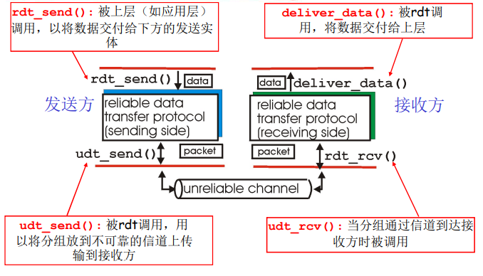

可靠数据传输：问题描述

- 渐增式地开发可靠数据传输协议（ rdt ）的发送方和接收方

- 只考虑单向数据传输，但控制信息是双向流动的

- 双向的数据传输问题实际上是2个单向数据传输问题的综合

- 使用有限状态机 (FSM) 来描述发送方和接收方

  > 有限状态机是一种描述形式
  >
  > 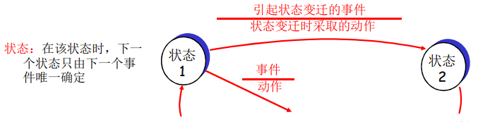


Rdt1.0： 在可靠信道上的可靠数据传输

- 下层的信道是完全可靠的

  - 没有比特出错
  - 没有分组丢失

- 发送方和接收方的FSM

  - 发送方将数据封装发送到下层信道

  - 接收方从下层信道接收数据，解封装

    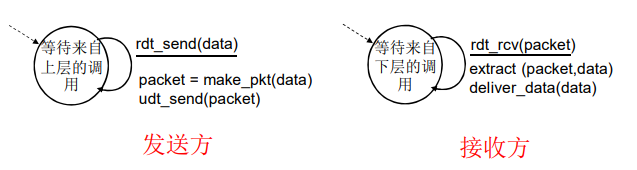


Rdt2.0：具有比特差错的信道

- 下层信道可能会出错：将分组中的比特翻转

  - 用校验和来检测比特差错

- 问题：怎样从差错中恢复

  - 确认（ACK）：接收方显式地告诉发送方分组已被正确接收
  - 否定确认（NAK）: 接收方显式地告诉发送方分组发生了差错
    - 发送方收到NAK后，发送方重传分组

- rdt2.0中的新机制：采用差错控制编码进行差错检测

  - 发送方差错控制编码、缓存
  - 接收方使用编码检错
  - 接收方的反馈：控制报文（ACK，NAK），由接收方发给发送方
  - 发送方收到反馈相应的动作

- 基于这样重传机制的可靠数据传输协议称为自动重传请求（ARQ）协议

- FSM描述

  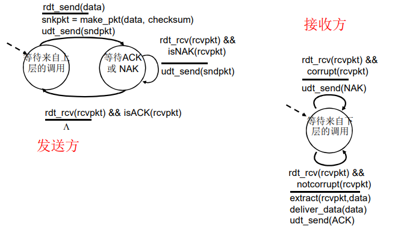


rdt2.0存在致命缺陷则 -> rdt2.1

如果ACK/NAK出错？

- 发送方不知道接收方发生了什么事情
- 发送方如何做
  - 若重传可能重复
  - 若不重传可能死锁(或出错) 
- 需要引入新的机制：序号

处理重复

- 发送方在每个分组中加入序号
- 如果ACK/NAK出错，发送方重传当前分组
- 接收方丢弃（不发给上层）重复分组

停止等待协议：发送方发送一个分组， 然后等待接收方的应答

FSM描述：

- 发送方处理出错的ACK/NAK

  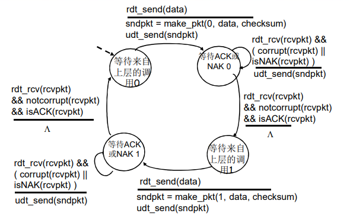

- 接收方处理出错的ACK/NAK

  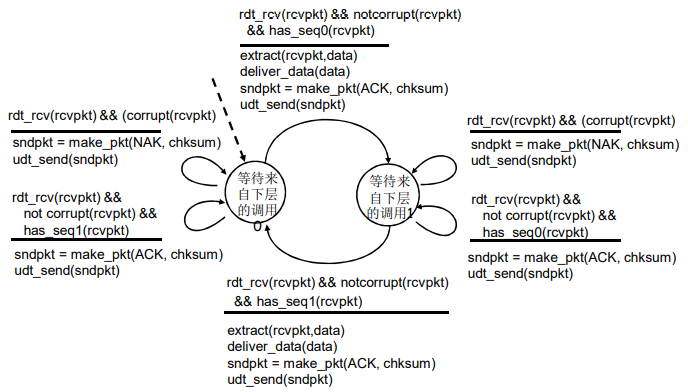

rdt2.1发送方

- 在分组中加入序列号
- 两个序列号（0，1）就足够了
  - 一次只发送一个未经确认的分组
- 必须检测ACK/NAK是否出错（需要EDC）
- 状态数变成了两倍
  - 必须记住当前分组的序列号为0还是1

rdt2.1接收方

- 必须检测接收到的分组是否是重复的
  - 状态会指示希望接收到的分组的序号为0还是1
- 注意：接收方并不知道发送方是否正确收到了其ACK/NAK
  - 没有安排确认的确认


rdt2.1运行过程：

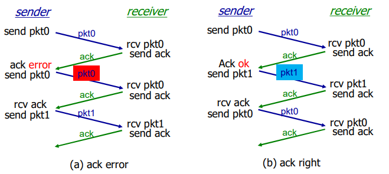

接收方不知道它最后发送的ACK/NAK是否被正确地收到

- 发送方不对收到的ack/nak给确认，没有所谓的确认的确认
- 接收方发送ack，如果后面接收方收到的是
  - 老分组p0，则ack 错误
  - 下一个分组P1，则ack正确


rdt2.2：无NAK（NAK free）的协议

- 功能同rdt2.1，但只使用ACK(ack 要编号）

- 接收方对**最后**正确接收的分组发ACK，以替代NAK

  - 接收方必须显式地包含被正确接收分组的序号

- 当收到重复的ACK（如：再次收到ack0）时，发送方与收到NAK采取相同的动作：重传当前分组

- 为后面的一次发送多个数据单位做一个准备

  - 一次能够发送多个
  - 使用对前一个数据单位的ACK，代替本数据单位的NAK
  - 确认信息减少一半，协议处理简单

- 运行过程

  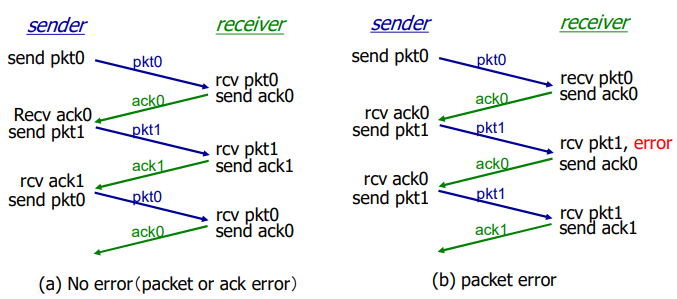


rdt3.0：具有比特差错和分组丢失的信道

问题：若下层信道可能会丢失分组（数据或ACK）

解决方法：发送方等待ACK一段合理的时间

> 链路层的timeout时间确定的 
>
> 传输层timeout时间是适应式的

- 发送端超时重传：如果到时没有收到ACK则重传
- 问题：如果分组（或ACK ）只是被延迟了
  - 重传将会导致数据重复，但利用序列号可以处理这个问题
  - 接收方必须指明被正确接收的序列号
- 需要一个倒计数定时器

rdt3.0发送方FSM描述：

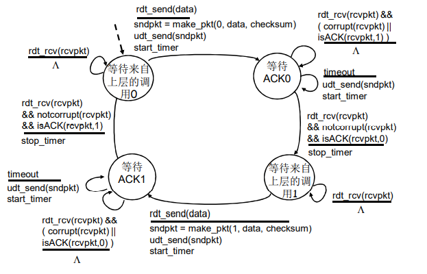

rdt3.0运行过程

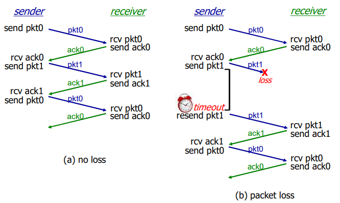

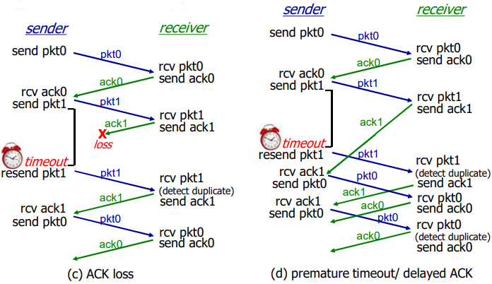

- 过早超时（延迟的ACK）也能够正常工作；但是效率较低，一半的分组和确认是重复的
- 设置一个合理的超时时间是比较重要的


**rdt3.0的性能**

rdt3.0可以工作，但链路容量比较大的情况下，性能很差

- 链路容量比较大，一次发一个PDU的不能够充分利用链路的传输能力

<br>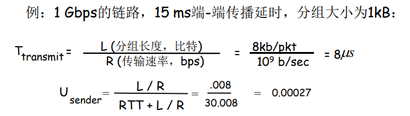

- $U_{sender}$：利用率，即忙于发送的时间比例
- 每30ms发送1KB的分组 -->270kbps=33.75kB/s 的吞吐量（在1Gbps 链路上）
- 瓶颈在于：网络协议限制了物理资源的利用

- 此例子体现了rdt3.0的停-等操作

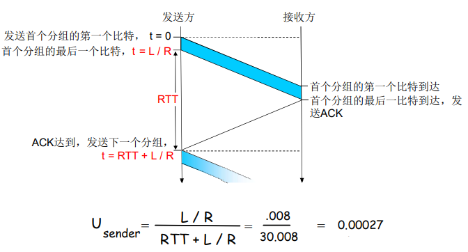


- 通过流水线提高链路利用率，下图展示同时发送3个分组的情况

  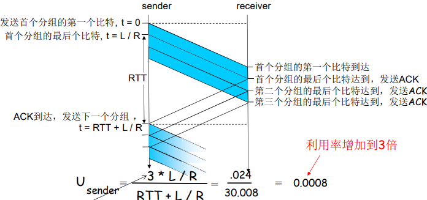

  - 增加n，能提高链路利用率
  - 但当达到某个n，其u=100%时，无法再通过增加n，提高利用率
  - 瓶颈变成了链路带宽


**流水线协议**

流水线：允许发送方在未得到对方确认的情况下一次发送多个分组

- 必须增加序号的范围：用多个bit表示分组的序号
- 在发送方/接收方要有缓冲区
  - 发送方缓冲：未得到确认，可能需要重传
  - 接收方缓存：上层用户取用数据的速率≠接收到的数据速率；接收到的数据可能乱序，排序交付（可靠）
- 两种通用的流水线协议：回退N步（GBN）和选择重传（SR）


滑动窗口（slide window）协议

- 发送缓冲区

  - 形式：内存中的一个区域，落入缓冲区的分组可以发送
  - 功能：用于存放已发送，但是没有得到确认的分组
  - 必要性：需要重发时可用

- 发送缓冲区的大小：一次最多可以发送多少个未经确认的分组

  - 停止等待协议=1
  - 流水线协议>1，合理的值，不能很大，链路利用率不能够超100%

- 发送缓冲区中的分组

  - 未发送的：落入发送缓冲区的分组，可以连续发送出去
  - 已经发送出去的、等待对方确认的分组：发送缓冲区的分组只有得到确认才能删除

- 发送窗口：发送缓冲区内容的一个范围

  - 那些已发送但是未经确认分组的序号构成的空间

- 发送窗口的最大值<=发送缓冲区的值

- 一开始：没有发送任何一个分组

  - 后沿=前沿
  - 之间为发送窗口的尺寸=0

- 每发送一个分组，前沿前移一个单位；发送窗口前沿移动的极限：不能够超过发送缓冲区

  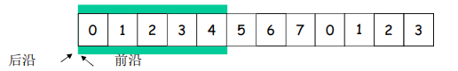

- 发送窗口后沿移动

  - 条件：收到老分组的确认

  - 结果：发送缓冲区罩住新的分组，来了分组可以发送

  - 移动的极限：不能够超过前沿

    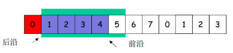

- 接收窗口（Receiving Window）= 接收缓冲区

  - 接收窗口用于控制哪些分组可以接收
    - 只有收到的分组序号落入接收窗口内才允许接收
    - 若序号在接收窗口之外，则丢弃
  - 接收窗口尺寸RW=1，则只能顺序接收，即GBN协议
  - 接收窗口尺寸RW>1 ，则可以乱序接收，但提交给上层的分组，要按序，即SR协议

- 接收窗口的滑动和发送确认

  - 滑动

    - 低序号的分组到来，接收窗口移动

    - 高序号分组乱序到，缓存但不交付（因为要实现rdt，不允许失序），不滑动

  - 发送确认

    - 接收窗口尺寸=1 ； 发送连续收到的最大的分组确认（累计确认）
    - 接收窗口尺寸>1 ； 收到分组，发送那个分组的确认（非累计确认）

- 正常情况下的2个窗口互动

  - 发送窗口
    - 有新的分组落入发送缓冲区范围，发送且前沿滑动
    - 来了老的低序号分组的确认->后沿向前滑动->新的分组可以落入发送缓冲区的范围
  - 接收窗口
    - 收到分组，落入到接收窗口范围内，接收
    - 是低序号，发送确认给对方
  - 发送端上面来了分组->发送窗口滑动->接收窗口滑动->发确认

- 异常情况下GBN的2窗口互动

  - 发送窗口
    - 新分组落入发送缓冲区范围，发送->前沿滑动
    - 超时重发机制让发送端将发送窗口中的所有分组发送出去
    - 来了老分组的重复确认->后沿不向前滑动->新的分组无法落入发送缓冲区的范围（此时如果发送缓冲区有新的分组可以发送）
  - 接收窗口
    - 收到乱序分组，没有落入到接收窗口范围内，抛弃
    - （重复）发送老分组的确认，累计确认；

- 异常情况下SR的2窗口互动

  - 发送窗口
    - 新分组落入发送缓冲区范围，发送->前沿滑动
    - 超时重发机制让发送端将超时的分组重新发送出去
    - 来了乱序分组的确认->后沿不向前滑动->新的分组无法落入发送缓冲区的范围（此时如果发送缓冲区有新的分组可以发送）
  - 接收窗口
    - 收到乱序分组，落入到接收窗口范围内，接收
    - 发送该分组的确认，单独确认；


GBN协议和SR协议的异同

- 相同之处
  - 发送窗口>1
  - 一次能够可发送多个未经确认的分组
- 不同之处
  - GBN :接收窗口尺寸=1
    - 接收端：只能顺序接收
    - 发送端：从表现来看，一旦一个分组没有发成功，如：0,1,2,3,4  ; 假如1未成功，234都发送出去了，要返回1再发送；GB1
  - SR: 接收窗口尺寸>1
    - 接收端：可以乱序接收
    - 发送端：发送0,1,2,3,4，一旦1 未成功，2,3,4,已发送，无需重发，选择性发送1


流水线协议总结

- Go-back-N
  - 发送端最多在流水线 中有N个未确认的分组
  - 接收端只是发送累计型确认cumulative ack
    - 接收端如果发现gap， 不确认新到来的分组
  - 发送端拥有对最老的 未确认分组的定时器
    - 只需设置一个定时器
    - 当定时器到时时，重传所有未确认分组
- Selective Repeat
  - 发送端最多在流水线中有N个未确认的分组
  - 接收方对每个到来的分组单独确认individual ack （非累计确认）
  - 发送方为每个未确认的分组保持一个定时器,当超时定时器到时，只重发到时的未确认分组


GBN：发送方扩展的FSM

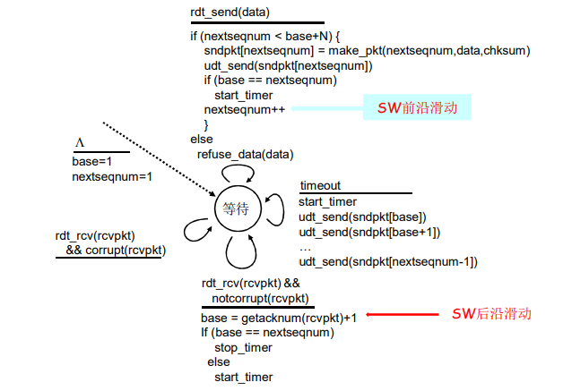

GBN：接收方扩展的FSM

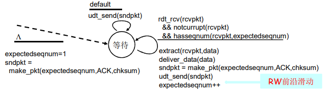

- 只发送ACK：对顺序接收的最高序号的分组
  - 可能会产生重复的ACK
  - 只需记住expectedseqnum；接收窗口=1，只一个变量就可表示接收窗口
- 对乱序的分组
  - 丢弃（不缓存），在接收方不被缓存
  - 对顺序接收的最高序号的分组进行确认------累计确认


选择重传SR

- 接收方对每个正确接收的分组，分别发送 ACKn（非累积确认）
  - 接收窗口>1，可以缓存乱序的分组
  - 最终将分组按顺序交付给上层
- 发送方只对那些没有收到ACK的分组进行重发-选择性重发
  - 发送方为每个未确认的分组设定一个定时器
- 发送窗口的最大值（发送缓冲区）限制发送未确认分组的个数

选择重传发送方：

- 从上层接收数据，如果下一个可用于该分组的序号可在发送窗口中，则发送

- timeout(n)：重新发送分组n，重新设定定时器 
- ACK(n) in [sendbase,sendbase+N]：将分组n标记为已接收，如n为最小未确认的分组序号， 将base移到下一个未确认序号

选择重传接收方：

- 分组n [rcvbase, rcvbase+N-1]
  - 发送ACK(n)
  - 乱序：缓存
  - 有序：该分组及以前缓存的序号连续的分组交付给上层 ，然后将窗口移到下一个仍未被接收的分组
- 分组n [rcvbase-N, rcvbase-1] 
  - 发送ACK(n) 
- 其它：忽略该分组


GBN和SR

|      | GBN                                     | SR                                       |
| ---- | --------------------------------------- | ---------------------------------------- |
| 优点 | 简单，所需资源少（接收方一个 缓存单元） | 出错时，重传一个代价小                   |
| 缺点 | 一旦出错，回退N步代价大                 | 复杂，所需要资源多（接收方多个缓存单元） |

适用范围

- 出错率低：比较适合GBN，出错非常罕见，没有必要用复杂的SR，为罕见的事件做日常的准备和复杂处理
- 链路容量大（延迟大、带宽大）：比较适合SR而不是GBN，一点出错代价太大


窗口的最大尺寸，若存在n个分组

- GBN：$2^n-1$
- SR：$2^{n-1}$


## 面向连接的传输：TCP

### TCP：概述

- 点对点：一个发送方，一个接收方
- 可靠的、按顺序的字节流
  - 没有报文边界
- 管道化（流水线）
  - TCP拥塞控制和流量控制设置窗口大小
- 发送和接收缓存
- 全双工数据
  - 在同一连接中数据流双向流动
  - MSS：最大报文段大小
- 面向连接
  - 在数据交换之前，通过握手（交换控制报文）初始化发送方、接收方的状态变量
- 有流量控制
  - 发送方不会淹没接收方


TCP报文段格式：

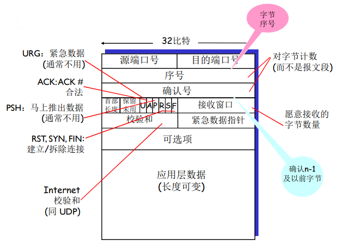

- 序号
  - 报文段首字节的在字节流的编号
- 确认号
  - 期望从另一方收到的下一个字节的序号
  - 累积确认


**TCP往返延时（RTT）和超时**

怎样设置TCP超时

- 比RTT要长，但RTT是变化的
- 太短：太早超时会造成不必要的重传
- 太长：对报文段丢失反应太慢，消极

怎样估计RTT？

- SampleRTT：测量从报文段发出到收到确认的时间

  - 如果有重传，忽略此次测量

- SampleRTT会变化，因此估计的RTT应该比较平滑

  - 对几个最近的测量值求平均，而不是仅用当前的SampleRTT

  - $EstimatedRTT(SampleRTT均值) = (1-\alpha)\times EstimatedRTT + \alpha\times SampleRTT$

    - 指数加权移动平均（Exponential Weighted Moving Average，EWMA）
    - 过去样本的影响呈指数衰减
    - 推荐值：$\alpha= 0.125$

  - SampleRTT会偏离EstimatedRTT多远，即偏差

    $DevRTT =(1-\beta)\times DevRTT+\beta\times|SampleRTT-EstimatedRTT|$

    - 推荐值：$\beta= 0.25$

超时时间间隔设置为： $TimeoutInterval = EstimatedRTT + 4*DevRTT$，初始设置为1s


### 可靠数据传输

- TCP在IP不可靠服务的基础上建立了rdt
  - 管道化的报文段
    - GBN or SR
  - 累积确认（像GBN）
  - 单个重传定时器（像GBN）
  - 对于乱序的，没有规范，可以丢弃或缓存
- 通过以下事件触发重传
  - 超时（只重发那个最早的未确认段：SR）
  - 快速重传：重复的确认，如收到了ACK50，之后又收到3个ACK50


首先考虑简化的TCP发送方

- 忽略重复的确认
- 忽略流量控制和拥塞控制

TCP发送方事件：

- 从应用层接收数据
  - 用nextseq创建报文段
  - 序号nextseq为报文段首字节的字节流编号
  - 如果还没有运行，启动定时器
    - 定时器与最早未确认的报文段关联
    - 过期间隔： TimeOutInterval 
- 超时
  - 重传后沿最老的报文段
  - 重新启动定时器 
- 收到确认
  - 如果是对尚未确认的报文段确认
    - 更新已被确认的报文序号
    - 如果当前还有未被确认的报文段，重新启动定时器


TCP重传情况：

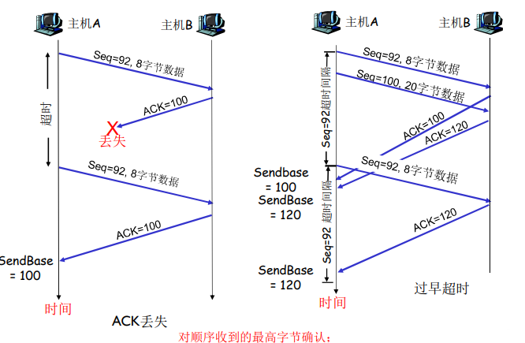

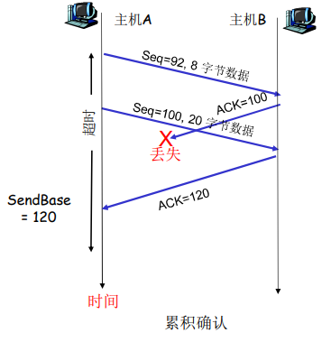


快速重传

- 超时周期往往太长

  - 在重传丢失报文段之前的延时太长

- 通过重复的ACK来检测报文段丢失

  - 发送方通常连续发送大量 报文段
  - 如果报文段丢失，通常会引起多个重复的ACK

- 如果发送方收到同一数据的3个冗余ACK，重传最小序号的段

  - 快速重传：在定时器过时之前重发报文段
  - 它假设跟在被确认的数据后面的数据丢失了
    - 第一个ACK是正常的
    - 收到第二个该段的ACK，表示接收方收到一个该段后的乱序段
    - 收到第3，4个该段的ack，表示接收方收到该段之后的2个 ，3个乱序段，段丢失可能性非常大

- 算法

  ```
  event: ACK received, with ACK field value of y 
  	if (y > SendBase) { 
  		SendBase = y
  	if (there are currently not-yet-acknowledged segments)
  		start timer 
  	} 
  	else { 
  		increment count of dup ACKs received for y
  		if (count of dup ACKs received for y = 3) {
  		resend segment with sequence number y
  }
  ```


### 流量控制

接收方控制发送方，通过**捎带技术**不让发送方发送的太多、太快以至于让接收方的缓冲区溢出

Piggybacking（捎带）：在发送数据的同时携带确认报文


- 接收方在其向发送方的TCP段头部的rwnd字段“通告”其空闲buffer大小
  - RcvBuffer大小通过socket选项设置（典型默认大小为4096 字节）
  - 很多操作系统自动调整 RcvBuffer
- 发送方限制未确认(“in-flight”)字节的个数≤接收方发送过来的 rwnd 值
- 保证接收方不会被淹没


### 连接管理

在正式交换数据之前，发送方和接收方握手建立通信关系

- 同意建立连接（每一方都知道对方愿意建立连接）
- 同意连接参数

2次握手连接建立的问题

- 变化的延迟（连接请求的段没有丢，但可能超时）

- 由于丢失造成的重传

- 报文乱序

- 相互看不到对方

- 存在的情况

  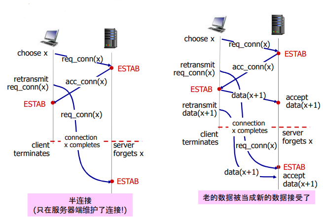


TCP 3次握手

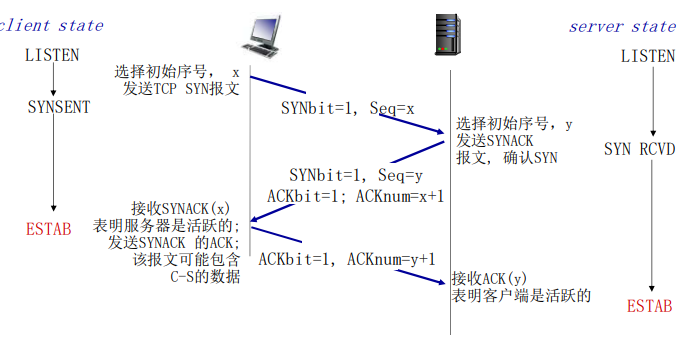

3次握手解决：半连接和接收老数据问题

方法：若连接不存在， 没建立起来；连接的序号不在当前连接的范围内，则丢弃数据


TCP：关闭连接

- 客户端，服务器分别关闭它自己这一侧的连接

  - 发送FIN bit = 1的TCP段

    > FIN：关闭连接
    >
    > SYN表示建立连接，FIN表示关闭连接，ACK表示响应

- 一旦接收到FIN，用ACK回应

  - 接到FIN段，ACK可以和它自己发出的FIN段一起发送

- 可以处理同时的FIN交换

  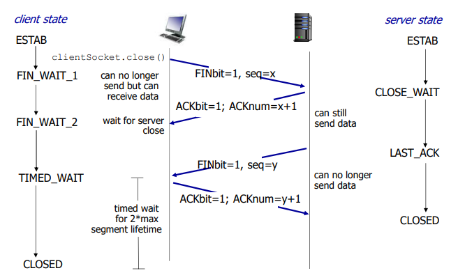


## 拥塞控制原理

- 拥塞：太多的数据需要网络传输，超过了网 络的处理能力
- 与流量控制不同
- 拥塞的表现
  - 分组丢失（路由器缓冲区溢出）
  - 分组经历比较长的延迟（在路由器的队列中排队）


### 拥塞原因与代价

情况1 ：两个发送方和一台具有无穷大缓存的路由器，输出链路带宽为R且没有重传

吞吐量上限由两条连接之间共享链路容量造成，即最大为R/2，当发送速率在0~R/2之间，接收方的吞吐量等于发送方的发送速率

当发送速率接近R/2，排队时延陡增，平均时延陡增

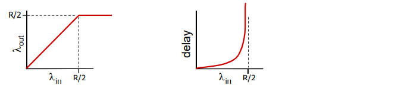


情况2：两个发送方和一台具有有限缓存的路由器

- 分组丢失时，发送端重传
  - 应用层的输入=应用层输出：$\lambda_{in}=\lambda_{out}$
  - 传输层的输入包括重传：$\lambda_{in}\geq\lambda_{out}$


理想化1：发送端知道什么时候路由器的缓冲是可用的

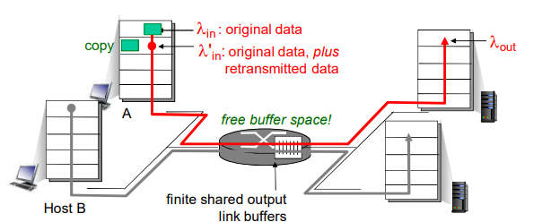

- 只在缓冲可用时发送
- 不会丢失：$\lambda_{in^{'}}=\lambda_{in}$


理想化2：掌握丢失信息，分组可以丢失，在路由器由于缓冲器满而被丢弃，若知道分组丢失了，发送方重传分组

当以R/2的速度发送时 , 一些分组是重传的 ，有效输出渐进逼近R/2，在发送方不仅包括发送的数据还包括重传数据

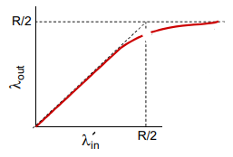


现实情况：重复

- 分组可能丢失，由于缓冲器满而被丢弃

- 发送端最终超时，发送第2个拷贝，2个分组都被传出

- 输出比输入少原因

  - 重传的丢失分组
  - 没有必要重传的重复分组

  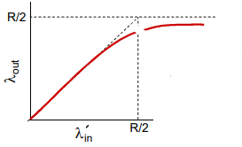

- 拥塞的“代价”

  - 为了达到一个有效输出，网络需要做更多的工作（重传）
  - 没有必要的重传，链路中包括了多个分组的拷贝，是那些没有丢失，经历的时间比较长（拥塞状态）但是超时的分组


情况3：4个发送方和具有有限缓存的多台路由器及多跳路径

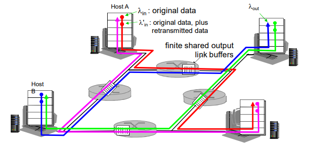

当分组丢失时，任何“关于这个分组的上游传输能力” 都被浪费了，最终形成死锁

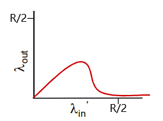


### 拥塞控制方法

端到端拥塞控制

- 没有来自网络的显式反馈
- 端系统根据延迟和丢失事件推断是否有拥塞
- TCP采用的方法

网络辅助的拥塞控制

- 路由器提供给端系统以反馈信息
  - 单个bit置位，显示有拥塞（SNA, DECbit,  TCP/IP ECN, ATM）
  - 显式提供发送端可以采用的速率


案例分析：ATM ABR 拥塞控制（网络辅助的拥塞控制）

ATM发送的数据为信元


ABR: available bit rate

- “弹性服务”
- 如果发送端的路径“轻载 ”，发送方使用可用带宽
- 如果发送方的路径拥塞了，发送方限制其发送的速度到一个最小保障速率上


RM (资源管理) 信元（显示通知）

- 由发送端发送，在数据信元中间隔插入
- RM信元中的比特被交换机设置（“网络辅助”）
  - NI bit: no increase in  rate (轻微拥塞)速率不要增加
  - CI bit: congestion  indication 拥塞指示
- 发送端发送的RM信元被接收端返回，接收端不做任何改变
- 在RM信元中的2个字节 ER (explicit rate)字段
  - 拥塞的交换机可能会降低信元中ER的值
  - 发送端发送速度因此是最低的可支持速率
- 数据信元中的EFCI bit: 被拥塞的交换机设置成1，如果在管理信元RM前面的数据信元EFCI被设置成了1, 接收端在返回的RM信元中设置CI bit


## TCP拥塞控制

端到端的拥塞控制机制

- 路由器不向主机有关拥塞的反馈信息
  - 路由器的负担较轻
  - 符合网络核心简单的 TCP/IP架构原则
- 端系统根据自身得到的信息 ，判断是否发生拥塞，从而采取动作


**拥塞感知（发送端如何探测到拥塞）**

- 某个段超时了（丢失事件 ）：拥塞
  - 超时时间到，某个段的确认没有来
  - 原因1：网络拥塞（某个路由器缓冲区没空间了，被丢弃）概率大
  - 原因2：出错被丢弃了（各级错误，没有通过校验，被丢弃）概率小
  - 一旦超时，就认为拥塞了，有一定误判，但是总体控制方向是对的
- 有关某个段的3次重复ACK：轻微拥塞
  - 段的第1个ack，正常，确认绿段，期待红段
  - 段的第2个重复ack，意味着红段的后一段收到了，蓝段乱序到达
  - 段的第2、3、4个ack重复，意味着红段的后第2、3、4个段收到了 ，橙段乱序到达，同时红段丢失的可能性很大（后面3个段都到了， 红段都没到）
  - 网络这时还能够进行一定程度的传输，拥塞但情况要比第一种好


**速率控制方法（如何控制发送端发送的速率）**

- 维持一个拥塞窗口的值：Congestion window，cwnd

- 发送端限制已发送但是未确认的数据量（的上限）：$LastByteSent-LastByteAcked\leq \min\{cwnd,rwnd\}$

- 从而粗略地控制发送方的往网络中注入的速率：$rate\approx \frac{cwnd}{RTT}$

- cwnd是动态的，是感知到的网络拥塞程度的函数

  - 超时或者3个重复ack，cwnd 下降

    - 超时时：cwnd降为1MSS，进入SS阶段然后再倍增到 cwnd/2（每个RTT），从而进入CA（拥塞避免）阶段

      > MSS（最大报文段长度）=MTU - IP head- TCP head

    - 3个重复ack ：cwnd降为cwnd/2，CA阶段

  - 否则（正常收到Ack，没有发送以上情况）：cwnd上升

    - SS阶段：加倍增加（每个RTT）
    - CA阶段：线性增加（每个RTT）

- 联合控制的方法

  - 发送端控制发送但是未确认的量同时也不能够超过接收窗口，满足流量控制要求
  - 同时满足拥塞控制和流量控制要求


**拥塞控制策略**

TCP 慢启动（slow-start，SS）

- 连接刚建立，cwnd = 1 MSS
- 可用带宽可能接近MSS/RTT，此时应该尽快加速，到达希望的速率
- 当连接开始时，指数性增加发送速率，直到发生丢失的事件
  - 启动初值很低
  - 增加速度很快
- 当连接开始时，指数性增加（每个RTT）发送速率直到发生丢失事件
  - 每一个RTT，cwnd加倍
  - 每收到一个ACK时，cwnd加1
  - 慢启动阶段：只要不超时或3个重复ack，一个RTT，cwnd加倍
- 总结：初始速率很慢，但是加速却是指数性的
  - 指数增加，SS时间很短，长 期来看可以忽略
- 例子：喝酒


TCP 拥塞控制：AIMD

- 乘性减：丢失事件后将cwnd降为1，将cwnd/2作为阈值，进入慢启动阶段（倍增直到 cwnd/2） 
- 加性增：当cwnd>阈值时，一个RTT如没有发生丢失事件，将cwnd加1MSS进行探测
- 在超时之前，当cwnd变成上次发生超时的窗口的一半，将指数性增长变成线性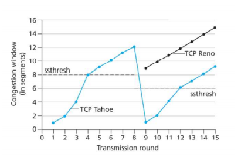

- 变量：Threshold

- 出现丢失，Threshold设置成cwnd的1/2


TCP拥塞控制总结：

- 当cwnd＜Threshold，发送端处于慢启动阶段（ slow-start）, 窗口指数性增长
- 当cwnd > Threshold，发送端处于拥塞避免阶段 （congestion-avoidance）, 窗口线性增长
- 当收到三个重复的ACKs（triple duplicate ACK），Threshold设置成 cwnd/2，cwnd = Threshold+3
- 当超时事件发生时timeout，Threshold = cwnd/2  cwnd=1MSS，进入SS阶段

| 事件                                   | 状态           | TCP 发送端行为                                       | 解释                                        |
| -------------------------------------- | -------------- | ---------------------------------------------------- | ------------------------------------------- |
| 以前没有收到 ACK的data  被ACKed        | 慢启动 (SS)    | cwnd = cwnd + MSS if（cwnd > Threshold）状态变成“CA” | 每一个RTT cwnd 加倍                         |
| 以前没有收到 ACK的data  被ACKed        | 拥塞避 免 (CA) | cwnd = cwnd + MSS *（MSS/cwnd）                      | 加性增加，每一个RTT对 cwnd 加一个1 MSS      |
| 通过收到3个重 复的ACK，发现 丢失的事件 | SS or CA       | Threshold = cwnd/2，cwnd = Threshold+3               | 快速重传，实现乘性的减. cwnd 没有变成1  MSS |
| 超时                                   | SS or CA       | Threshold = cwnd/2，cwnd = 1MSS，状态变为SS          | 进入slow start                              |
| 重复的 ACK                             | SS or CA       | 对被ACKed 的segment，增加重复ACK的计数               | cwnd和Threshold不变                         |


TCP 吞吐量：忽略慢启动阶段，假设发送端总有数据传输

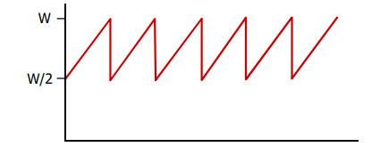

- W：发生丢失事件时的窗口尺寸（单位：字节）

- 平均窗口尺寸：3/4W

- 平均吞吐量：RTT时间吞吐3/4W

  > $T=\frac{\frac{W}{2}+W}{2RTT}=\frac{3}{4}\frac{W}{RTT}$


**TCP公平性**

若K个TCP会话分享一个链路带宽为R的瓶颈，每一个会话的有效带宽为 R/K

2个竞争的TCP会话

- 加性增加，斜率为1, 吞吐量增加
- 乘性减，吞吐量比例减少


公平性和 UDP

- 多媒体应用通常不是用 TCP，应用发送的数据速率希望不受拥塞控制的节制
- 使用UDP：音视频应用泵出数据的速率是恒定的, 忽略数据的丢失
- 研究领域：TCP友好性


公平性和并行TCP连接

- 2个主机间可以打开多个并行的TCP连接
- 如Web浏览器

