网络应用的原理：网络应用协议的概念和实现方面

- 传输层的服务模型
- 客户-服务器模式
- 对等模式(peer-to-peer) 
- 内容分发网络

<!-- more -->

网络应用的实例：互联网流行的应用层协议

- HTTP
- FTP
- SMTP / POP3 /  IMAP
- DNS

编程：网络应用程序

- Socket API


## 应用层协议原理

### 创建一个新的网络应用

- 编程
  1. 在不同的端系统上运行
  2. 通过网络基础设施提供的服务，应用进程彼此通信
  3. 如Web
     - Web 服务器软件与浏览器软件通信 

- 网络核心中没有应用层软件
  - 网络核心没有应用层功能
  - 网络应用只在端系统上存在
  - 促进网络应用快速开发和部署


### 应用程序体系结构

- 客户-服务器模式（C/S:client/server）
- 对等模式(P2P:Peer To Peer)
- 混合体模式：客户-服务器和对等体系结构


#### C/S体系结构 

- 服务器
  - 一直运行
  - 固定的IP地址和众知的端口号（约定）
  - 扩展性：服务器场
    - **数据中心**进行扩展
    - 扩展性差
- 客户端
  - 主动与服务器通信
  - 与互联网有间歇性的连接
  - 可能是动态IP 地址
  - 不直接与其它客户端通信

> C/S体系结构达到一定阈值时呈现断崖式下降


#### P2P体系结构

- （几乎）没有一直运行的服务器
- 任意端系统之间可以进行通信
- 每一个节点既是客户端又是服务器
  - **自扩展性**：新peer节点带来新的服务能力，同时也带来新的服务请求
- 参与的主机间歇性连接且可以改变IP地址
  - 难以管理
- 例子：Gnutella，迅雷


#### 混合体模式

Napster（一个P2P文件分发系统）

- 文件搜索：集中
  - 主机在中心服务器上注册其资源
  - 主机向中心服务器查询资源位置
- 文件传输：P2P
  - 任意Peer节点之间

即时通信

- 在线检测：集中
- 当用户上线时，向中心服务器注册其IP地址
- 用户与中心服务器联系，以找到其在线好友的位置
- 两个用户之间聊天：P2P


### 进程通信

进程：在主机上运行的应用程序

- 在同一个主机内，使用进程间通信机制通信（ 操作系统定义）
- 不同主机，通过交换报文（Message）来通信
  - 使用OS提供的通信服务
  - 按照应用协议交换报文（借助传输层提供的服务）


- 客户端进程：发起通信的进程 

- 服务器进程：等待连接的进程

  > P2P架构的应用也有客户端进程和服务器进程之分


分布式进程通信需要解决的问题

1. 进程标示和寻址问题（服务用户）
2. 传输层-应用层使用提供服务是如何（服务）
   - 位置：层间界面的SAP （TCP/IP ：socket）
   - 形式：应用程序接口API （TCP/IP ：socket API）
3. 如何使用传输层提供的服务，实现应用进程之间的报文交换，实现应用（用户使用服务）
   - 定义应用层协议：报文格式，解释，时序等
   - 编制程序，使用OS提供的API ，调用网络基础设施提供通信服务传报文，实现应用时序等；

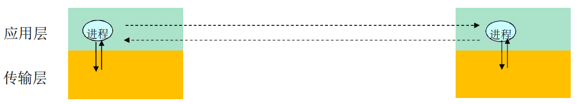


#### 进程寻址

进程为了接收报文，必须有一个标识即：SAP（发送也需要标示），进程至少需要三个标示

- 主机：唯一的 32位IP地址
  - 仅仅有IP地址不能够唯一标示一个进程
  - 在一台端系统上有很多应用进程在运行
- 所采用的传输层协议：TCP or UDP
- 端口号（Port Numbers），65536个端口号，16位

一些知名端口号的例子

- HTTP：TCP 80 
- Mail：TCP 25 
- FTP：TCP 2

一个进程：用IP+port标示端节点

本质上，一对主机进程之间的通信由2个端节点构成


#### 传输层提供的服务-需要穿过层间的信息

层间接口必须要携带的信息

- 要传输的报文（对于本层来说：SDU）
- 谁传的：对方的应用进程的标示：IP+TCP(UDP) 端口
- 传给谁：对方的应用进程的标示：对方的IP+TCP(UDP)端口号

传输层实体（tcp或者udp实体）根据这些信息进行TCP 报文段（UDP数据报）的封装

- 源端口号，目标端口号，数据等
- 将IP地址往下交IP实体，用于封装IP数据报：源IP，目标IP


如果Socket API 每次传输报文，都携带如此多的信息，太繁琐易错，不便于管理，用个代号标示通信的双方或者单方即socket，就像OS打开文件返回的句柄（对句柄的操作，就是对文件的操作）一样


##### TCP socket

- TCP服务，两个进程之间的通信需要之前要建立连接
  -  两个进程通信会持续一段时间，通信关系稳定
- 可以用一个整数表示两个应用实体之间的**通信关系** ，**本地标示**
- 穿过层间接口的信息量最小
- 便于操作系统管理
- TCP socket：源IP，源端口，目标IP，目标IP，目标端口

> TCP之上的套接字（socket）
>
> 对于使用面向连接服务（TCP）的应用而言，套接字是4元组的一个具有本地意义的标示
>
> - **4元组：源IP，源port，目标IP，目标port**
> - 唯一的指定了一个会话（2个进程之间的会话关系）
> - 应用使用这个标示，与远程的应用进程通信
> - 不必在每一个报文的发送都要指定这4元组
> - 就像使用操作系统打开一个文件，OS返回一个文件句柄一样，以后使用这个文件句柄，而不是使用这个文件的目录名、文件名 
> - 简单，便于管理

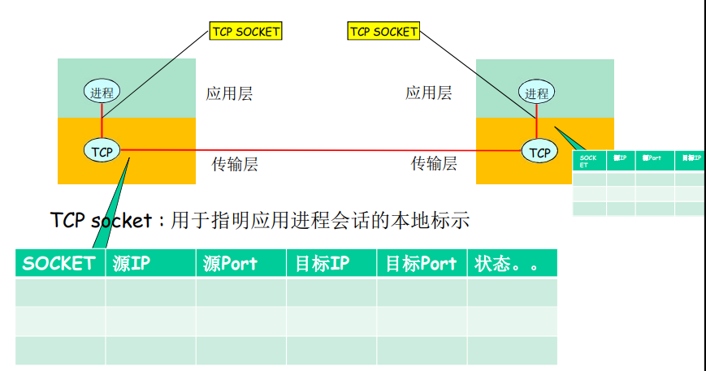


##### UDP socket

- UDP服务，两个进程之间的通信之前无需建立连接
  - 每个报文都是独立传输的
  - 前后报文可能给不同的分布式进程
- 因此，只能用一个整数表示**本应用实体**的标示，因为这个报文可能传给另外一个分布式进程
- 穿过层间接口的信息大小最小
- UDP socket：本IP，本端口
- 传输报文时：必须要提供对方IP，port

> UDP之上的套接字（socket）
>
> 对于使用无连接服务（UDP）的应用而言，套接字是2元组的一个具有本地意义的标示
>
> - **2元组：IP，port （源端指定）**
> - UDP套接字指定了应用所在的一个端节点（end  point）
> - 在发送数据报时，采用创建好的本地套接字（标示 ID），就不必在发送每个报文中指明自己所采用的IP和port
> - 但是在发送报文时，必须要指定对方的IP和UDP port(另外一个端节点)

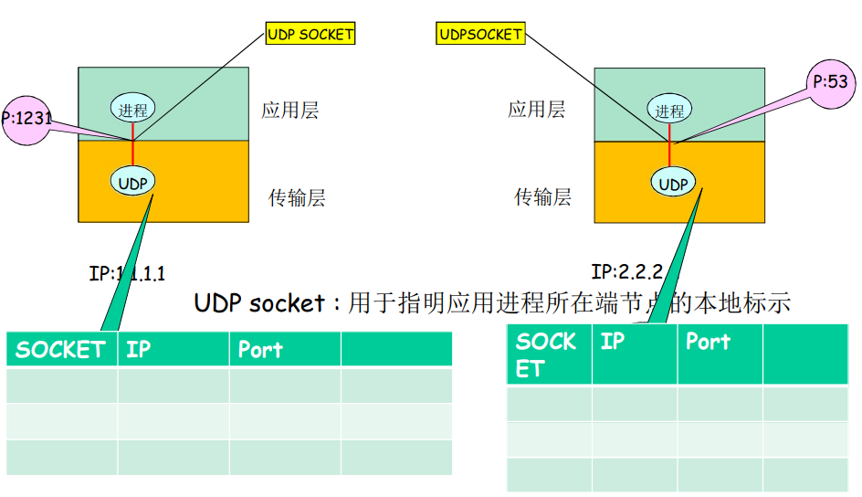


套接字

进程向套接字发送报文或从套接字接收报文

套接字类似于门户

- 发送进程将报文推出门户，发送进程依赖于传输层设施在另外一侧的 门将报文交付给接受进程
- 接收进程从另外一端的门户收到报文（依赖于传输层设施）


#### 应用层协议

定义运行在不同端系统上的应用进程如何相互交换报文

- 交换的**报文类型**：请求和应答报文
- 各种报文类型的**语法**：报文中的各个字段及其描述
- 字段的**语义**：即字段取值的含义
- 进程何时、如何发送报文及对报文进行响应的**规则**

应用协议仅仅是应用的一个组成部分

- 如Web应用包含HTTP协议，web客户端，web服务器，HTML文件解释

公开协议

- 由RFC文档定义
- 允许互操作
- 如HTTP, SMTP

专用（私有）协议

- 协议不公开
- 如：Skype


传输层提供服务的性能指标

- 数据丢失率
  - 有些应用则要求100%的可靠数据传输（如文件）
  - 有些应用（如音频）能容忍 一定比例以下的数据丢失 
- 延迟
  - 一些应用出于有效性考虑，对数据传输有严格的时间限制
    - Internet 电话、交互式游戏
    - 延迟、延迟差 
- 吞吐
  - 一些应用（如多媒体）必须需要最小限度的吞吐，从而使得应用能够有效运转
  - 一些应用能充分利用可供使 用的吞吐(弹性应用) 
- 安全性
  - 机密性
  - 完整性
  - 可认证性（鉴别）


常见应用对传输服务的要求

|    应用    | 数据丢失率 |                    吞吐                     | 时间敏感性 |
| :--------: | :--------: | :-----------------------------------------: | :--------: |
|  文件传输  |  不能丢失  |                    弹性                     |     不     |
|   e-mail   |  不能丢失  |                    弹性                     |     不     |
|  Web 文档  |  不能丢失  |                    弹性                     |     不     |
| 实时音视频 |  容忍丢失  | 音频：5kbps~1Mbps       视频：100kbps~5Mbps | 是，100ms  |
| 存储音视频 |  容忍丢失  | 音频：5kbps~1Mbps       视频：100kbps~5Mbps |  是，几秒  |
| 交互式游戏 |  容忍丢失  |                几kbps~10kbps                | 是，100ms  |
|  即时讯息  |  不能丢失  |                    弹性                     |     是     |


### Internet 传输层提供的服务

#### TCP 服务

- 可靠的传输服务
- 流量控制：发送方不会淹没接受方
- 拥塞控制：当网络出现拥塞时，能抑制发送方
- 不能提供的服务：时间保证、最小吞吐保证和安全
- 面向连接：要求在客户端进程和服务器进程之间建立连接


#### UDP 服务

- 不可靠数据传输
- 不提供的服务：可靠， 流量控制、拥塞控制、 时间、带宽保证、建立连接

UDP存在的必要性

- 能够区分不同的进程，而IP服务不能
  - 在IP提供的主机到主机端到端功能的基础上，区分了主机的应用进程
- 无需建立连接，省去了建立连接时间，适合事务性的应用
- 不做可靠性的工作，例如检错重发，适合那些对实时性要求比较高而对正确性要求不高的应用
  - 因为为了实现可靠性（准确性、保序等），必须付出时间代价（检错重发）
- 没有拥塞控制和流量控制，应用能够按照设定的速度发送数据
  - 而在TCP上面的应用，应用发送数据的速度和主机向网络发送的实际速度是不一致的，因为有流量控制和拥塞控制


#### Internet应用及其应用层协议和传输协议

|     应用     |         应用层协议         | 下层的传输协议 |
| :----------: | :------------------------: | :------------: |
|    e-mail    |            SMTP            |      TCP       |
| 远程终端访问 |           Telnet           |      TCP       |
|     Web      |            HTTP            |      TCP       |
|   文件传输   |            FTO             |      TCP       |
|    流媒体    | 专用协议（如RealNetworks） |    TCP或UDP    |
| Internet电话 |  专用协议（如Net2Phone）   |    TCP或UDP    |


#### 安全TCP 

TCP & UDP 

- 都没有加密
- 明文通过互联网传输 ，甚至密码

SSL（安全套接字层）

- 在TCP上面实现，提供加密的TCP连接
- 私密性
- 数据完整性
- 端到端的鉴别

SSL在应用层

- 应用采用SSL库，SSL 库使用TCP通信

SSL socket API

- 应用通过API将明文交 给socket，SSL将其加密在互联网上传输


## Web和HTTP

Web页由一些**对象**组成，对象可以是HTML文件、JPEG图像、Java小程序、声音剪辑文件等

Web页含有一个基本的HTML文件，该基本HTML文件又包含若干对象的引用（链接）

通过URL对每个对象进行引用，URL包含访问协议，用户名，口令字，端口等；

Prot:（协议名）//user:psw（用户，口令）@www.someSchool.edu（主机名）/someDept（路径名）/pic.gif（文件名）:port（端口号）


### HTTP概况

HTTP: 超文本传输协议

- Web的应用层协议

- 客户/服务器模式

  - 客户: 请求、接收和显示 Web对象的浏览器
  - 服务器: 对请求进行响应，发送对象的Web服务器

  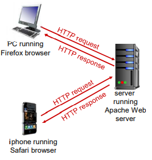

- HTTP 1.0：RFC 1945

- HTTP 1.1：RFC 2068


HTTP使用TCP协议

- 客户发起一个与服务器的 TCP连接 (建立套接字) ， 端口号为 80
- 服务器接受客户的TCP连接
- 在浏览器（HTTP客户端）与 Web服务器(HTTP服务器 server)交换HTTP 报文（应用层协议报文）
- TCP连接关闭

**HTTP是无状态的，即服务器并不维护关于客户的任何信息**

> 维护状态的协议很复杂
>
> - 必须维护历史信息(状态)
> - 如果服务器/客户端死机，它们的状态信息可能不一致， 然而二者的信息必须是一致的
> - 无状态的服务器能够支持更多的客户端


### HTTP连接

#### 非持久HTTP

- 最多只有一个对象在 TCP连接上发送
- 下载多个对象需要多个TCP连接
- HTTP/1.0使用非持久连接

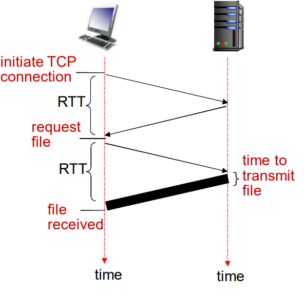

**响应时间模型**

往返时间RTT（round-trip  time）：一个小的分组从客户端到服务器，在回到客户端的时间（传输时间忽略） 

响应时间

- 一个  RTT用来发起TCP连接
- 一个 RTT用来HTTP请求并等待HTTP响应
- 文件传输时间
  - **共2RTT+传输时间**


非持久HTTP的缺点

- 每个对象要2个 RTT
- 操作系统必须为每个TCP连接分配资源
- 浏览器通常打开并行TCP连接，以获取引用对象


#### 持久HTTP

- 多个对象可以在一个 （在客户端和服务器之间的）TCP连接上传输
- HTTP/1.1 默认使用持久连接
- 服务器在发送响应后，仍保持 TCP连接
- 在相同客户端和服务器之间的后续请求和响应报文通过相同的连接进行传送
- 客户端在遇到一个引用对象的 候，就可以尽快发送该对象的请 求


非流水方式的持久HTTP

- 客户端只能在收到前一个响应后才能发出新的请求
- 每个引用对象花费一个RTT

流水方式的持久HTTP

- HTTP/1.1的默认模式
- 客户端遇到一个引用对象就立即产生一个请求
- 所有引用（小）对象只花费一个 RTT是可能的


### HTTP报文

两种类型的HTTP报文：请求、响应


#### HTTP请求报文

- ASCII（人能够阅读）

  ```ASCII
  GET /somedir/page.html HTTP/1.1                 请求行 (GET, POST, HEAD，PUT，DELETE命令)
  Host: www.someschool.edu  						首部行     主机名
  User-agent: Mozilla/4.0 						首部行     用户代理程序，浏览器版本
  Connection: close  								首部行		连接关闭
  Accept-language:fr  							首部行	    语言
  												换行回车符，表示报文结束
  ```

- 报文格式

  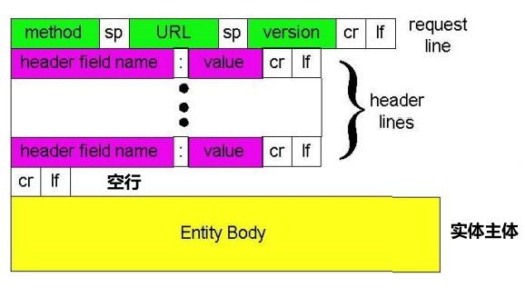

- 提交表单输入

  - Post方式

    - 网页通常包括表单输入
    - 包含在实体主体 (entity body )中的输入被提交到服务器

  - GET方式

    - 通过请求行的 URL字段输入数据上载

    - 如

      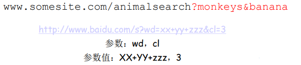

- 方法类型

  - HTTP/1.0

    - GET

    - POST

    - HEAD

      > 要求服务器在响应报文中不包含请求对象，通常用于调试跟踪或搜索引擎建立索引

  - HTTP/1.1

    - GET, POST, HEAD

    - PUT

      > 将实体主体中的文件上载到URL字段规定的路径

    - DELETE

      > 删除URL字段规定的文件

    

#### HTTP响应报文

- ASCII

  ```ASCII
  HTTP/1.1 200 OK\r\n								状态行 (协议版本、状态码和相应状态信息)
  Connection close\r\n							首部行 	连接关闭
  Date: Thu, 06 Aug 1998 12:00:15 GMT\r\n			首部行 	日期和时间
  Server: Apache/1.3.0 (Unix) \r\n				首部行 	服务器类型版本
  Last-Modified: Mon, 22 Jun 1998 …... \r			首部行 	最后修改时间
  Content-Length: 6821\r\n						首部行 	内容字节长度
  Content-Type: text/html\r\n						首部行 	对象类型，此次指示位HTML文本
  	\r\n
  	\r\n
  data data data data data ... 					实体主体
  ```

- 响应状态码

  - 200 OK

    > 请求成功，请求对象包含在响应报文的后续部分 

  - 301 Moved Permanently

    > 请求的对象已经被永久转移了；新的URL在响应报文的Location: 首部行中指定
    >
    > 客户端软件自动用新的URL去获取对象 

  - 400 Bad Request

    > 一个通用的差错代码，表示该请求不能被服务器解读 

  - 404 Not Found

    > 请求的文档在该服务上没有找到

  - 505 HTTP Version Not Supported

    > 服务器不支持请求报文使用的HTTP协议版本

  


### 用户-服务器状态：cookie

大多数主要的门户网站使用 cookies

cookies有4个组成部分

1. 在HTTP响应报文中有一个cookie的首部行
2. 在HTTP请求报文含有一个cookie的首部行
3. 在用户端系统中保留有一个cookie文件，由用户的浏览器管理
4. 在Web站点有一个后端数据库


Cookie维护状态过程

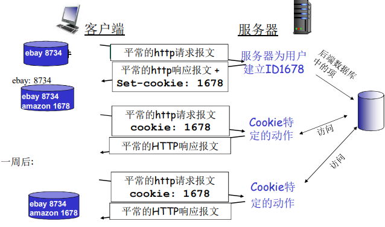

如何维持状态

- 协议端节点：在多个事务上，发送端和接收端维持状态
- cookies：HTTP报文携带状态信息


Cookies与隐私

- Cookies允许站点知道许多关于用户的信息
- 可能将它知道的东西卖给第三方
- 使用重定向和cookie的搜索引擎还能知道用户更多的信息
- 如通过某个用户在大量站点上的行为，了解其个人浏览方式的大致模式
- 广告公司从站点获得信息


### Web缓存（代理服务器）

目标：不访问原始服务器，就满足客户的请求

- 用户设置浏览器： 通过缓存访问Web
- 浏览器将所有的HTTP  请求发给缓存
  - 在缓存中的对象：缓存直接返回对象
  - 如对象不在缓存，缓存请求原始服务器，然后再将对象返回给客户端
- 缓存既是客户端又是服务器
- 通常缓存是由ISP安装 (大学、公司、居民区ISP)


使用Web缓存的优点

- 降低客户端的请求响应时间
- 可以大大减少一个机构内部网络与Internet接入链路上的流量
- 互联网大量采用了缓存： 可以使较弱的ICP也能够有效提供内容


**缓存示例**

假设

- 平均对象大小 = 100kb
- 机构内浏览器对原始服务器的平均请求率为 = 15请求/s
- 平均到浏览器的速率：1.5Mbps
- 机构内部路由器到原始服务器再返回到路由器的的延时（ Internet 延时）= 2s
- 接入链路带宽：1.54Mbps
- 局域网带宽：1Gbps

结果

- LAN的流量强度 =（15个请求/s）$\times$ （100kb/请求）/（1Gbps）= 15%
- 接入链路上的流量强度（15个请求/s）$\times$ （100kb/请求）/（1.54Mbps）=  99%
- 总延时 = LAN延时 + 接入延时 + Internet 延时 = ms + 分 + 2s，耗时太长，减少耗时可以采用提高宽带的方法


利用缓存减少耗时，计算链路利用率，有缓存的延迟

- 假设缓存命中率0.4
- 40%请求在缓存中被满足，其他60%的请求需要被原始服务器满足

则接入链路利用率

- 60%的请求采用接入链路
- 流量强度=（15个请求/s）$\times$ （100kb/请求）$\times$ 0,6/1.54 =0.58，则排队延时为毫秒级
- 总体延迟= 0.6 * (从原始服务器获取对象的延迟) +0.4 * (从缓存获取对象的延迟) = 0.6$\times$(10ms+排队延时+2s) + 0.4$\times$(毫秒级)  $\approx$1.2s
- 比安装154Mbps链路延时小且比较便宜


### 条件GET方法

目标：若缓存器中的对象拷贝是最新的，就不要发送对象

缓存器: 在HTTP请求中指定缓存拷贝的日期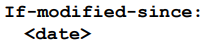

服务器: 如果缓存拷贝陈旧，则响应报文没包含对象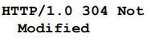

<br>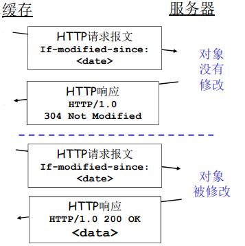


## FTP(文件传输协议)

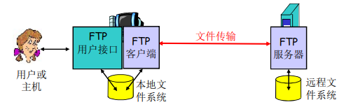

- 向远程主机上传输文件或从远程主机接收文件
- 客户/服务器模式
  - 客户端：发起传输的一方
  - 服务器：远程主机
- FTP：RFC 959
- FTP服务器：端口号为21


FTP：控制连接与数据连接分开

- FTP客户端与FTP服务器通过端口21联系，并使用TCP为传输协议
- 客户端通过控制连接获得身份确认
- 客户端通过控制连接发送命令浏览远程目录
- 收到一个文件传输命令时，服务器主动打开一个到客户端的数据连接
- 一个文件传输完成后，服务器关闭连接
- 服务器打开第二个TCP数据连接用来传输另一个文件
- 控制连接： 带外（ “out of band”  ）传送，传指令或者控制信息
- FTP服务器维护用户的状态信息：当前路径、用户帐户与控制连接对应
- 有状态协议，服务器需要维护客户端状态


FTP命令、响应

命令样例

- 在控制连接上以ASCII文本方式传送
- USER username
- PASS password
- LIST：请服务器返回远程主机当前目录的文件列表
- RETR filename：从远程主机的当前目录检索文件 (gets)，下载
- STOR filename：向远程主机的当前目录存放文件 (puts)，上载

返回码样例

- 状态码和状态信息 (同HTTP)
- 331 Username OK,  password required
- 125 data connection  already open;  transfer starting
- 425 Can’t open data  connection
- 452 Error writing  file


## E-mail(电子邮件)

### 主要组成部分

- 用户代理

  > 又名 “邮件阅读器” 
  >
  > 撰写、编辑和阅读邮件
  >
  > 如Outlook、Foxmail
  >
  > 输出和输入邮件保存在服务器上

- 邮件服务器

  > 邮箱中管理和维护发送给用户的邮件
  >
  > 输出报文队列保持待发送邮件报文
  >
  > 邮件服务器之间的SMTP协议：发送email报文
  >
  > - 客户：发送方邮件服务器
  > - 服务器：接收端邮件服务器

- 简单邮件传输协议：SMTP

  > 使用TCP在客户端和服务器之间传送报文，端口号为25
  >
  > 直接传输：从发送方服务器到接收方服务器
  >
  > 传输的3个阶段
  >
  > - 握手
  > - 传输报文
  > - 关闭
  >
  > 命令/响应交互
  >
  > - 命令：ASCII文本
  > - 响应：状态码和状态信息
  >
  > 命令/响应交互
  >
  > - 命令：ASCII文本
  > - 响应：状态码和状态信息
  >
  > 报文必须为7位ASCII码
  >
  > 
  >
  > SMTP使用持久连接
  >
  > SMTP要求报文（首部和主体）为7位ASCII编码
  >
  > SMTP服务器使用 CRLF.CRLF决定报文的尾部
  >
  > 
  >
  > 与HTTP比较
  >
  > - HTTP：拉（pull）
  > - SMTP：推（push）
  > - 二者都是ASCII形式的命令/响应交互、状态码
  > - HTTP：每个对象封装在各自的响应报文中
  > - SMTP：多个对象包含在一个报文中


### 邮件报文格式

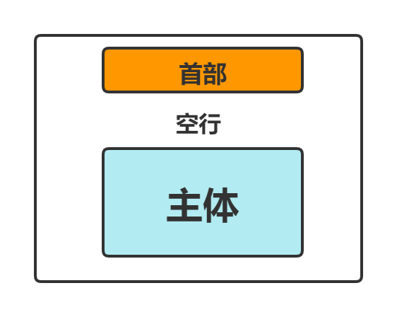

首部行：如

- To:
- From:
- Subject
- 与SMTP命令不同

主体

- 报文，只能是ASCII码字符

报文格式：多媒体扩展，类似编码和解码

- MIME：多媒体邮件扩展（multimedia mail extension）, RFC 2045, 2056

- 在报文首部用额外的行申明MIME内容类型

  ```
  From: alice@crepes.fr 
  To: bob@hamburger.edu 
  Subject: Picture of yummy crepe. 
  MIME-Version: 1.0 								MIME版本
  Content-Transfer-Encoding: base64 				数据的编码方式，如base64
  Content-Type: image/jpeg 						多媒体数据类型、子类型和参数申明
  base64 encoded data ..... 						编码好的数据
  ......................... 
  ......base64 encoded data 
  ```

  

### 邮件访问协议


- SMTP: 传送到接收方的邮件服务器
- 邮件访问协议：从服务器访问邮件
  - POP：邮局访问协议（Post Office Protocol）[RFC 1939]
    - 用户身份确认 (代理<-->服务器) 并下载
  - IMAP：Internet邮件访问协议（Internet Mail Access  Protocol）[RFC 1730]
    - 更多特性 (更复杂)
    - 在服务器上处理存储的报文
  - HTTP：Hotmail , Yahoo! Mail等
    - 方便


#### POP3协议

用户特许阶段

- 客户端命令
  - user: 申明用户名
  - pass: 口令
- 服务器响应
  - +OK，指示前面的命令正常
  - -ERR ，指示前面的命令出现错误

事物处理阶段, 客户端

- list：报文号列表
- retr：根据报文号检索报文
- dele：删除
- quit

更新阶段

- 在客户端发出quit命令后，结束POP3会话
- 邮件服务器删除被标记的报文

用户代理方式

- “ 下载并删除”模式
  - 如果改变客户机，Bob不能阅读邮件
- “下载并保留”模式
  - 不同客户机上为报文的拷贝


POP3在会话中是无状态的

POP3访问后，本地下载邮件，是在本地管理文件夹


#### IMAP协议

IMAP服务器将每个报文与一个文件夹联系起来

允许用户用目录来组织报文

允许用户读取报文组件

IMAP在会话过程中维护用户状态

- 目录名、报文ID与目录名之间映射

IMAP是远程管理文件夹


## DNS

DNS（Domain Name System，域名系统）：因特网的目录服务


DNS的必要性

- IP地址标识主机、路由器便于解析，但IP地址较于字符串不好记忆，不便人类使用（没有意义）
- 则存在着字符串---IP地址转换的必要性
- 人类用户提供要访问机器的字符串名称，由DNS负责转换成为二进制的网络地址


DNS的主要思路

- 分层的、基于域的命名机制
- 若干分布式的数据库完成名字到IP地址的转换
- 运行在UDP之上端口号为53的应用服务
- 核心的Internet功能，但以应用层协议实现
  - 在网络边缘处理复杂性


DNS主要目的

- 实现主机名-IP地址的转换(name/IP translate) 
- 其它目的
  - 主机别名到规范主机名的转换（Host aliasing）
  - 邮件服务器别名到邮件服务器的正规名字的转换（Mail server  aliasing）
  - 负载均衡（Load Distribution）


DNS工作过程

- DNS应用调用解析器（resolver）
- 解析器作为客户向Name Server发出查询报文（封装在UDP段中）
- Name Server返回响应报文（name/ip）


DNS系统需要解决的问题

1. 如何命名设备
   - 用有意义的字符串：好记，便于人类使用
   - 解决一个平面命名的重名问题：层次化命名
2. 如何完成名字到IP地址的转换
   - 分布式的数据库维护和响应名字查询
3. 如何维护：增加或者删除一个域，需要在域名系统中做哪些工作


### DNS域名结构

一个层面命名设备会有很多重名

DNS采用层次树状结构的命名方法，树叶是主机

Internet 根被划为几百个顶级域（top lever domains）

- 通用的(generic) 
  - .com; .edu ; .gov ; .int ; .mil ; .net ; .org ; .firm ; .hsop ; .web ; .arts ; .rec
- 国家的(countries)
  - .cn ; .us ; .nl ; .jp

 每个（子）域下面可划分为若干子域（subdomains）

**DNS名字空间**

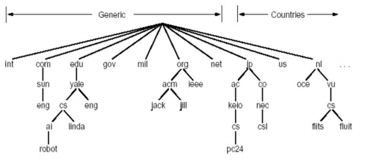

域名(Domain Name)

- 从本域往上，直到树根
- 中间使用“.”间隔不同的级别
- 例如
  - ustc.edu.cn
  - auto.ustc.edu.cn
  - www.auto. ustc.edu.cn
- 域的域名：可以用于表示一个域
- 主机的域名：一个域上的一个主机


域名的管理

- 一个域管理其下的子域，如 .jp 被划分为 ac.jp co.jp    .cn 被划分为 edu.cn com.cn
- 创建一个新的域，必须征得它所属域的同意


域与物理网络无关

- 域遵从组织界限，而不是物理网络
  - 一个域的主机可以不在一个网络
  - 一个网络的主机不一定在一个域
- 域的划分是逻辑的，而不是物理的

​    

### 名字服务器（Name Server）

单个名字服务器存在的问题

- 可靠性问题：单点故障
- 扩展性问题：通信容量
- 维护问题：远距离的集中式数据库

区域（zone）

- 区域的划分有区域管理者自己决定
- 将DNS名字空间划分为互不相交的区域，每个区域都是树的一部分
- 名字服务器
  - 每个区域都有一个名字服务器：维护着它所管辖区域的**权威信息**（authoritative record）
  - 名字服务器允许被放置在区域之外，以保障可靠性
  - 区域名字服务器维护**资源记录**


权威DNS服务器：组织机构的DNS服务器， 提供组织机构服务器（如 Web和mail）可访问的主机和IP之间的映射

- 组织机构可以选择实现自己维护或由某个服务提供商来维护

顶级域(TLD)服务器：负责顶级域名（如com, org, net,  edu和gov）和所有国家级的顶级域名（如cn, uk, fr, ca,  jp ）

- Network solutions 公司维护com TLD服务器
- Educause公司维护edu TLD服务

根DNS服务器：提供TLD服务器的IP地址

- 有400多个，有13个不同的组织管理

本地名字服务器（Local Name Server）

- 并不严格属于层次结构
- 每个ISP（居民区的ISP、公司、大学）都有一 个本地DNS服务器
- 也称为“默认名字服务器” 
- 当一个主机发起一个DNS查询时，查询被送到其本地DNS服务器
  - 起着代理的作用，将查询转发到层次结构中


名字解析过程

- 目标名字在Local Name Server中

  - 情况1：查询的名字在该区域内部
  - 情况2：存在缓存（cashing），直接将缓存信息返回

- 递归查询

  - 名字解析负担都放在当前联络的名字服务器上
  - 问题：根服务器的负担太重
  - 解决：迭代查询 (iterated  queries)

  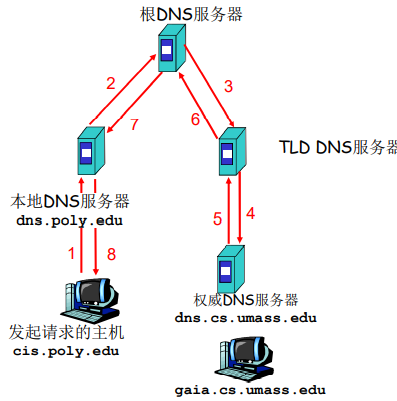

- 迭代查询

  - 根（及各级域名）服务器返回的不是查询结果，而是下一个NS的地址

  - 最后由权威名字服务器给出解析结果

  - 当前联络的服务器给出可以联系的服务器的名字

    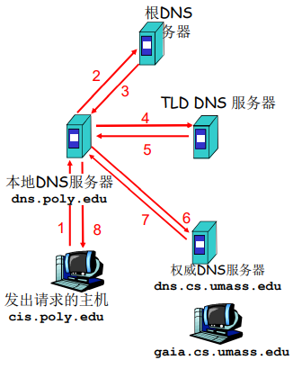


提高性能：缓存

- 一旦名字服务器学到了一个映射，就将该映射缓存起来
- 根服务器通常都在本地服务器中缓存着
  - 使得根服务器不用经常被访问
- 目的：提高效率
- 可能存在的问题：如果情况变化，缓存结果和权威资源记录不一致
  - 解决方案：TTL（默认2天）


### DNS记录和报文

资源记录（resource records，RR）

- 作用：维护 域名-IP地址（其它）的映射关系

- 位置：Name Server的分布式数据库中

- RR格式：(name, value, type, TTL)

  - Domain_name：域名

  - TTL（time to live）：生存时间，决定了资源记录应当从缓存中删除的时间（若维护的是权威信息，则是长期的；若为缓冲记录，则是短期的，基本为2天）

  - Class 类别：对于Internet，值为IN

  - Value 值：可以是数字，域名或ASCII串

  - Type 类别：资源记录的类型

    > Type=A
    >
    > - Name 为主机
    > - Value 为IP地址
    >
    > Type=CNAME
    >
    > - Name 为规范名字的别名
    > - value 为规范名字
    >
    > Type=MX
    >
    > - Value为name对应的邮件服务器的名字
    >
    > Type=NS
    >
    > - Name域名(如foo.com)
    > - Value为该域名的权威服务器的域名


DNS协议：查询和响应报文的报文格式相同

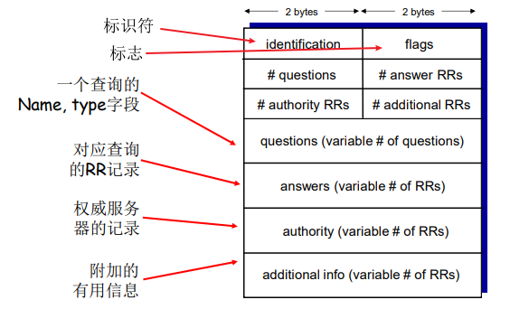

- 标识符（ID）：16位
- flags
  - 查询（0）/应答（1）
  - 希望递归
  - 递归可用
  - 应答为权威


维护问题：新增一个域

- 在上级域的名字服务器中增加两条记录，指向这个新增 的子域的域名和域名服务器的地址
- 在新增子域的名字服务器上运行名字服务器，负责本域的名字解析： 名字->IP地址

例子：在com域中建立一个“Network Utopia” 

- 到注册登记机构注册域名networkutopia.com
  - 需要向该机构提供权威DNS服务器（基本的、和辅助的）的名字和IP地址
  - 登记机构在com TLD服务器中插入两条RR记录
    - (networkutopia.com, dns1.networkutopia.com, NS) 
    - (dns1.networkutopia.com, 212.212.212.1, A) 
- 在networkutopia.com的权威服务器中确保有
  - 用于Web服务器的www.networkuptopia.com的类型为A的记录
  - 用于邮件服务器mail.networkutopia.com的类型为MX的记录


### DNS安全性

分布式拒绝服务（DDoS）带宽洪泛攻击

- 对根服务器进行流量轰炸攻击：发送大量ping
  - 没有成功
  - 原因１：根目录服务器配置 了流量过滤器，防火墙
  - 原因２：Local DNS 服务器缓存了TLD服务器的IP地址,  因此无需查询根服务器
- 向TLD服务器流量轰炸攻击：发送大量查询
  - 效果一般，大部分DNS缓存了TLD

重定向攻击

- 中间人攻击

  - 截获查询，伪造回答，从而攻击某个（DNS回答指定的IP）站点

- DNS中毒

  - 发送伪造的应答给DNS服务器，希望它能够缓存这个虚假的结果

- 技术上较困难：分布式截获和伪造

利用DNS基础设施进行DDoS

- 伪造某个IP进行查询， 攻击这个目标IP

- 查询放大，响应报文比查询报文大

- 效果有限

  总的说来，DNS比较健壮


## P2P文件分发

纯P2P架构

- 没有（或极少）一直运行的服务器
- 任意端系统都可以直接通信
- 利用peer的服务能力
- Peer节点间歇上网，每次IP地址都有可能变化
- 例子
  - 文件分发 （BitTorrent）
  - 流媒体
  - VoIP（Skype）


### P2P的扩展性

例：从一台服务器分发文件（大小F）到N个peer，耗时D

- C/S模式：$D_{CS}\geq\max\{{\frac{NF}{u_s},\frac{F}{d_{min}}}\}$

- P2P模式：$D_{P2P}\geq\max\{\frac{F}{u_s},\frac{F}{d_{min}},\frac{NF}{u_s+\sum_{i=1}^Nu_i}\}$

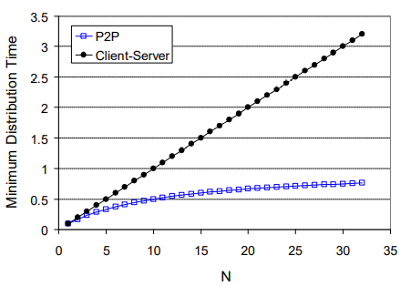

如图所示，C/S模式随着对等方数量增加，分发时间呈线性增长并且无界，P2P模式最小分发时间不仅总是小于C/S模式的分发时间，且小于任意的对等方数量N，总小于1小时

P2P体系结构的应用具有自扩展性


### P2P管理模式

- 非结构化P2P：节点与节点之间的关系是任意的

  - 集中式目录：文件传输是分散的， 而定位内容是高度集中的

    - 存在的问题：单点故障；性能瓶颈；侵犯版权

  - 查询洪泛：Gnutella

    - 全分布式：没有中心服务器

    - 开放文件共享协议

    - 许多Gnutella客户端实现了Gnutella协议

      > Gnutella：协议
      >
      > - 在已有的TCP连接上发送查询报文
      >
      > - 对等方转发查询报文
      >
      > - 以反方向返回查询命中报文
      >
      >   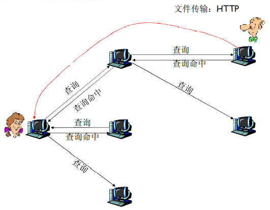

  - 利用不匀称性：KaZaA

    > KaZaA：查询
    >
    > - 每个文件有一个散列标识码和一个描述符
    > - 客户端向其组长发送关键字查询
    > - 组长用匹配进行响应
    >   - 对每个匹配：元数据、散列标识码和IP地址
    > - 如果组长将查询转发给其他组长，其他组长也以匹配进行响应
    > - 客户端选择要下载的文件
    >   - 向拥有文件的对等方发送一个带散列标识码的HTTP请求

- DHT（分布式散列表）结构化P2P：overlay（覆盖网，逻辑网络）是有序的

  - 哈希表
  - DHT方案
  - 环形DHT以及覆盖网络
  - Peer波动


#### BitTorrent(https://www.bilibili.com/video/BV1JV411t7ow?p=18)

- 文件被分为一个个块256KB
- 网络中的这些peers发送接收文件块，相互服务


## CDN

### 因特网视频

视频：固定速度显示的图像序列

网络视频特点

- 高码率：>10x于音频，高的网络带宽需求
- 可以被压缩
- 90%以上的网络流量是视频

数字化图像：像素的阵列

- 每个像素被若干bits表示

编码：使用图像内和图像间的冗余来降低编码的比特数

- 空间冗余（图像内）
- 时间冗余（相邻的图像间）

编码方式

- CBR（constant bit  rate）：以固定速率编码
- VBR（variable bit  rate）：视频编码速率随时间的变化而变化


### 多媒体流化服务：DASH

DASH（HTTP的动态适应性流）: Dynamic, Adaptive Streaming over HTTP

服务器

- 将视频文件分割成多个块
- 每个块独立存储，编码于不同码率（8-10种）
- 告示文件（manifest file）: 提供不同块的URL

客户端

- 先获取告示文件
- 周期性地测量服务器到客户端的带宽
- 查询告示文件,在一个时刻请求一个块，HTTP头部指定字节范围
- 如果带宽足够，选择最大码率的视频块
- 会话中的不同时刻，可以切换请求不同的编码块 (取决于当时的可用带宽) 

智能客户端：客户端自适应决定

- 什么时候去请求块 (不至于缓存挨饿，或者溢出)
- 请求什么编码速率的视频块 (当带宽够用时，请求高质量的视频块)
- 哪里去请求块 (可以向离自己近的服务器发送URL，或者向高可用带宽的服务器请求) 


### 内容分发网（CDN）

CDN：Content Distribution Networks

服务器如何通过网络向上百万用户同时流化视频内容 (上百万视频内容)?

通过CDN，全网部署缓存节点，存储服务内容，就近为用户提供服务，提高用户体验

- enter deep：将CDN服务器深入到许多接入网
  - 更接近用户，数量多，离用户近，高度分布式设计管理困难
  - 如Akamai, 1700个位置
- bring home：部署在少数(10个左右)关键位置，如将服务器簇安装于POP附近（离若干1stISP POP较近）
  - 采用租用线路将服务器簇连接起来
  - Limelight

用户从CDN中请求内容

- 通过DNS重定向到最近的拷贝，请求内容
- 如果网络路径拥塞，可能选择不同的拷贝


**集群选择策略**：动态的将客户定向到CDN中的某个服务器集群或数据中心的机制


## Socket编程

应用进程使用传输层提供的服务才能够交换报文，实现应用协议，实现应用

socket：分布式应用进程之间的门，传输层协议提供的端到端服务接口

应用进程使用Socket API访问传输服务

2种传输层服务的socket类型

- TCP: 可靠的、字节流的服务
- UDP: 不可靠（数据UDP数据报）服务

套接字：应用进程与端到端传输协议（TCP或UDP）之间的门户


### TCP套接字编程

TCP服务：从一个进程向另一个进程可靠地传输字节流

TCP连接过程：

服务器首先运行，等待连接建立

1. 服务器进程必须先处于运行状态

   - **创建**欢迎socket

   - 和本地端口**捆绑**

   - 在欢迎socket上阻塞式**等待接收**用户的连接

客户端主动和服务器建立连接

2. 创建客户端本地套接字（隐式捆绑到本地port）
   - 指定服务器进程的IP地址和端口 号，与服务器进程连接
3. 当与客户端连接请求到来时
   - 服务器接受来自用户端的请求 ，解除阻塞式等待，返回一个新的socket（与欢迎socket不一样），与客户端通信
     - 允许服务器与多个客户端通信
     - 使用源IP和源端口来区分不同的客户端
4. 连接API调用有效时，客户端与服务器建立了TCP连接

.png)


TCP Socket编程

```C
//IP地址和port捆绑关系的结构体（标示进程的端节点）
struct sockaddr_in {
	short sin_family; 					// AF_INET，地址簇
	u_short sin_port; 					// port
	struct in_addr sin_addr ; 			// IP address, unsigned long
	char sin_zero[8]; 					// align
};


//域名和IP地址的结构体
struct hostent{ 
    char *h_name;						//主机域名 
	char **h_aliases; 					//二维指针，主机别名
	int h_addrtype; 					
	int h_length;                       //地址长度
	char **h_addr_list; 				//IP地址列表
	#define h_addr h_addr_list[0];
};

/*
hostent作为调用域名解析函数时的参数
返回后，将IP地址拷贝到 sockaddr_in的IP地址部分
*/

//C语言编程参考资料PPT
```

```python
//应用程序客户端
from socket import *                                    //该模块形成python中网络通信基础
serverName = 'servername'								//使用服务器的主机名，将自动执行DNS lookup得到服务器的IP地址
serverPort = 12000
clientSocket = socket(AF_INET,SOCK_STREAM)				//创建客户端套接字，第一个参数指定地址簇，AF_INET指示底层网络															 使用IPv4.第二个参数指示该套接字为SOCK_STREAM类型，即为TCP															 套接字，客户端套接字的端口号由OS执行
clientSocket.connect((serverName,serverPort))			//建立TCP连接
sentence = raw_input('Input lowercase sentence:')		//获取用户输入
clientSocket.send(sentence.encode())					//通过客户的套接字进入TCP连接发送字符串sentence
modifiedSentence = clientSocket.recv(1024)			    //接收来自服务器的数据
print('From Server:',modifiedSentence.decode())			//打印数据
clientSocket.close()									//关闭客户套接字，TCP连接
```

```python
//应用程序服务器端
from socket import *                                    //导入套接字模块						
serverPort = 12000	
serverSocket = socket(AF_INET,SOCK_STREAM)				//服务器创建欢迎套接字
serverSocket.bind(('',serverPort))						//将端口号与套接字关联
serverSocket.listen(1)									//等待并接听客户，定义请求连接的最大数（至少为1）
print("The server is ready to receive")
while True:
    connectionSocket,addr = serverSocket.accept()		//创建连接套接字，w
    sentence = connectionSocket.recv(1024).decode()
    capitalizedSentence = sentence.upper()
    connectionSocket.send(capitalizedSentence.encode())
    connectionSocket.close
```


### UDP套接字编程

UDP：在客户端和服务器之间没有连接

- 没有握手
- 发送端在每一个报文中明确地指定目标的IP地址和端口号
- 服务器必须从收到的分组中提取出发送端的IP地址和端口号

UDP: 传送的数据可能乱序，也可能丢失

UDP 为客户端和服务器提供不可靠的字节组的传送服务

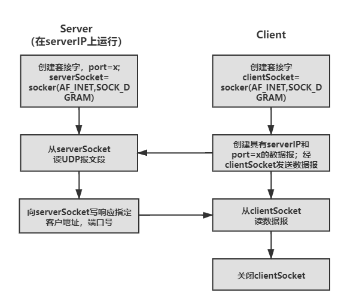


UDP Socket编程：客户端的数据经由服务器转化为大写

```python
//应用程序客户端
from socket import *                                    //该模块形成python中网络通信基础
serverName = 'hostname'									//使用服务器的主机名，将自动执行DNS lookup得到服务器的IP地址
serverPort = 12000
clientSocket = socket(AF_INET,SOCK_DGRAM)				//创建客户端套接字，第一个参数指定地址簇，AF_INET指示底层网络															 使用IPv4.第二个参数指示该套接字为SOCK_DGRAM类型，即为UDP															套接字，客户端套接字的端口号由OS执行
message = raw_input('Input lowercase sentence:')		//生成发送报文
clientSocket.sendto(message.encode(),(serverNmae,serverPort))		//发送报文
modifiedMessage,serverAddress = clientSocket.recvfrom(2048)			//接收来自服务器的数据
print(modifiedMessage.decode())							//打印数据
clientSocket.close()									//关闭客户套接字
```

```python
//应用程序服务器端
from socket import *                                    //导入套接字模块						
serverPort = 12000										//整数变量设置未12000
serverSocket = socket(AF_INET,SOCK_DGRAM)	
serverSocket.bind(('',serverPort))						//将端口号与服务器套接字绑定
print("The server is ready to receive")
while True:												//循环允许UDPSrever无限期地接收并处理来自客户地分组
    message,clientAddress = serverSocket.recvfrom(2048)	//接收到分组，该分组地数据被放置到变量message中，源地址放置到															 变量clientAddress中。变量clientAddress包含了客户的IP地															址和客户的端口号
    modifiedMseeage = message.decode().upper()			//将报文由decode函数转化为字符串后，获取客户端的行并转换大写
    serverSocket.sendto(modifiedMseeage.encode(),clientAddress) //发送分组，并等待另一个UDP分组到达
```

