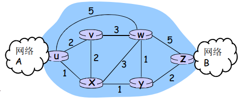
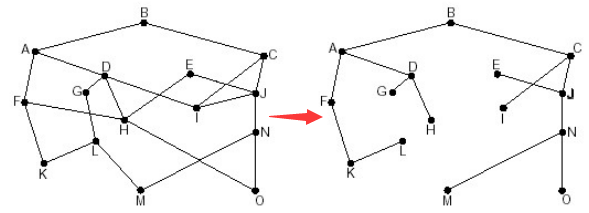
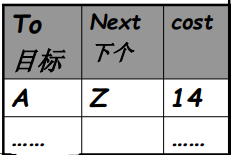
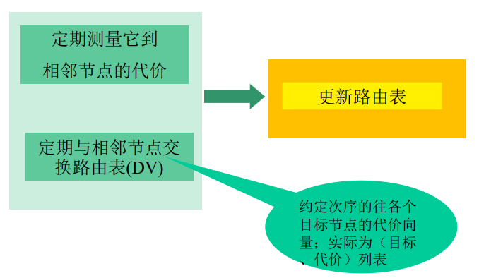
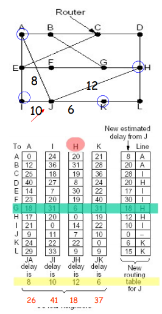
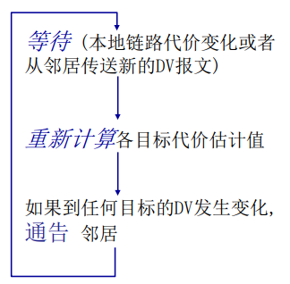
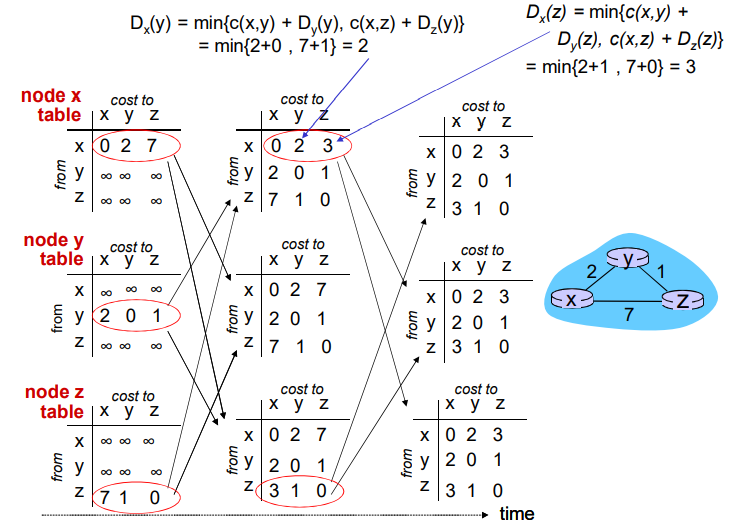
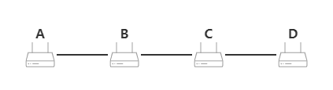
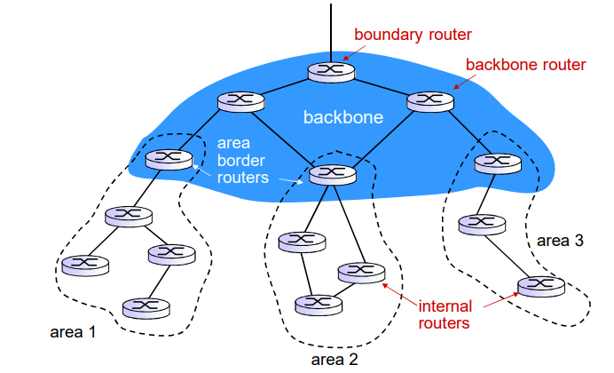

## 路由选择算法

路由：按照某种指标（传输延迟,所经过的站点数目等）找到一条从源节点到目标节点的较好路径

- 以网络为单位进行路由（路由信息通告+路由计算）
- 网络——网络的路由 = 路由器——路由器之间的最优路径，用子网的方式大大降低了路由计算的规模
- 指标：站数，延迟，费用，队列长度等，或者是一些单纯指标的加权平均，采用什么样的指标，表示网络使用者希望网络在什么方面表现突出，什么指标网络使用者比较重视，即代价

路由选择算法（routing algorithm）：网络层软件的一部分,完成路由功能

<!-- more -->

**网络的图抽象**

- 图：G = (N,E) 
- N = 路由器集合 = { u, v, w, x, y, z } 
- E = 链路集合 ={ (u,v), (u,x), (v,x), (v,w), (x,w), (x,y), (w,y), (w,z), (y,z) } 
- c(x,x’) = 链路的代价 (x,x’)
  - 代价可能总为１，跳数
  - 或是链路带宽的倒数，最大带宽路径
  - 或是拥塞情况的倒数，最不拥塞路径
- 路由的输入：拓扑、边的代价、源节点
- 路由的输出：源节点的汇集树

最优化原则（optimality principle）

**汇集树（sink tree）**

- 此节点到所有其它节点的最优路径形成的树

- 路由选择算法就是为所有路由器找到并使用汇集树

  

**路由选择算法的原则**

- 正确性（correctness）
  - 算法必须是正确的和完整的，使分组一站一站接力，正确发向目标站
  - 目标所有的站地址，在路由表中都能找到相应的表项
  - 没有处理不了的目标站地址
- 简单性（simplicity）
  - 算法在计算机上应简单：最优但复杂的算法
  - 时间上延迟大造成不实用，不应为了获取路由信息增加很多的通信量
- 健壮性（robustness）
  - 算法应能适应通信量和网络拓扑的变化：通信量变化，网络拓扑的变化算法能很快适应
  - 不向很拥挤的链路发数据，不向断了的链路发送数据
- 稳定性（stability）：产生的路由不应该摇摆
- 公平性（fairness）：对每一个站点都公平
- 最优性（optimality）：某一个指标的最优，时间上，费用 上，等指标，或综合指标；实际上，获取最优的结果代价较高，可以是次优的

**路由算法分类**

全局/局部路由信息

- 全局
  - 所有的路由器拥有完整的拓扑和边的代价的信息
  - “link state” 算法 
- 分布式
  - 路由器只知道与它有物理连接关系的邻居路由器，和到相应邻居路由器的代价值
  - 叠代地与邻居交换路由信息、计算路由信息
  - “distance vector” 算法

静态/动态路由信息

- 静态
  - 路由随时间变化缓慢
  - 非自适应算法（non-adaptive algorithm）：不能适应网络拓扑和通行量的变化，路由表使事现计算好的
- 动态
  - 路由变化很快
  - 周期性更新
  - 根据链路代价的变化而变化
  - 自适应路由选择(adaptive algorithm）：能适应网络拓扑和通行量的变化

### LS算法

链路状态路由选择算法：Link State

#### LS的应用情况

- OSPF协议是一种LS协议，被用于Internet上
- IS-IS（intermediate system-intermediate system）：被用于Internet主干中

#### LS路由的工作过程

- 各点通过各种渠道获得整个网络拓扑，网络中所有链路代价等信息（这部分和算法没关系，属于协议和实现）
- 使用LS路由算法，计算本站点到其它站点的最优路径（汇集树），得到路由表
- 按照此路由表转发分组（datagram方式）

#### 链路状态路由选择（link state routing）

1. 发现相邻节点，获知对方网络地址
   - 一个路由器工作之后，向所有线路发送HELLO分组
   - 其它路由器收到HELLO分组，回送应答，在应答分组中，告知自己的名字（全局唯一）
   - 在LAN中，通过广播HELLO分组，获得其它路由器的信息
2. 测量到相邻节点的代价（延迟，开销）
   - 实测法：发送一个分组要求对方立即响应
   - 回送一个ECHO分组
   - 通过测量时间可以估算出延迟情况
3. 组装一个分组，描述相邻节点的情况
4. 将分组通过扩散（即泛洪）的方法发到所有其它路由器
   - 顺序号：用于控制无穷的扩散，每个路由器都记录（源路由器,顺序号），发现重复的或老的就不扩散
     - 具体问题1：循环使用问题
     - 具体问题2：路由器崩溃之后序号从0开始
     - 具体问题3：序号出现错误
   - 解决问题的办法：年龄字段（age）
     - 生成一个分组时，年龄字段不为0
     - 每个一个时间段，AGE字段减1
     - AGE字段为0的分组将被抛弃
   - 扩散分组的数据结构
     - Source：从哪个节点收到LS分组
     - Seq，Age：序号，年龄
     - Send flags：发送标记，必须向指定的哪些相邻站点转发LS分组
     - ACK flags：本站点必须向哪些相邻站点发送应答
     - DATA：来自source站点的LS分组
5. 通过Dijkstra算法找出最短路径
   - 路由器获得各站点LS分组和整个网络的拓扑
   - 通过Dijkstra算法计算出到其它各路由器的最短路径（汇集树）
   - 将计算结果安装到路由表中

### DV算法

#### 距离矢量路由选择（distance vector routing）

- 动态路由算法之一 

- DV算法历史及应用情况

  - 1957 Bellman, 1962 Ford Fulkerson
  - 用于ARPANET, Internet(RIP)  DECnet , Novell, ApplTalk

- 距离矢量路由选择的基本思想

  - 各路由器维护一张路由表，结构如图

    

  - 各路由器与相邻路由器交换路由表

  - 根据获得的路由信息，更新路由表

  

#### 距离矢量路由例子

- 以当前节点J为例，相邻节点 A，I，H，K

- J测得到A，I，H，K的延迟为8ms，10ms，12ms，6ms

- 通过交换DV，从A，I，H，K获得到它们到G的延迟为18ms，31ms，6ms，31ms

- 因此从J经过A，I，H，K到G的延迟为26ms，41ms，18ms，37ms

- 将到G的路由表项更新为18ms，下一跳为：H

- 其它目标一样，除了本节点J

  

#### **距离矢量算法**

**Bellman-Ford 方程（动态规划）**

设 $d_x(y)$：从x到y的最小路径代价，则$d_x(y)=\min \{c(x,v)+d_v(y)\}$

- $\min$：取所有x的邻居取最小的v
- $c(x,v)$：到邻居v的代价
- $d_v(y)$：从邻居v到目标y的代价

- 异步式，迭代：每次本地迭代被以下事件触发

  - 本地链路代价变化了
  - 从邻居来了DV的更新消息

- 分布式：每个节点只是在自己的DV改变之后向邻居通告，然后邻居们在有必要的时候通知他们的邻居

- 每个节点：

  

- 经过多次迭代，使得每个节点获得真实的表项

#### DV的无穷计算问题

- DV的特点：好消息传的快，坏消息传的慢

  > 好消息：某个路由器接入或有更短的路径
  >
  > 坏消息：某个路由器被截断，不可达

  - 好消息的传播以每一个交换周期前进一个路由器的速度进行
  - 坏消息的传播速度非常慢（无穷计算问题）

- 水平分裂（split horizon）算法：一种对无穷计算问题的解决办法

  - C知道要经过B才能到达A，所以C向B报告它到A的距离为INF；C 告诉D它到A的真实距离

  - D告诉E，它到A的距离，但D告诉C它通向A的距离为INF

  - 第一次交换：B通过测试发现到A的路径为INF，而C也告诉B到A的距离为INF，因此，B到A的距离为INF

  - 第二次交换：C从B和D那里获知，到A的距离为INF，因此将它到A的距离为INF

  - 坏消息以一次交换一个节点的速度传播

    

  - 缺点：在某些拓扑形式下会失败（存在环路）

### LS 和 DV 算法的比较

消息复杂度（DV胜出）

- LS：有 n 节点, E 条链路,发送报文：O(nE)个
  - 局部的路由信息；全局传播
- DV：只和邻居交换信息
  - 全局的路由信息，局部传播

收敛时间（LS胜出）

- LS：O($n^2$) 
  - 算法有可能震荡
- DV：收敛较慢
  - 可能存在路由环路
  - count-to-infinity 问题

健壮性（LS胜出） 

- LS
  - 节点会通告不正确的链路代价
  - 每个节点只计算自己的路由表
  - 错误信息影响较小，局部，路由较健壮
- DV
  - DV 节点可能通告对全网所有节点的不正确路径代价
    - 距离矢量
  - 每一个节点的路由表可能被其它节点使用
    - 错误可以扩散到全网

## 因特网中自治系统内部的路由选择

### RIP

路由信息协议：Routing Information Protocol：

- 基于Distance vector 算法
  - 距离矢量：:每条链路代价cost=1，即hops (max = 15 hops) 跳数
  - DV每隔30秒和邻居交换DV，**通告**
  - 每个通告包括：最多25个**目标子网**
- DV：在邻居之间每30秒交换通告报文
  - 定期，而且在改变路由的时候发送通告报文
  - 在对方的请求下可以发送通告报文
- 每一个通告：至多AS内部的25个目标网络的 DV 
  - 目标网络+跳数：一次公告最多25个；子网最大跳数为16 

RIP链路失效和恢复如果：180秒没有收到通告信息，则认为邻居或者链路失效

- 发现经过这个邻居的路由已失效
- 新的通告报文会传递给邻居
- 邻居因此发出新的通告（如果路由变化的话）
- 链路失效快速地在整网中传输
- 使用毒性逆转（poison reverse）阻止ping-pong回路（不可达的距离：跳数无限 = 16 段）

RIP 进程处理

- RIP 以应用进程的方式实现：route-d (daemon) 
- 通告报文通过UDP报文传送，周期性重复
- 网络层的协议使用了传输层的服务（传输距离矢量），以应用层实体的方式实现

### OSPF 

开放最短路径优先：Open Shortest Path First

- 使用LS算法
  - LS 分组在网络中（一个AS内部）分发
  - 全局网络拓扑、代价在每一个节点中都保持
  - 路由计算采用Dijkstra算法
- OSPF通告信息中携带表项，每一个邻居路由器一个表项
- 通告信息会传遍AS全部（通过泛洪）
  - 在IP数据报上直接传送OSPF报文（而不是通过UDP和TCP）
- IS-IS路由协议：几乎和OSPF一样
- 安全：所有的OSPF报文都是经过认证的 (防止恶意的攻击)
- 允许有多个代价相同的路径存在 (在RIP协议中只有一个)
- 对于每一个链路，对于不同的TOS有多重代价矩阵
  - 例如：卫星链路代价对于尽力而为的服务代价设置比较低，对实时服务代价设置的比较高
  - 支持按照不同的代价计算最优路径，如：按照时间和延迟分别计算最优路径
- 对单播和多播的集成支持
  - Multicast OSPF (MOSPF) 使用相同的拓扑数据库， 就像在OSPF中一样
- 在大型网络中支持**层次性**OSPF

层次化OSPF路由

- 2个级别的层次性：本地, 骨干

  - 链路状态通告仅仅在本地区域Area范围内进行
  - 每一个节点拥有本地区域的拓扑信息
    - 关于其他区域，仅知道去它的方向，通过区域边界路由器（最短路径）

- 区域边界路由器：“汇总（聚集）”到自己区域内网络的距离，向其它区域边界路由器通告

- 骨干路由器：仅仅在骨干区域内，运行OSPF路由

- 边界路由器：连接其它的AS’s

  

## ISP之间的路由选择：BGP

### 平面路由

- 一个网络中的所有路由器的地位一样
- 通过LS, DV，或者其他路由算法，所有路由器都要知道其他所有路由器（子网）如何走
- 所有路由器在一个平面
- 平面路由的问题
  - 规模巨大的网络中，路由信息的存储、传输和计算代价巨大
    - DV：距离矢量很大，且不能够收敛
    - LS：几百万个节点的LS分组的泛洪传输，存储以及最短路径算法的计算
  - 管理问题
    - 不同的网络所有者希望按照自己的方式管理网络
    - 希望对外隐藏自己网络的细节
    - 希望和其它网络互联

### 层次路由

层次路由：将互联网分成一个个AS(路由器区域)

- 某个区域内的路由器集合，自治系统（Autonomous  Systems，AS）
- 一个AS用AS Number （ASN）唯一标示
- 一个ISP可能包括1个或者多个AS

路由变成了2个层次路由

- AS内部路由：在同一个AS内路由器运行相同的路由协议
  - “intra-AS” routing  protocol：内部网关协议
  - 不同的AS可能运行着不同的内部网关协议
  - 能够解决规模和管理问题
  - 如：RIP，OSPF，IGRP
  - 网关路由器：AS边缘路由器，可以连接到其他AS
- AS间运行AS间路由协议
  - “inter-AS” routing  protocol：外部网关协议
  - 解决AS之间的路由问题，完 成AS之间的互联互通

层次路由的优点

- 解决了规模问题
  - 内部网关协议解决：AS内部数量有限的路由器相互到达的问题，AS内部规模可控
    - 如AS节点太多，可分割AS，使得AS内部的节点数量有限
  - AS之间的路由的规模问题
    - 增加一个AS，对于AS之间的路由从总体上来说，只是增加了一 个节点，即子网（每个AS可以用一个点来表示）
    - 对于其他AS来说只是增加了一 个表项，就是这个新增的AS如何走的问题
    - 扩展性强：规模增大，性能不会减得太多
- 解决了管理问题
  - 各个AS可以运行不 同的内部网关协议
  - 可以使自己网络的细节不向外透露

### 互联网AS间路由：BGP

- BGP（Border Gateway Protocol）：自治区域间路由协议，边界网关协议
- BGP 提供给每个AS以下方法
  - eBGP：从相邻的ASes那里获得子网可达信息
  - iBGP：将获得的子网可达信息传遍到AS内部的所有路由器
  - 根据子网可达信息和策略来决定到达子网的“好”路径

- 允许子网向互联网其他网络通告“我在这里”
- 基于距离矢量算法（路径矢量），不仅仅是距离矢量，还包括到达各个目标网络的详细路径（AS 序号的列表）能够避免简单DV算法的路由环路问题

- BGP会话：2个BGP路由器（“peers”）在一个半永久的TCP连接上交换BGP报文
  - 通告向不同目标子网前缀的“路径”（BGP是一个“路径矢量”协议）

- 当通告一个子网前缀时，通告包括 BGP 属性
  - prefix + attributes = “route” 
- 2个重要的属性
  - AS-PATH：前缀的通告所经过的AS列表，如AS 67 AS 17
    - 检测环路；多路径选择
    - 在向其它AS转发时，需要将自己的AS号加在路径上
  - NEXT-HOP：从当前AS到下一跳AS有多个链路，在NETX-HOP 属性中，告诉对方通过哪个转发
  - 其它属性：路由偏好指标，如何被插入的属性
- 基于策略的路由
  - 当一个网关路由器接收到了一个路由通告，使用输入策略来接受或过滤（accept/decline.）
    - 过滤原因例1：不想经过某个AS，转发某些前缀的分组
    - 过滤原因例2：已经有了一条往某前缀的偏好路径
  - 策略也决定了是否向它别的邻居通告收到的这个路由信息

- 使用TCP协议交换BGP报文
- BGP 报文
  - OPEN：打开TCP连接，认证发送方
  - UPDATE：通告新路径（或者撤销原路径）
  - KEEPALIVE：在没有更新时保持连接，也用于对 OPEN 请求确认
  - NOTIFICATION：报告以前消息的错误，也用来关闭连接

- BGP 路径选择

  - 路由器可能获得一个网络前缀的多个路径，路由器必须进行路径的选择，路由选择可以基于

    1. 本地偏好值属性：偏好策略决定

    2. 最短AS-PATH ：AS的跳数

    3. 最近的NEXT-HOP路由器：热土豆路由

       > 热土豆策略：选择具备最小内部区域代价的网关作为去往目的的出口，不操心域间的代价

    4. 附加的判据：使用BGP标示

  - 一个前缀对应着多种路径，采用消除规则直到留下一条路径

为什么内部网关协议和外部网关协议如此不同?

- 策略
  - Inter-AS（外部）：管理员需要控制通信路径，谁在使用它的网络进行数据传输
  - Intra-AS（内部）：一个管理者，所以无需策略
    - AS内部的各子网的主机尽可能地利用资源进行快速路由
- 规模
  - AS间路由必须考虑规模问题，以便支持全网的数据转发
  - AS内部路由规模不是一个大的问题
    - 如果AS 太大，可将此AS分成小的AS，因此规模可控
    - AS之间只使多了一个点
    - 或者AS内部路由支持层次性，层次性路由节约了表空间，降低了更新的数据流量
- 性能
  - Intra-AS：关注性能
  - Inter-AS：策略可能比性能更重

## SDN控制平面

为什么需要一个逻辑上集中的控制平面？

- 网络管理更加容易：避免路由器的错误配置，对于通信流的弹性更好
- 基于流表的转发，允 许“可编程”的路由器
  - 集中式“编程”更加容易：集中计算流表然后分发
  - 传统方式分布式“编程”困难：在每个单独的路由器上分别运行分布式的算法，得到转发表（部署和升级代价高），而且要求各分布式计算出的转发表都得基本正确
- 控制平面的开放实现（非私有）
  - 新的竞争生态

### SDN特点

- 基于流的匹配+行动
- 控制平面和数据平面的分离
- 控制平面功能在数据交换设备之外实现
- 可编程控制：在控制器之上以网络应用形式实现各种网络功能

### OpenFlow协议

- 控制器和SDN交换机交互的协议
- 采用TCP 来交换报文
  - 加密可选
- 3种OpenFlow报文类型
  - 控制器>>>交换机
  - 异步（交换机>>>控制器 ）
  - 对称（misc）

OpenFlow：关键的控制器---交换机报文

- 特性：控制器查询交换机特性，交换机应答
- 配置：交换机查询/设置交换机的配置参数
- 修改状态：增加删除修改OpenFlow表中的流表
- packet-out：控制器可以将分组通过特定的端口发出

OpenFlow：关键的交换机---控制器的报文

- 分组进入：将分组（和它的控制）传给控制器，见来自控制器的packet-out报文
- 流移除：在交换机上删除流表项
- 端口状态：通告控制器端口的变化

 网络管理员不需要直接通过创建/发送流表来编程交换机，而是采用在控制器上的app自动运算和配置

OpenDaylight（ODL）控制器和ONOS控制器

## ICMP：因特网控制报文协议

- 由主机、路由器、网关用于传达网络层控制信息
  - 错误报告：主机不可到达、 网络、端口、协议
  - Echo 请求和回复（ping）
- ICMP处在网络层，但是是在IP协议的上面，ICMP消息由IP数据报承载
- ICMP 报文
  - 类型
  - 编码
  - 第一个导致该ICMP报文的IP数据报头8个字节

| ICMP类型 | 编码 | 描述                     |
| -------- | ---- | ------------------------ |
| 0        | 0    | 回显回答（对ping的回答） |
| 3        | 0    | 目的网络不可达           |
| 3        | 1    | 目的主机不可达           |
| 3        | 2    | 目的协议不可达           |
| 3        | 3    | 目的端口不可达           |
| 3        | 6    | 目的网络未知             |
| 3        | 7    | 目的主机未知             |
| 4        | 0    | 源抑制（拥塞控制）       |
| 8        | 0    | 回显请求                 |
| 9        | 0    | 路由器通告               |
| 10       | 0    | 路由器发现               |
| 11       | 0    | TTL过期                  |
| 12       | 0    | IP首部损坏               |

## 网络管理和SNMP

网络管理功能

- 性能管理
  - 性能（利用率、吞吐量）量化、测量、报告、分析和控制不同网络部件的性能
  - 涉及到的部件：单独部件（网卡，协议实体），端到端的路径
- 故障管理：记录、检测和响应故障
  - 性能管理为长期监测设备性能
  - 故障管理：突然发生的强度大的性能降低，强调对故障的响应
- 配置管理：跟踪设备的配置，管理设备配置信息
- 账户管理：定义、记录和控制用户和设备访问网络资源
  - 限额使用、给予使用的收费，以及分配资源访问权限
- 安全管理：定义安全策略，控制对网络资源的使用
