## 网络层概述

网络层服务

- 在发送主机和接收主机对之间传送段（segment）
- 在发送端将段封装到数据报中
- 在接收端，将段上交给传输层实体
- 网络层协议存在于**每一个**主机和路由器
- 路由器检查每一个经过它的IP数据报的头部

<!--more-->

网络层关键功能

- 转发：将分组从路由器的输入接口转发到合适的输出接口（局部功能，数据平面）
- 路由：使用路由算法来决定分组从发送主机到目标接收主机的路径（全局功能，控制平面）
  - 路由选择算法
  - 路由选择协议

网络层

- 数据平面

  - 本地，每个路由器功能

  - 决定从路由器输入端口到达的分组如何转发到输出端口

  - 转发功能

    - 传统方式：基于目标地址+转发表

    - SDN方式：基于多个字段+流表

      > SDN功能：转发，block（阻止），泛洪，修改字段等等

- 控制平面

  - 网络范围内的逻辑
  - 决定数据报如何在路由器之间路由，决定数据报从源到目标主机之间的端到端路径
  - 2个控制平面方法
    - 传统的路由算法：在路由器中被实现
    - software-defined networking（SDN，软件定义网络）：在远程的服务器中实现

传统方式

- 每个路由器(Per-router)控制平面
  - 在每一个路由器中的单独路由器算法元件，在控制平面进行交互

- 传统方式：路由和转发的相互作用
  - 控制平面：路由算法决定端到端路径 
  - 数据平面：IP协议根据转发表决定了IP数据报在此路由器上的局部转发

SDN方式：逻辑集中的控制平面

- 一个不同的（通常是远程的）控制器与本地控制代理（CAs） 交互
- 可编程的

网络服务模型

- 对于单个数据报的服务
  - 可靠传送
  - 延迟保证，如：少于 40ms的延迟 
- 对于数据报流的服务
  - 保序数据报传送
  - 保证流的最小带宽
  - 保证分组之间的延迟差

网络层和传输层连接服务区别

- 网络层：在2个主机之间，涉及到路径上的一些路由器
- 传输层：在2个进程之间，很可能只体现在端系统上 (TCP连接)

网络层服务模型

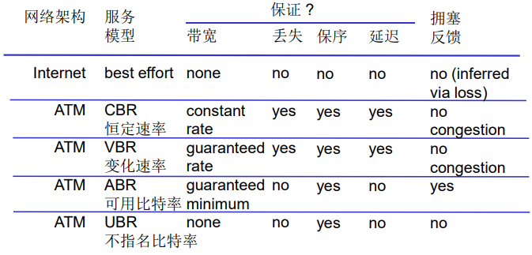

## 路由器组成

高层面（非常简化的）通用路由器体系架构

- 路由：运行路由选择算法／协议（RIP, OSPF, BGP）-------生成路由表
- 转发：从输入到输出链路交换数据报--------根据路由表进行分组的转发

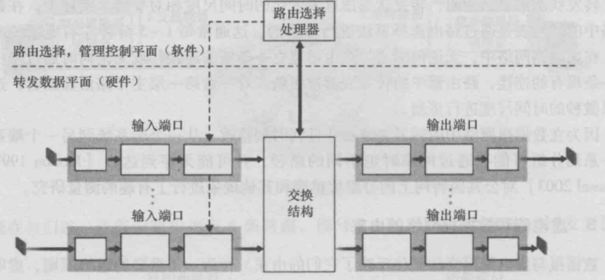

### 输入端口

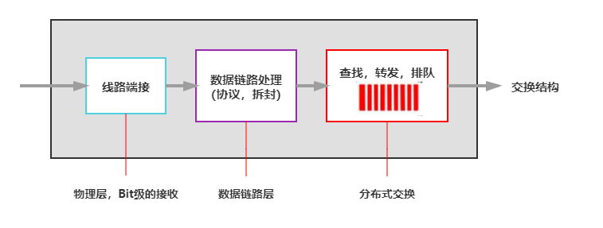

- 功能
  - 根据数据报头部的信息如：目的地址 ，在输入端口内存中的转发表中查找合适的输出端口（匹配+行动）
  - 基于目标的转发：仅仅依赖于IP数据报的目标IP地址（传统方法）
  - 通用转发：基于头部字段的任意集合进行转发
  - 最长前缀匹配：当给定目标地址查找转发表时，采用最长地址前缀匹配的目标地址表项

- 输入端口缓存
  - 当交换机构的速率小于输入端口的汇聚速率时， 在输入端口可能要排队
    - 排队延迟以及由于输入缓存溢出造成丢失
  - Head-of-the-Line (HOL) blocking：排在队头的数据报 阻止了队列中其他数据报向前移动

### 交换结构

- 将分组从输入缓冲区传输到合适的输出端口

- 交换速率：分组可以按照该速率从输入传输到输出

  - 运行速度经常是输入/输出链路速率的若干倍
  - N 个输入端口：交换机构的交换速度是输入线路速度的N倍，才不会成为瓶颈

- 3种典型的交换机构：内存、总线、纵横式

  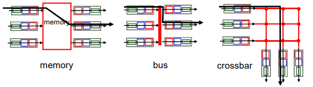

1. 通过内存交换：第一代路由器
   - 在CPU直接控制下的交换，采用传统的计算机
   - 分组被拷贝到系统内存，CPU从分组的头部提取出目标地址，查找转发表，找到对应的输出端口，拷贝到输出端口
   - 转发速率被内存的带宽限制（数据报通过BUS两遍）
   - 一次只能转发一个分组
   - 如Cisco Catalyst 8500系列
2. 通过总线交换
   - 数据报通过共享总线，从输入端口转发到输出端口
   - 总线竞争: 交换速度受限于总线带宽
   - 1次处理一个分组
   - 对于接入网或企业级路由器，速度足够（但不适合区域或骨干网络）
   - 如Cisco 6500路由器：内部通过一个32Gbps背板总线来交换分组
3. 通过互联网络（crossbar等）的交换
   - 同时并发转发多个分组，克服总线带宽限制
   - Banyan（榕树）网络，crossbar（纵横）和其它的互联网络被开发，将多个处理器连接成多处理器
   - 当分组从端口A到达，转给端口Y；控制器短接相应的两个总线
   - 高级设计：将数据报分片为固定长度的信元，通过交换网络交换
   - 如Cisco12000：以60Gbps的交换速率通过互联网络

### 输出端口

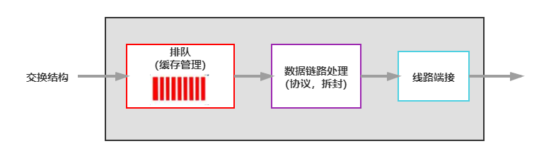

- 当数据报从交换机构的到达速度比传输速率快需要输出端口缓存

  > 数据报（分组）可能会被丢弃， 由于拥塞，缓冲区没有空间
  >
  > 缓存大小：
  >
  > - RFC 3439 拇指规则（经验性规则）：平均缓存大小=典型的RTT倍于链路容量C
  > - 新推荐：有N（非常大）个流，缓存大小等于$\frac{RTT\times C}{\sqrt{N}}$

- 由调度规则选择排队的数据报进行传输

- 输出端口排队

  - 当多个输入端口同时向输出端口发送时，缓冲该分组（当通过交换网络到达的速率超过输出速率则缓存）
  - 排队带来延迟，由于输出端口缓存溢出则丢弃数据报

### 调度机制

- 调度: 选择下一个要通过链路传输的分组

- FIFO (first in first out) scheduling：按照分组到来的次序发送（先进先出）

- 优先权排队

  - 优先权调度：发送最高优先权的分组
  - 多类，不同类别有不同的优先权
    - 类别可能依赖于标记或者其他的头部字段，如 IP  source/dest，port  numbers，ds，etc.
    - 先传高优先级的队列中的分组
    - 高（低）优先权中的分组传输次序：FIFO

- Round Robin (RR) scheduling

  - 多类
  - 循环扫描不同类型的队列，发送完一类的一个分组，再发送下一个类的一个分组，循环所有类

- Weighted Fair Queuing (WFQ)

  - 循环加权公平排队（Round Robin queuing discipline）

  - 在一段时间内，每个队列得到的服务时间是：$\frac{w_i}{\sum w_j}\times t$和权重成正比

    > 分母为所有分组排队等待传输的类别之和
    >
    > 分子为当前类

  - 每个类在每一个循环中获得不同权重的服务量

## IP Internet Protocol

网络层功能：

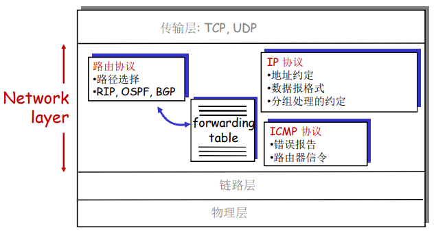

### IPv4数据报格式

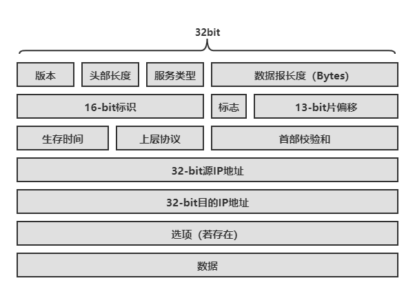

- 版本（version）：IP协议版本号，4bit
- 头部长度（head line）：确定IP数据报中载荷实际开始的地方，4bit
- 服务类型（type of service，TOS）：使不同类型的IP数据报相互区别
- 数据报长度（length）：16bit，IP数据报理论最大长度为65535字节
- 标识（16-bit identifier）、标志（flag）、片偏移（fragment offset）：与分片/重组有关
- 生存时间（time to live，TTL）：确保数据报不会在网络中循环。每经过一路由器处理，TTL值减1，TTL=0时，数据报丢弃
- 上层协议（upper layer）：指示IP数据报的数据部分应交给哪个特定的传输层协议（6为TCP、17为UDP）
- 首部校验和（Internet checksum）：检测收到的IP数据报中的比特错误
- 源和目的IP地址（source IP address，destination IP address）
- 选项（Options，if any）：该字段允许IP首部被扩展
  - 如时戳，由路由器记录, 指定所经过路由器的列表
- 数据（data）：有效载荷

### IP 分片和重组

- 分片（Fragmentation）和重组（Reassembly）
- 网络链路有MTU（最大传输单元）------链路层帧所携带的最大数据长度
  - 不同的链路类型有不同的MTU
- 大的IP数据报在网络上被分片
  - 一个数据报被分割成若干个小的数据报
    - 相同的ID
    - 不同的偏移量（offset）
    - 最后一个分片标记为0
  - “重组”只在最终的目标主机进行
  - IP头部的信息被用于标识，排序相关分片

例：4000 字节数据报包含20字节头部和3980字节数据，其MTU = 1500 bytes

解：第一片：20字节头部+1480字节数据                                             偏移量：0

​		第二片：20字节头部+1480字节数据（1480字节应用数据）     偏移量：1480/8=185

​		第三片：20字节头部+1020字节数据（应用数据）                      偏移量：2960/8=370

其中，flag标志位为1，表明后面还有片，为0表示是最后一片，后面没有其他片

### IPv4编址

IP 地址：32位标示，对主机或者路由器的接口编址

接口：主机/路由器和物理链路的连接处

- 路由器通常拥有多个接口 
- 主机也有可能有多个接口
- IP地址和每一个接口关联

**一个IP地址和一个接口相关联**

#### 子网(Subnet)

- IP地址

  - 子网部分（高位bits）
  - 主机部分（低位bits）

- 一个子网内的节点（主机或者路由器）它们的IP地址的高位部分相同，这些节点构成的网络的一部分叫做子网

- 无需路由器介入，子网内各主机可以在物理上相互直接到达（1跳可达）

  > 有些也经由路由器，但其IP地址的高位相同，也称为子网

- 路由信息的通告和计算是以一个子网为单位进行

#### 子网掩码(subnet mask)

32bits , 0 or 1 in each bit

- 1：bit位置表示子网部分
- 0：bit位置表示主机部分

原始的A、B、C类网络的子网掩码分别是

- A：255.0.0.0 ：11111111 00000000 0000000 00000000
- B：255.255.0.0：11111111 11111111 0000000 00000000
- C：255.255.255.0：11111111 11111111 11111111 00000000

CIDR下的子网掩码例子：11111111 11111111 11111100 00000000

另外的一种表示子网掩码的表达方式

- /#
- 例：/22：表示前面22个bit为子网部分，如11111111 11111111 11111100 00000000 = 255.255.252.0/23

#### IP 地址分类

- Class A：126 networks ，16 million hosts
- Class B：16382networks ，64 K hosts
- Class C：2 million networks ，254 host
- Class D：multicast，主播地址
- Class E：reserved for future，预留地址

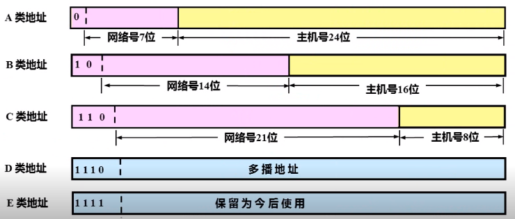

- 特殊IP地址
  - 子网部分: 全为 0---本网络（主机号）
  - 主机部分: 全为0---本主机（网络号）
  - 主机部分: 全为1--广播地址，这个网络的所有主机
  - 127.x.x.x：回退地址
- 内网（专用）IP地址
  - 专用地址：地址空间的一部份供专用地址使用
  - 永远不会被当做公用地址来分配, 不会与公用地址重复
    - 只在局部网络中有意义，区分不同的设备
  - 专用地址范围
    - Class A： 10.0.0.0~10.255.255.255 MASK 255.0.0.0
    - Class B： 172.16.0.0~172.31.255.255 MASK 255.255.0.0
    - Class C： 192.168.0.0~192.168.255.255 MASK  255.255.255.0

#### IP 编址：CIDR

CIDR（Classless Inter Domain Routing）：无类域间路由

- 子网部分可以在任意的位置
- 地址格式：a.b.c.d/x，其中 x 是地址中子网号的长度

#### 转发表和转发算法

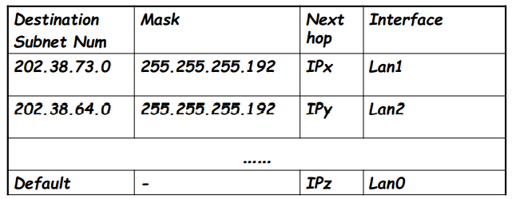

- 获得IP数据报的目标地址（IP Des addr）
- 对于转发表中的每一个表项
  - 若 (IP Des addr) & (mask) == destination Subnet Num，则按照表项对应的接口转发该数据报
  - 若都没有找到，则使用默认表项（Default gateway）转发数据报

#### 如何获得一个IP地址

- 系统管理员将地址配置在一个文件中
  - Wintel（Windows-Intel架构）：control-panel->network- >configuration->tcp/ip->properties
  - UNIX：/etc/rc.config 
- DHCP（Dynamic Host Configuration Protocol，动态主机配置协议）:  从服务器中动态获得一个IP地址
  - 也称为即插即用协议（plug-and-play）或零配置协议（zeroconf）

DHCP：允许主机在加入网络的时候，动态地从服务器那里获得IP地址

- 可以更新对主机在用IP地址的租用期

  > 每次获取IP地址会生成一个租用期

- 重新启动时，允许重新使用以前用过的IP地址

- 支持移动用户加入到该网络（短期在网）

- 工作流程

  - 主机广播“DHCP discover” 报文[可选]
  - DHCP 服务器用 “DHCP offer”提供报文响应[可选]
  - 主机请求IP地址：发送 “DHCP request” 报文
  - DHCP服务器发送地址：“DHCP ack” 报文
  - 在未获取DHCP之前，使用32位全0的本主机的特殊地址，不知道DHCP server的目标地址，目标地址使用32位全1的广播地址

  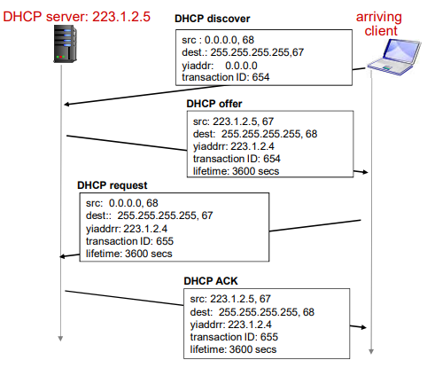

- DHCP是驻留在UDP之上的DHCP的服务

ICANN: Internet Corporation for Assigned  Names and Numbers，一个ISP获得地址块的方式

- 分配地址
- 管理DNS
- 分配域名，解决冲突

层次编址：路由聚集（route aggregation）

### 网络地址转换

- NAT：Network Address Translation

动机：本地网络只有一个有效IP地址

- 不需要从ISP分配一块地址，可用一个IP地址用于所有的（局域网）设备，因此省钱
- 可以在局域网改变设备的地址情况下而无须通知外界
- 可以改变ISP（地址变化）而不需要改变内部的设备地址
- 局域网内部的设备没有明确的地址，对外是不可见的，因此安全

实现NAT路由器

1. 外出数据包：替换源地址和端口号为NAT IP地址和新的端口号，目标IP和端口不变，如远端的C/S将会用NAP IP地址，新端口号作为目标地址
2. 记住每个转换替换对（在NAT转换表中）如源IP，端口 vs NAP IP ，新端口
3. 进入数据包：替换目标IP地址和端口号，采用存储在NAT表中的mapping表项，用（源IP，端口）

NAT 穿越问题：外网无法连接到内网设备

解决方法：

1. 静态配置NAT：转发进来的对服务器特定端口连接请求

2. Universal Plug and Play  (UPnP) Internet Gateway  Device (IGD) 协议. 允许 NATted主机

   - 获知网络的公共IP地址

   - 列举存在的端口映射

   - 增/删端口映射（在租用时间内）

     > 自动化静态NAT端口映射配置

3. 中继（used in Skype）

   - NAT后面的服务器建立和中继的连接
   - 外部的客户端链接到中继
   - 中继在2个连接之间桥接

### IPv6

动机：

- 扩展地址空间
- 头部格式改变帮助加速处理和转发
  - TTL-1
  - 头部checksum
  - 分片
- 头部格式改变帮助QoS 

#### IPv6数据报格式

- 固定的40 字节头部
- 数据报传输过程中，不允许分片

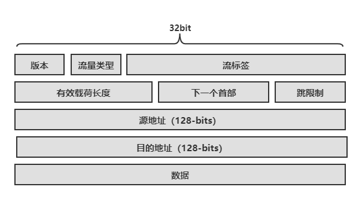

- 版本（Version）：IP版本号，6bits
- 流量类型（Priority）：同IPv4的TOS
- 流标签（Flow Label）：标示流中数据报的优先级，20bits
- 有效载荷长度（Payload Length）：16bits，给出IPv6数据报中跟在定长的40字节首部后的字节数量
- 下一个首部（Next header）：标示上层协议
- 跳限制（Hop Limit）：转发数据报的每台路由器该字段减1，到0丢弃该数据报

和IPv4的其它变化

- Checksum：被移除掉，降低在每一段中的处理速度
- Options：允许，但是在头部之外, 被 “Next  Header” 字段标示
- ICMPv6：ICMP的新版本
  - 附加了报文类型, 如“Packet Too Big”
  - 多播组管理功能

#### IPv4到IPv6的平移

隧道（Tunneling）：在IPv4路由器之间传输的IPv4数据报中携带IPv6数据报

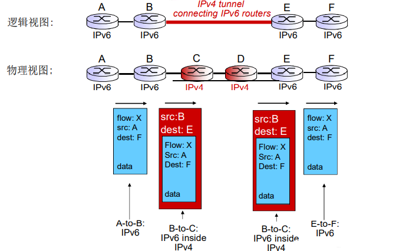

## 通用转发和SDN

传统方式：

- 每个路由器上都有实现路由算法元件（它们之间需要相互交互）
- 每台路由器上既实现控制功能、又实现数据平面
- 控制功能分布式实现
- 路由表：控制平面算出路由表，IP协议按路由表实现分组转发

传统方式实现网络功能的问题

- 垂直集成导致昂贵的成本、不便于创新的生态

  > 垂直集成：每台路由器或其他网络设备，包括
  >
  > - 硬件和私有的操作系统
  > - 互联网标准协议（IP, RIP, IS-IS, OSPF, BGP）的私有实现
  > - 从上到下都由一个厂商提供（代价大、被设备上“绑架“）

- 分布式、固化设备功能导致网络设备种类繁多

  - 无法改变路由等工作逻辑，无法实现流量工程等高级特性
  - 配置错误影响全网运行；升级和维护会涉及到全网设备，进而造成管理困难
  - 要增加新的网络功能，需要设计、实现以及部署新的特定设备，由于设备种类繁多不便于实现

SDN：逻辑上集中的控制平面

主要思路：

- 网络设备数据平面和控制平面分离
- 数据平面---分组交换机
  - 将路由器、交换机和目前大多数网络设备的功能进一步抽象成：按照流表（由控制平面设置的控制逻辑）进行PDU（帧、分组）的动作（包括转发、丢弃、拷贝、泛洪、阻塞）
  - 统一化设备功能：SDN交换机（分组交换机），执行控制逻辑
- 控制平面---控制器+网络应用
  - 分离、集中
  - 计算和下发控制逻辑：流表

SDN控制平面和数据平面分离的优势

- 水平集成控制平面的开放实现（而非私有实现），创造出好的产业生态，促进发展
  - 分组交换机、控制器和各种控制逻辑网络应用app可由不同厂商生产，专业化，引入竞争形成良好生态
- 集中式实现控制逻辑，网络管理容易
  - 集中式控制器了解网络状况，编程简单，传统方式困难
  - 避免路由器的误配置
- 基于流表的匹配+行动的工作方式允许“可编程的”分组交换机
  - 实现流量工程等高级特性
  - 在此框架下实现各种新型（未来）的网络设备

SDN架构

1. 数据平面交换机

   - 快速，简单，商业化交换设备采用硬件实现通用转发功能
   - 流表被控制器计算和安装
   - 基于南向API（例如OpenFlow ），SDN控制器访问基于流的交换机
   - 定义了和控制器的协议
2. SDN控制器（网络OS）

   - 维护网络状态信息
   - 通过上面的北向API和网络控制应用交互
   - 通过下面的南向API和网络交换机交互
   - 逻辑上集中，但是在实现上通常由于性能、可扩展性、 容错性以及鲁棒性采用分布式方法
3. 网络控制应用
   - 控制的大脑： 采用下层提供的服务（SDN控制器提供的API)，实现网络功能
     - 路由器交换机
     - 接入控制防火墙
     - 负载均衡
     - 其他功能
   - 非绑定：可以被第三方提供，与控制器厂商以通常上不同，与分组交换机厂商也可以不同

OpenFlow 数据平面抽象

- 流：由分组（帧）头部字段所定义
- 通用转发：简单的分组处理规则
  - 模式：将分组头部字段和流表进行匹配
  - 行动：对于匹配上的分组，可以是丢弃、转发、修改、 将匹配的分组发送给控制器
  - 优先权：几个模式匹配了，优先采用哪个
  - 计数器Counters:：#bytes 以及 #packet
- 路由器中的流表定义了路由器的匹配和行动规则

OpenFlow 抽象：match+action统一化各种网络设备提供的功能

- 路由器
  - match：最长前缀匹配
  - action：通过一条链路转发
- 交换机
  - match：目标MAC地址
  - action：转发或者泛洪
- 防火墙
  - match：IP地址和 TCP/UDP端口号
  - action：允许或者禁止
- NAT
  - match：IP地址和端口号
  - action：重写地址和端口号
- 目前几乎所有的网络设备都可以在这个**匹配+行动模式**框架进行描述，具体化为各种网络设备包括未来的网络设备

