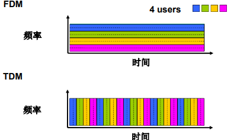
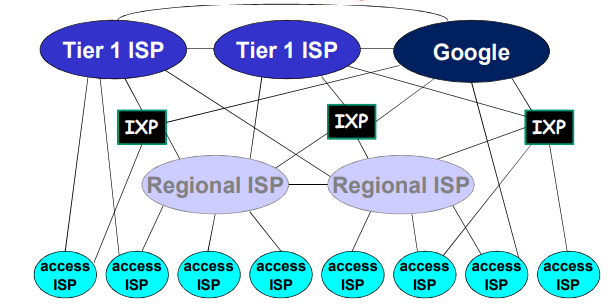
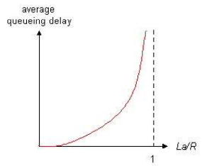
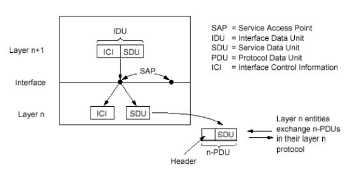
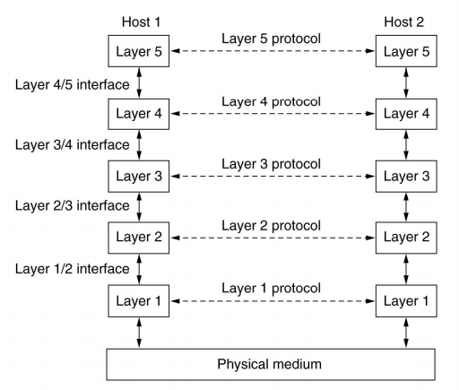
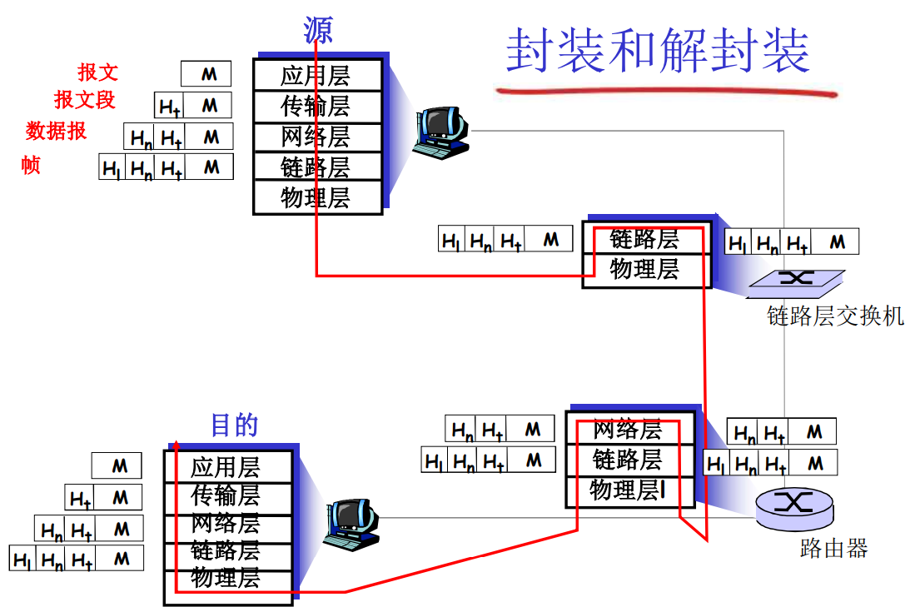

## 什么是因特网？

- 边（通信链路）：
  - 接入网链路：主机连接到互联网的链路
  - 主干链路：路由器间的链路

- 节点：
  - 主机及其上运行的应用程序
  - 路由器、交换机等网络交换设备
- 协议：
  - 控制信息的接受和发送

<!--more-->

互联网是“网络的网络“，由网络通过网络互联设备连接的网络

### 具体构成描述

- 数以亿计的、互联的计算设备：

  - 主机（端系统）
  - 运行网络应用程序

- 通信链路：

  - 光纤、同轴电缆、无限电、卫星
  - 传输速率 = 带宽（bps）

- 分组交换设备（转发分组）

  > 分组（packets）：端系统发送数据到另一端系统时形成的数据包

  - 路由器
  - 链路层交换机

- 因特网

  - 松散的层次结构、互联的ISP

    > ISP（Internet Service Provider，因特网服务提供商）

- 协议

  - 控制信息的接受和发送

  - TCP、IP、HTTP、FTP、PPP

    > 协议（protocol）定义了在两个或多个通信实体之间交换的报文的格式和顺序，以及报文发送或接收一条报文或其他事件所采取的动作
    >
    > Internet中所有的通信行为都受到协议制约

- Internet标准

  - IETF（Internet Engineering Task Force，因特网工程任务组）研发
  - RFC（Request For Comment，请求评论），IETF的标准文档

### 服务描述

- 使用通信设施进行通信的分布式应用
- 通信基础设施为应用程序提供编程接口（通信服务）（socket interface，套接字接口）
  - 将发送和接收数据的应用程序与互联网连接起来
  - 通信服务的方式
    1. 无连接不可靠服务（UDP提供）
    2. 面向连接的可靠服务（TCP提供）

## 网络结构

- 网络边缘
  - 主机
  - 应用程序（客户端和服务器）
- 网络核心
  - 互连的路由器
  - 网络的网络
- 接入网、物理媒体
  - 有线或无线通信链路

### 网络边缘

- 端系统（主机）
  - 运行应用程序
  - 如Web、email
  - 在 “网络的边缘” 

- 客户/服务器模式（C/S模式）
  - 客户端向服务器请求、接收服务
  - 如Web浏览器/服务器；email 客户端/服务器
- 对等（peer-peer，P2P ）模式
  - 很少（甚至没有）专门的服务器
  - 如 Gnutella、KaZaA、Emule

#### 采用网络设施的面向连接服务 

目标：在端系统之间传输数据，应用进程通信前需要握手

> 握手：在数据传输之前做好准备
>
> - 两个通信主机之间为连接建立状态
>
> TCP – 传输控制协议（ Transmission Control  Protocol ）[RFC 793]
>
> - 面向连接
> - 可靠地、按顺序地传送数据：确认和重传
> - 流量控制：发送方不会淹没接收方，发送方的速度会依据接收方调整
> - 拥塞控制：当网络拥塞时，发送方降低发送速率
>
> 使用TCP的应用
>
> - HTTP (Web)
> - FTP (文件传 送)
> - Telnet (远程登录)
> - SMTP (email) 

[^有连接和面向连接的区别：连接状态的维持仅由端系统维持的是面向连接；路径上的节点都知道连接协议，并维持它，为有连接]: 

#### 采用基础设施的无连接服务 

目标：在端系统之间传输数据，使用无连接服务

> UDP – 用户数据报协议（User Datagram  Protocol） [RFC 768]
>
> - 无连接
> - 不可靠数据传输
> - 无流量控制
> - 无拥塞控制
>
> 使用 UDP的应用
>
> - 流媒体
> - 远程会议
> - DNS
> - Internet电话

### 网络核心

网络核心：路由器的网状网络

网络传输方式

1.  电路交换（circuit switching）：为每个呼叫预留一条专有电路：如电话网 
2.  分组交换（pocket switching）
    - 将要传送的数据（报文）分成一个个单位： 分组
    - 将分组从一个路由器传到相邻路由器（hop），一段段最终从源端传到目标端
    - 每段：采用链路的最大传输能力（ 带宽）

#### 电路交换

端到端的资源被分配给从源端到目标端的呼叫 “call”

- 独享资源：不共享，每个呼叫一旦建立起来就能够保证性能
- 如果呼叫没有数据发送，被分配的资源就会被浪费（no sharing）
- 通常被传统电话网络采用

为呼叫预留端-端资源

- 预留链路带宽、交换能力
- 专用资源：不共享
- 保证性能
- 要求建立呼叫连接

**电路交换的复用**

网络资源（如带宽）被分成片（piece）

- 为呼叫分配片
- 如果某个呼叫没有数据， 则其资源片处于空闲状态（不共享）

复用方式

- 频分（Frequency-division multiplexing，FDM）：将带宽可用通信范围进行划分

- 时分（Time-division  multiplexing，TDM）：将带宽划为T，一个大T划为若干个时隙（slat）

- 波分（Wave-division  multiplexing，WDM）：光纤通信，将光波段划分为小波段

   

电路交换不适合计算机之间的通信的原因

1. 连接建立时间长
2. 计算机之间的通信有突发性，如果使用线路交换，则浪费的片较多，因为即使这个呼叫没有数据传递，其所占据的片也不能够被别的呼叫使用
3. 可靠性不高

#### 分组交换

在源和目的端之间，每个分组通过通信链路和分组交换机（路由器和链路层交换机）传送

以分组为单位存储-转发方式

- 网络带宽资源不再分为一个个片，传输时使用全部带宽
- 主机之间传输的数据被分为一个个分组 

资源共享，按需使用

- 存储-转发：分组每次移动一跳（ hop ）

  - 在转发之前，节点必须收到整个分组

  - 延迟比线路交换要大（接收到整个分组后再进行转发）

  - 排队时间

    > 排队和延迟：如果到达速率>链路的输出速率
    >
    > - 分组将会排队，等待传输
    > - 如果路由器的缓存用完了，分组将会被抛弃，即丢包

转发表和路由选择协议

- 转发: 将分组从路由器的输入链路转移到输出链路

  > 转发表（forwarding table）：用于将目的地址映射成为输出链路

- 路由: 决定分组采用的源到目标的路径（由路由算法决定）

  > 路由选择协议（routing protocol）：用于自动地设置转发表

分组交换采用的复用方式：统计多路复用（特殊的TDM），划分时间片的方式是不固定的

#### 分组交换VS电路交换

同样的网络资源，分组交换允许更多用户使用网络

分组交换

1. 适合于对突发式数据传输
   - 资源共享
   - 简单，不必建立呼叫
2. 过度使用会造成网络拥塞：分组延时和丢失
   - 对可靠的数据传输需要协议来约束：拥塞控制

#### 分组交换网络：存储-转发

分组交换: 分组的存储转发一段一段从源端传到目标端 ，按照有无网络层的连接，分成：

1. 数据报网络

   - 分组的目标地址决定下一跳

   - 在不同的阶段，路由可以改变

   - 类似：问路

   - Internet

     > 数据报(datagram) 的工作原理
     >
     > - 在通信之前,无须建立起一个连接,有数据就传输
     > - 每一个分组都独立路由（路径不一样,可能会失序）
     > - 路由器根据分组的目标地址进行路由
     > - 每个分组携带完整的目标地址，无网络层连接，路由器间不维护通信状态

2. 虚电路网络

   - 每个分组都带标签（虚电路标识 VC ID），标签决定下一跳
   - 在呼叫建立时决定路径，在整个呼叫中路径保持不变
   - 路由器维持每个呼叫的状态信息
   - X.25 和ATM

### 接入网

- 住宅接入网络
- 单位接入网络 （学校、公 司）
- 无线接入网络

#### 住宅接入

##### modem（调制解调器）

-  将上网数据调制加载音频信号上， 在电话线上传输，在局端将其中的数据解调出来
   - 调频
   - 调幅
   - 调相位
   - 综合调制
-  拨号调制解调器
   - 56Kbps 的速率直接接入路由器（通常更低）
   - 不能同时上网和打电话：不能总是在线

##### DSL（digital subscriber line，数据用户线）

- 采用现存的到交换局DSLAM的电话线
  - DSL线路上的数据被传到互联网
  - DSL线路上的语音被传到电话网
- < 2.5Mbps上行传输速率（通常 < 1Mbps）
- < 24Mbps下行传输速率（通常 < 10Mbps）
- ADSL，非对称传输

##### 线缆网络

有线电视信号线缆双向改造

FDM：在不同频段传输不同信道的数据， 数字电视和上网数据（上下行，上行带宽共享）

HFC（hybrid fiber coax，混合光纤同轴）

- 非对称：最高30Mbps的下行传输速率，2Mbps 上行传输速率

线缆和光纤网络将个家庭用户接入到 ISP 路由器

各用户共享到线缆头端的接入网络

- 与DSL不同，DSL每个用户一个专用线路到CO（central  office）

##### FTTH（Fiber to the home，光纤到户）

从CO（本地中心局）直接到家庭提供一条光纤路径

#### 企业接入

- 经常被企业或者大学等机构采用
- 10Mbps，100Mbps，1Gbps，10Gbps传输率
- 现在，端系统经常直接接到以太网络交换机上

#### 无线接入

各无线端系统共享无线接入网络端系统到无线路由器（通过基站或者接入点）

- 无线LAN
  - 建筑物内部
  - 802.11b/g（WiFi）: 11，54Mbps 传输速率
- 广域无线接入
  - 由电信运营商提供 (cellular) , 10’s km
  - 1 到 10Mbps
  - 3G和4G：LTE

### 物理媒体

Bit（比特）：在发送-接收对间传播

物理链路：连接每个发送-接收对之间的物理媒体

- 导引型媒体：有形介质，电波沿着固体媒体前行，如光缆、双绞铜线或同轴电缆。电波传的更远
- 非导引型媒体：电波在空气或外层空间中传播，如无线局域网或数字卫星频道中

#### 双绞线（TP）

- 两根绝缘铜导线拧合
- 5类：100Mbps 以太网，Gbps 千兆位以太网
- 6类：10Gbps万兆以太网
- 无屏蔽双绞线（Unshielded Twisted Pair ，UTP）

#### 同轴电缆

- 两根同轴的铜导线
- 双向
- 基带电缆
  - 电缆上一个单个信道
  - Ethernet
- 宽带电缆
  - 电缆上有多个信道
  - HFC

#### 光纤

- 光脉冲，每个脉冲表示一个 bit，在玻璃纤维中传输
- 高速：点到点的高速传输（如10Gps-100Gbps传输速率 ）
- 低误码率：在两个中继器之间可以有很长的距离，不受电磁噪声的干扰
- 安全

#### 无线链路

- 开放空间传输电磁波，携带要传输的数据
- 无需物理”线缆”
- 双向
- 强度与距离的平方成反比
- 传播环境效应
  - 反射
  - 吸收
  - 干扰

**无线链路类型**

- 地面微波
  - e.g  up to 45Mbps channels
- LAN （e.g，WiFi）
  - 11Mbps, 54Mbps,540Mbps… 
- wide-area (e.g.，蜂窝)
  - 3G cellular：数Mbps 
  - 4G 10Mbps
  - 5G 数Gbps
- 卫星
  - 每个信道Kbps 到45Mbps（或者多个聚集信道）
  - 270ms 端到端延迟
  - 同步静止卫星和低轨卫星（LEO）

## Internet结构和ISP

- 端系统通过接入ISPs (Internet Service Providers)连接到互联网——住宅，公司和大学的ISPs
- 接入ISPs相应的必须是互联的
  - 因此任何2个端系统可相互发送分组到对方
- 导致的“网络的网络”非常复杂
  - 发展和演化是通过经济的和国家的政策来驱动的

1. 若存在多个接入ISP（用户），将每两个ISPs直接相连，则不可扩展，需要$O（N^2）$连接

2. 所以将每个接入ISP都连接到全局ISP（全局范围内覆盖），客户ISPs和提供者ISPs有经济合约

   > 竞争：但如果全局ISP是有利可为的业务，那会有竞争者 
   >
   > 合作：通过ISP之间的合作可以完成业务的扩展，肯定会有互联，对等互联的结算关系

3. 然后业务细分（全球接入和区域接入），区域网络将出现，用与将接入ISPs连接到全局ISPs

4. 内容提供商网络（Internet Content Providers,ICP）可能会构建它们自己的网络，将它们的服务、内容更加靠近端用户，向用户提供更好的服务,减少自己的运营支出

   > 很多内容提供商(如：Google, Akamai )可能会部署自己的网络，在全球范围内建立数据中心机房（DC），自己铺设电缆或租用运营商电缆，DC之间由专用线缆连接，连接自己的在各地的DC，走自己的数据
   >
   > 连接若干local ISP和各级（包括一层）ISP，更加靠近用户

在网络的最中心，一些为数不多的充分连接的大范围网络（分布广、节点有限、 但是之间有着多重连接）

- “tier-1” commercial ISPs (如 Level 3, Sprint, AT&T, NTT)，国家或者国际范围的覆盖
- content provider network (如Google): 将它们的数据中心接入ISP，方便周边用户的访问；通常私有网络之间用专网绕过第一层ISP和区域ISP

**网络的网络**

- 松散的层次模型

- 一个分组要经过许多网络

  

- 中心：第一层ISP（如UUNet, BBN/Genuity, Sprint,  AT&T）国家/国际覆盖，速率极高

  - 直接与其他第一层ISP相连
  - 与大量的第二层ISP和其他客户网络相连

- 第二层ISP：更小些的 (通常是区域性的) ISP

  - 与一个或多个第一层ISPs，也可能与其他第二层ISP

- 第三层ISP与其他本地ISP

  - 接入网 (与端系统最近)

**ISP之间的连接**

- POP：高层ISP面向客户网络的接入点，涉及费用结算

  - 如一个低层ISP接入多个高层ISP，多宿（multi home）

    > 多宿：与两个或多个提供商ISP连接

- 对等接入：2个ISP对等互接，不涉及费用结算

- IXP（因特网交换点）：多个对等ISP互联互通之处，通常不涉及费用结算

  - 对等接入

- ICP自己部署专用网络，同时和各级ISP连接

## 分组延时、丢包和吞吐量

分组延时类型

1. 节点处理延时
   - 检查 bit级差错
   - 检查分组首部和决定将分组导向何处
2. 排队延时
   - 在输出链路上等待传输的时间
   - 依赖于路由器的拥塞程度
3. 传输延时
   - R = 链路带宽(bps)
   - L = 分组长度(bits)
   - 将分组发送到链路上的时间 = L/R
   - 存储转发延时
   - 传输延时越短信道容量越小
4. 传播延时
   - d = 物理链路的长度
   - s = 在媒体上的传播速度 (通常为3x$10^8$ m/sec或2x$10^8$ m/sec)
   - 传播延时 = d/s

节点总延时：$d_{nodal}=d_{proc}+d_{queue}+d_{trans}+d_{prop}$

- $d_{proc}=$   处理延时，通常试微妙数量级或更少

- $d_{queue}= $  排队延时，取决于拥塞程度

- $d_{trans}= $  传输延时，= L/R，对低速率的链路而言很大（如拨号），通常为微秒级到毫秒级

- $d_{prop}= $  传播延时，通常为几微秒到几百毫秒

  

排队延时

- R = 链路带宽（bps)）
- L = 分组长度（bits）
- a = 分组到达队列的平均速率
- 流量强度 = La/R
  - La/R ~ 0: 平均排队延时很小
  - La/R -> 1: 延时变得很大
  - La/R > 1: 比特到达队列的速率超过了从该队列输出的速率，平均排队延时将趋向无穷大

**设计系统时流量强度不能大于1**

分组丢失（丢包）

- 链路的队列缓冲区容量有限
- 当分组到达一个满的队列时，该分组将会丢失
- 丢失的分组可能会被前一个节点或源端系统重传，或根本不重传

吞吐量: 在源端和目标端之间传输的速率（数据量/单位时间）

- 瞬间吞吐量：在一个时间点的速率
- 平均吞吐量：在一个长时间内平均值

瓶颈链路：端到端路径上，限制端到端吞吐的链路

具有N条链路的网络，传输速率分别是$R_1,R_2,……,R_N$，吞吐量为min{$R_1,R_2,……,R_N$}

在实际场景中，要考虑到多个分组平均使用链路的情况

## 协议层次及服务模型

层次化方式实现复杂网络功能

- 将网络复杂的功能分层功能明确的层次，每一层实现了其中一个或一组功能，功能中有其上层可以使用的功能：服务
- 本层协议实体相互交互执行本层的协议动作，目的是实现本层功能，通过接口为上层提供更好的服务
- 在实现本层协议的时候，直接利用了下层所提供的服务
- 本层的服务：借助下层服务实现的本层协议实体之间交互带来的新功能（上层可以利用的）+  更下层所提供的服务

### 服务

服务（Service）：低层实体向上层实体提供它们之间的通信的能力

- 服务用户(service user)
- 服务提供者(service provider ) 

原语(primitive)：上层使用下层服务的形式，高层使用低层提供的服务，以及低层向高层提供服务都是通过服务访问原语（如Socket API 的函数）来进行交互的，即提供服务的形式

服务访问点 (Services Access Point，SAP) ：上层使用下层提供的服务通过层间的接口，用于区分不同的服务用户

- 地址(address)：下层的一个实体支撑着上层的多个实体， SAP有标志不同上层实体的作用
- 可以有不同的实现，队列
- 如传输层的SAP：端口(port)

### 服务类型

- 面向连接的服务（Connection-oriented Service）
  - 连接(Connection)：两个通信实体为进行通信而建立的一 种结合
  - 面向连接的服务通信的过程：建立连接，通信，拆除连接
  - 面向连接的服务的例子：网络层的连接被成为虚电路
  - 适用范围：对于大的数据块要传输; 不适合小的零星报文
  - 特点：保序
  - 服务类型
    - 可靠的信息流：传送页面（可靠的获得，通过接收方的确认）
    - 可靠的字节流：远程登录
    - 不可靠的连接：数字化声音
- 无连接的服务（Connectionless Service）
  - 无连接服务：两个对等层实体在通信前不需要建立一个连接，不预留资源；不需要通信双方都是活跃（例：寄信）
  - 特点：不可靠、可能重复、可能失序
  - IP分组，数据包
  - 适用范围：适合传送零星数据
  - 服务类型
    - 不可靠的数据报：电子方式的函件
    - 有确认的数据报：挂号信
    - 请求回答：信息查询

### 服务和协议

- 服务与协议的区别
  - 服务(Service)：低层实体向上层实体提供它们之间的通信的能力，是通过原语(primitive)来操作的，垂直关系
  - 协议(protocol) ：对等层实体(peer entity)之间在相互通信的过程中，需要遵循的规则的集合，水平关系
- 服务与协议的联系
  - 本层协议的实现要靠下层提供的服务来实现
  - 本层实体通过协议为上层提供更高级的服务

### 数据单元（DU）

各层次的协议数据单元

- 应用层：报文(message)
- 传输层：报文段(segment)：TCP段，UDP数据报
- 网络层：分组packet（如果无连接方式：数据报 datagram）
- 数据链路层：帧(frame)
- 物理层：位(bit)

分层处理和实现复杂系统的好处

概念化：结构清晰，便于标示网络组件，以及描述其相互关系

- 分层参考模型

结构化：模块化更易于维护和系统升级

- 改变某一层服务的实现不影响系统中的其他层次
  - 对于其他层次而言是透明的
- 如改变登机程序并不影响系统的其它部分

### 协议栈

- 应用层：网络应用

  - 为人类用户或者其他应用进程提供网络应用服务
  - FTP，SMTP，HTTP，DNS

- 传输层：主机之间的数据传输

  - 传输层分组为报文段（segment）

  - 在网络层提供的端到端通信基础上，细分为进程到进程，将不可靠的通信变成可靠地通信
  - TCP，UDP

- 网络层：为数据报从源到目的选择路由

  - 主机主机之间的通信，端到端通信，不可靠
  - IP，路由协议

- 链路层：相邻网络节点间的以帧为单位的数据传输

  - 链路层分组为帧（frame）
  - 2个相邻2点的通信，点到点通信，可靠或不可靠
  - 点对对协议PPP，802.11（WiFi），Ethernet

- 物理层：在线路上传送bit 

### OSI 模型

- 表示层：允许应用解释传输的数据，如加密，压缩，机器相关的表示转换
- 会话层：数据交换的同步，检查点，恢复

### 封装

每一层，一个分组具有两种类型的字段：首部字段和有效载荷字段，有效载荷字段通常来自上一层的分组

## 历史

早期（1960以前）计算机网络

- 线路交换网络
- 线路交换的特性使得其不适合计算机之间的通信
  - 线路建立时间过长
  - 独享方式占用通信资源，不适合突发性很强的计算机之间的通信
  - 可靠性不高：非常不适合军事通信

1961-1972: 早期的分组交换概念

- 三个小组独立地开展分组交换的研究
  - 1961：Kleinrock(MIT)，排队论
  - 1964：Baran(美国兰德公司) – 军用网络上的分组交换
  - 1964：Donald（英国）等，NPL（英国国家物理实验室）
- 1967：Kleinrock和在MIT的同事在美国高级研究计划研究局（ARPA）考虑ARPA-net 计划（第一个分组交换计算机网络）
- 1969：第一个 ARPA-net 节点（IMP：接口报文处理机）开始工作（安装在UCLA，加州大学洛杉矶分校） 
- 1969年底：建立了4个节点
- 1972：ARPAnet 公众演示
  - 网络控制协议是第一个端系统之间的主机-主机协议
  - NCP协议：相当于传输层和网络层在一起，支持应用开发
  - 第一个e-mail 程序（ BBN）
  - ARPA-net有15个节点

1972-1980：专用网络和网络互联

- 出现了很多对以后来说重要的网络形式
  - 1970：ALOHAnet,夏威夷上的微波网络
  - 1973: Metcalfe在博士论文中提出了 Ethernet
  - ATM网络
  - ALOHAnet，Telenet，Cyclades法国等
- 1970后期，网络体系结构的必要性
  - 专用的体系结构： DECnet, SNA, XNA
  - 标准化的体系结构，达到网络的互通互联
- 1974：网际互联的Cerf and Kahn 体系结构
- 1979：ARPA-net的规模在持续增加，体系结构也在酝酿着变化，以支持网络互联和 其他目的（性能）需求
  - 节点数目增加，有200个节点

> Cerf and Kahn 网络互联原则定义了今天的Internet体系结构
>
> - 极简、自治（通过IP网连接所有网络）
> - 尽力而为（best  effort）服务模型（是否传到，是否有序无关）
> - 无状态的路由器
> - 分布控制

1980-1990：体系结构变化, 网络数量激增，应用丰富

- 1983：TCP/IP部署，标记日
  - NCP分化成2个层次，TCP/IP， 从而出现UDP
  - 覆盖式IP解决网络互联问题
  - 主机设备和网络交换设备分开
- 1982：smtp e-mail协议定义
- 1983：DNS 定义，完成域名到IP地址的转换
- 1985：ftp 协议定义
- 1988：TCP拥塞控制
- 其他网络形式的发展
  - 新的国家级网络：Csnet，BITnet，NSFnet，Minitel
  - 1985年：ISO/OSI提出， 时机不对且太繁琐
- 100,000主机连接到网络联邦

1990, 2000’s：商业化，Web，新的应用

- 1990年代初：NSF为ARPA-net 的访问网，双主干网络，之后ARPA-net退役
- 1991：NSF放宽了对NSFnet用于商业目的的限制 (1995退役)， ASFNET非盈利性机构维护，后面叫Internet
- UNIX 中TCP/IP的免费捆绑
- 1990年代初：Web
  - hypertext，超文本 [Bush 1945, Nelson  1960’s]
  - HTML，HTTP：Berners-Lee
  - 1994：Mosaic (Netscape， andreesen) 
  - 1990年代后期：Web的商业化

- 1990后期 – 21世纪
  - TCP/IP体系结构的包容性，在其上部署应用便捷，出现非常多的应用
  - 新一代杀手级应用（即时讯息 ，P2P 文件共享，社交网络等 ）更进一步促进互联网的发展
  - 安全问题不断出现和修订（互联网的补丁对策）
  - 2001网络泡沫，使得一些好公司沉淀下来（谷歌，微软，苹 果，Yahoo，思科）
  - 主干网的速率达到Gbps

2005-现在

- 100+亿主机：包括智能手机和平板
- 宽带接入的快速部署
- 高速无线接入无处不在：移动互联时代
  - 4G部署，5G蓄势待发
  - 带宽大，终端性能高，价格便宜，应用不断增多
- 在线社交网络等新型应用的出现
  - Facebook：10亿用户
  - 微信，QQ：数十亿用户
- 内容提供商 (Google, Microsoft)创建他们自己的网络
  - 通过自己的专用网络提供对搜索、视频内容和电子邮件的即刻访问
- 电子商务，大学，企业在云中运行他们的服务 (e.g. Amazon EC2) 

