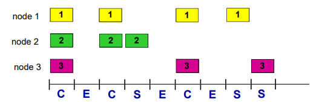
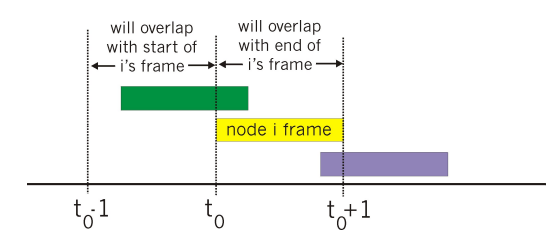
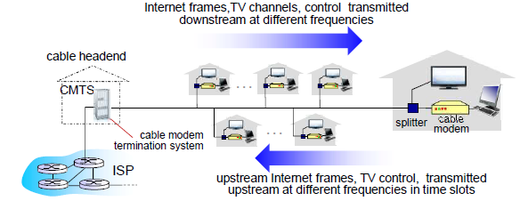
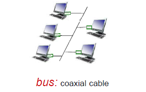
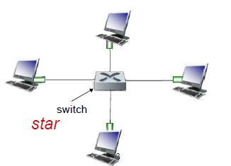
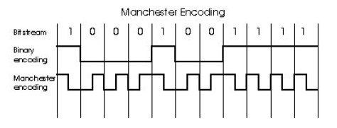
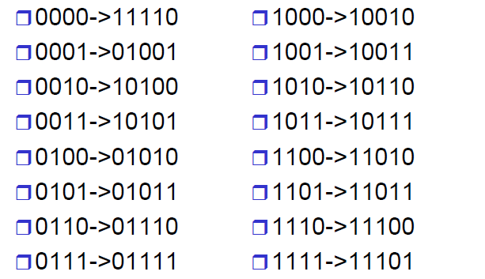
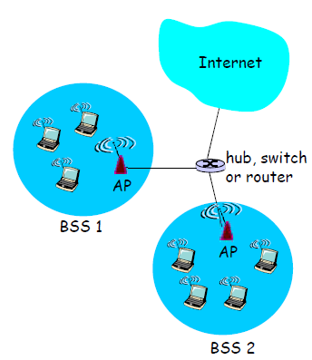
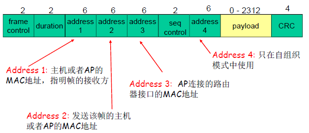
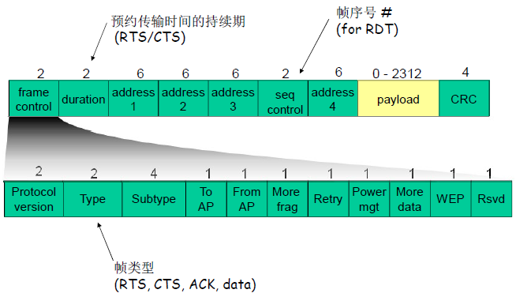

## 链路层概述

网络节点的连接方式

- 点到点连接
- 多点连接
  - 共享型介质（同轴电缆连接）
  - 通过网络交换机

<!-- more-->

WAN一般采用点到点链路

- 带宽大、距离远（延迟大） >带宽延迟积大
- 如果采用多点连接方式
  - 竞争方式：一旦冲突代价大
  - 令牌等协调方式：在其中协调节点的发送代价大
- 点到点链路的链路层服务实现非常简单，即封装和解封装

LAN一般采用多点连接方式

- 连接节点非常方便
- 接到共享型介质上（或网络交换机），连接所有其他节点
- 多点连接方式网络的链路层功能实现相当复杂
  - 多点接入：协调各节点对共享性介质的访问和使用
  - 竞争方式：冲突之后的协调
  - 令牌方式：令牌产生，占有和释放等

术语：

- 主机和路由器是节点（网桥和交换机也是）：nodes
- 沿着通信路径，连接个相邻节点通信信道的是链路：links
  - 有线链路
  - 无线链路
  - 局域网，共享性链路
- 第二层协议数据单元帧frame ，封装数据报

**数据链路层负责从一个节点通过链路将（帧中的）数据报发送到相邻的物理节点（一个子网内部的2节点）**

数据报（分组）在不同的链路上以不同的链路协议传送

不同的链路协议提供不同的服务

**链路层服务**

- 成帧，链路接入
  - 将数据报封装在帧中，加上帧头、帧尾部
  - 如果采用的是共享性介质，信道接入获得信道访问权
  - 在帧头部使用“MAC”（物理）地址来标示源和目的，不同于IP地址

- 可靠传输
  - 在低出错率的链路上（光纤和双绞线电缆）很少使用
  - 在无线链路经常使用：出错率高

- 流量控制
  - 使得相邻的发送和接收方节点的速度匹配
- 错误检测
  - 差错由信号衰减和噪声引起
  - 接收方检测出的错误：通知发送端进行重传或丢弃帧
- 差错纠正
  - 接收端检查和纠正bit错误，不通过重传来纠正错误
- 双工和全双工
  - 半双工：链路可以双向传输，但一次只有一个方向

**链路层在哪里实现**

- 在每一个主机上
  - 每个路由器上
  - 交换机的每个端口上
- 链路层功能在“适配器”上 实现（aka network  interface card NIC）或者在一个芯片组上
  - 以太网卡，802.11 网卡 ; 以太网芯片组
  - 实现链路层和相应的物 理层功能
- 接到主机的系统总线上
- 硬件、软件和固件的综合 体

**适配器通信**

- 发送方
  - 在帧中封装数据报
  - 加上差错控制编码，实现RDT和流量控制功能等
- 接收方
  - 检查有无出错，执行 rdt和流量控制功能等
  - 解封装数据报，将其交给上层
- 适配器是半自治的实现了链路和物理层功能

## 差错检查和纠正错误

检验和：CRC（循环冗余校验）

- 强大的差错检测码
- 将数据比特 D，看成是二进制的数据
- 生成多项式G：双方协商r+1位模式（r次方）
  - 生成和检查所使用的位模式
- 目标:选择r位 CRC附加位R，使得
  - 正好被 G整除（modulo 2）
  - 接收方知道 G，将除以 G，如果非0余数：检查出错误
  - 能检出所有少于r+1位的突发错误
- 实际中广泛使用（以太网、802.1WiFi，ATM）

CRC性能分析

- 突发错误和突发长度
- CRC检错性能描述
  - 能够检查出所有的1bit错误
  - 能够检查出所有的双bits的错误
  - 能够检查出所有长度 =r或者<r 位的错误
  - 出现长度为 r+1的突发错误，检查不出的概率是$\frac{1}{2^{r-1}}$
  - 出现长度大于r+1的突发错误，检查不出的概率是$\frac{1}{2^r}$

详细见《自顶向下》P291

## 多路访问链路和协议

两种类型的链路（一个子网内部链路连接形式）

- 点对点
  - 拨号访问的PPP
  - 以太网交换机和主机之间的点对点链路
- 广播（共享线路或媒体）
  - 传统以太网
  - HFC上行链路
  - 802.11无线局域网

### 多路访问协议

多路访问问题

- 单个共享的广播型链路
- 2个或更多站点同时传送会造成冲突（collision）
  - 多个节点在同一个时刻发送，则会收到2个或多个信号叠加

多路访问协议（介质访问控制协议：MAC）

- 分布式算法-决定节点如何使用共享信道，即：决定节点什么时候可以发送
- 关于共享控制的通信必须用借助信道本身传输
  - 没有带外的信道，各节点使用其协调信道使用
  - 用于传输控制信息

理想的多路访问协议

- 给定：Rbps的广播信道
- 必要条件
  1. 当一个节点要发送时，可以R速率发送
  2. 当M个节点要发送，每个可以以R/M的平均速率发送
  3. 完全分布的
     - 没有特殊节点协调发送
     - 没有时钟和时隙的同步
  4. 简单

**MAC（媒体访问控制）协议分类**

- 信道划分
  - 把信道划分成小片（时间、频率、编码）
  - 分配片给每个节点专用
- 随机访问
  - 信道不划分，允许冲突
  - 冲突后恢复
- 依次轮流 
  - 节点依次轮流
  - 但是有很多数据传输的节点可以获得较长的信道使用权

### 信道划分协议

TDMA（time division multiple access，时分多路复用）

- 轮流使用信道，信道的时间分为周期
- 每个站点使用每周期中固定的时隙（长度=帧传输时间）传输帧
- 如果站点无帧传输，时隙空闲会造成浪费
- 如：6站LAN，1、3、4有数据报，时隙2、5、6空闲

FDMA（frequency division multiple access，频分多路复用）

- 信道的有效频率范围被分成一个个小的频段
- 每个站点被分配一个固定的频段
- 分配给站点的频段如果没有被使用，则空闲
- 如：6站LAN，1、3、4有数据报，频段2、5、 6空闲

CDMA（code division multiple access，码分多路复用）

- 所有站点在整个频段上同时进行传输，采用编码原理加以区分
- 完全无冲突
- 假定：信号同步很好，线性叠加

比喻

- TDM：不同的人在不同的时刻讲话
- FDM：不同的组在不同的小房间里通信
- CDMA：不同的人使用不同的语言讲话

### 随机存取协议

- 当节点有帧要发送时
  - 以信道带宽的全部 Rbps发送
  - 没有节点间的预先协调
- 两个或更多节点同时传输，会发生冲突 “collision”
- 随机存取协议规定
  - 如何检测冲突
  - 如何从冲突中恢复（如：通过稍后的重传）
- 随机MAC协议
  - 时隙ALOHA
  - ALOHA
  - CSMA，CSMA/CD，CSMA/CA

#### 时隙ALOHA

假设

- 所有帧是等长的
- 时间被划分成相等的时隙 ，每个时隙可发送一帧
- 节点只在时隙开始时发送帧
- 节点在时钟上是同步的
- 如果两个或多个节点在一 个时隙传输，所有的站点都能检测到冲突 

运行

- 当节点获取新的帧，在下一 个时隙传输
- 传输时没有检测到冲突，成功
- 节点能够在下一时隙发送新帧
- 检测时如果检测到冲突，失败
- 节点在每一个随后的时隙以概率p重传帧直到成功

优点

- 节点可以以信道带宽全速连续传输
- 高度分布：仅需要节点之间在时隙上的同步
- 简单 

缺点

- 存在冲突，浪费时隙
- 即使有帧要发送，仍然有可能存在空闲的时隙
- 节点检测冲突的时间<帧传输的时间，因为必须传完
- 需要时钟上同步

最好情况：信道利用率37%

#### 纯ALOHA（非时隙）

- 无时隙ALOHA：简单、无须节点间在时间上同步
- 当有帧需要传输：马上传输
- 冲突的概率增加
  - 帧在t0 发送，和其它在[t0 -1, t0 +1]区间内开始发送的帧冲突
  - 和当前帧冲突的区间
- 效率比时隙ALOHA差

#### CSMA

CSMA（载波侦听多路访问）：在传输前先侦听信道

- 如果侦听到信道空闲，传送整个帧
- 如果侦听到信道忙，推迟传送

CSMA冲突：冲突仍然可能发生

- 由传播延迟造成：两个节点可能侦听不到正在进行的传输

- 冲突：整个冲突帧的传输时间都被浪费了，是无效的传输

- 注意：传播延迟（距离）决定了冲突的概率

  > 节点依据本地的信道使用情况来判断全部信道的使用情况，是局部性的判断

##### CSMA/CD（冲突检测）

- 载波侦听CSMA：和在CSMA中一样发送前侦听信道

- 没有传完一个帧就可以在短时间内检测到冲突

- 冲突发生时则传输终止，减少对信道的浪费

- 冲突检测CD技术，在有线局域网中容易实现：

  - 检测信号强度，比较传输与接收到的信号是否相同
  - 通过周期的过零点检测

- 以太网CSMA/CD算法

  1. 适配器获取数据报，创建帧

  2. 发送前：侦听信道CS

    - 闲：开始传送帧
    - 忙：一直等到闲再发送

  3. 发送过程中，冲突检测CD

    - 没有冲突：成功
    - 检测到冲突：放弃，之后尝试重发

  4. 发送方适配器检测到冲突，除放弃外还发送一个Jam信号（强化冲突信息），所有听到冲突的适配器也是如此

    - 强化冲突：让所有站点都知道发生冲突，防止冲突时间过短导致其他结点不知道发生冲突

  5. 如果放弃，适配器进入指数退避状态

    在第m次失败后，适配器在$\{0,1,2, ,2^{m-1}\}$中随机选择一个数K，等待K*512位时后，转到步骤2

    > 二进制指数退避算法（exponential backoff）
    >
    > - 目标：适配器试图适应当前负载，在一个变化的碰撞窗口中随机选择时间点尝试重发
    >   - 高负载：重传窗口时间大，减少冲突，但等待时间长
    >   - 低负载：使得各站点等待时间少，但冲突概率大
    > - 首次碰撞：在{0，1}选择K；延迟K512位时
    > - 第2次碰撞：在{0，1，2，3}选择K
    > - 第10次碰撞：在{0，1，2，3，……，1023}选择
    >   K

- CSMA/CD效率：$efficiency=\frac{1}{1+5T_{prop}/T_{trans}}$

  - $T_{prop}$ = LAN上2个节点的最大传播延迟
  - $T_{trans}$ = 传输最大帧的时间
  - 效率变为1的两种情况
    1. 当tprop 变成0时
    2. 当ttrans 变成无穷大时
  - 比ALOHA更好的性能，而且简单，廉价，分布式

##### CSMA/CA（冲突避免）

- 802.11（WLAN）：发送前侦听信道

  - 不会和其它节点正在进行的传输发生冲突

- 802.11：没有冲突检测

  - 无法检测冲突：自身信号远远大于其他节点信号

  - 即使能CD：冲突与成功没有直接关系

    > 隐藏终端和暴露终端问题

  - 利用冲突避免：CSMA/C(ollision)A(voidance)

    - 无法CD，则一旦发送就全部发送完毕，不CD
    - 为了避免无CD带来的信道利用率低的问题，事前进行冲突避免

- 发送方

  1. 如果站点侦测到信道空闲持续DIFS（分布式帧间间隙）长，则传输整个帧

  2. 如果侦测到信道忙碌，那么选择一个随机回退值，并在信道空闲时递减该值；如果信道忙碌，回退值不会变化

     当数到0时（只生在信道闲时）发送整个帧如果没有收到ACK，增加回退值，重复2

- 802.11 接收方

  - 如果帧正确，则在SIFS（短帧间间隔）后发送ACK

- 无法完全避免冲突

  - 两个站点相互隐藏
    - A,B 相互隐藏，C在传输
    - A,B选择了随机回退值
    - 一个节点如A胜利了，发送
    - 而B节点收不到，顺利count down到0 发送
    - A,B的发送在C附近形成了干扰
  - 选择了非常靠近的随机回退值：
    - A,B选择的值非常近
    - A到0后发送
    - 但是这个信号还没到达B时
    - B也到0了，发送
    - 冲突

- 允许发送方“预约”信道，而不是随机访问该信道：避免长数据帧的冲突（可选项）

  - 发送方首先使用CSMA向BS发送一个小的RTS分组
    - RTS可能会冲突（但是由于比较短，浪费信道较少）
  - BS广播clear-to-send CTS，作为RTS的响应
  - CTS能够被所有涉及到的节点听到
    - 发送方发送数据帧
    - 其它节点抑制发送

  > 采用小的预约分组，可以完全避免数据帧的冲突

### 线缆接入网络

- 多个40Mbps 下行（广播）信道，FDM
  - 下行：通过FDM分成若干信道，互联网、数字电视等
  - 互联网信道：只有1个CMTS在其上传输
- 多个30 Mbps上行的信道，FDM
  - 多路访问：所有用户使用；通过TDM分成微时隙
  - 部分时隙（下行）：分配
  - 部分时隙（上行）：竞争预约
- DOCSIS（data over cable service interface spec）协议
  - 采用FDM进行信道的划分：若干上行、下行信道
  - 下行信道:
    - 在下行MAP帧中：CMTS告诉各节点微时隙分配方案，分配给各站点的上行微时隙
    - 另外：头端传输下行数据（给各个用户）
  - TDM上行信道
    - 采用TDM的方式将上行信道分成若干微时隙：MAP指定
    - 站点采用分配给它的微时隙上行数据传输：分配
    - 在特殊的上行微时隙中，各站点请求上行微时隙：竞争
      - 各站点对于该时隙的使用是随机访问的
      - 一旦碰撞（请求不成功，结果是：在下行的MAP中没有为它分配，则利用二进制退避算法）选择时隙上传输

### 轮流MAC协议

轮流（Taking Turns）：综合信道划分MAC协议和随机访问MAC协议的优点

#### 轮询协议

- 主节点邀请从节点依次传送
- 从节点一般比较“dumb”
- 缺点:
  - 轮询（polling）开销：轮询本身消耗信道带宽
  - 等待时间：每个节点需等到主节点轮询后开始传输，即使只有一个节点，也需要等到轮询一周后才能够发送
  - 单点故障：主节点失效时造成整个系统无法工作

#### 令牌传递协议

- 控制令牌( token)循环从一个节点到下一个节点传递
- 令牌报文：特殊的帧
- 缺点
  - 令牌开销：本身消耗带宽
  - 延迟：只有等到抓住令牌，才可传输
  - 单点故障（token）：
    - 令牌丢失系统级故障，整个系统无法传输
    - 复杂机制重新生成令牌

**MAC 协议总结**

- 信道划分：按时间、频率或者编码
  - TDMA、FDMA、CDMA
- 随机访问（动态）
  - ALOHA，S-ALOHA，CSMA，CSMA/CD
  - 载波侦听: 在有些介质上很容易（wire：有线介质），但在有些介质上比较困难（wireless：无线）
  - CSMA/CD：802.3 Ethernet网中使用
  - CSMA/CA：802.11WLAN中使用
- 依次轮流协议
  - 集中：由一个中心节点轮询
  - 分布：通过令牌控制
  - 蓝牙、FDDI、令牌环

## LANs

交换机局域网，提供的服务有链路层寻址和以太网协议

### 链路层寻址和ARP

#### 网络地址和MAC地址

- 32bit IP 地址：
  - 网络层地址
  - 前n-1跳：用于使数据报到达目的IP子网
  - 最后一跳：到达子网中的目标节点
- LAN（MAC/物理/以太网）地址
  - 用于使帧从一个网卡传递到与其物理连接的另一个网卡(在同一个物理网络中)
  - 48bit MAC地址固化在适配器的ROM，有时也可以通过软件设定
  - 理论上全球任何2个网卡的MAC地址都不相同
  - e.g.: 1A-2F-BB-76-09-AD

**网络地址和MAC地址分离**

1. IP地址和MAC地址的作用不同
   - IP地址是分层的
     - 一个子网所有站点网络号一致，路由聚集，减少路由表
     - 需要一个网络中的站点地址网络号一致，如果捆绑需要定制网卡非常麻烦
     - 希望网络层地址是配置的；IP地址完成网络到网络的交付
   - MAC地址是一个平面的
     - 网卡在生产时不知道被用于哪个网络，因此给网卡一个唯一的标示，用于区分一个网络内部不同的网卡即可
     - 可以完成一个物理网络内部的节点到节点的数据交付
2. 分离好处
   - 网卡坏了，IP不变，可以捆绑到另外一个网卡的MAC地址上
   - 物理网络还可以除IP之外支持其他网络层协议，链路协议为任意上层网络协议， 如IPX等
3. 捆绑的问题
   - 如果仅仅使用IP地址，不用MAC地址，那么它仅支持IP协议
   - 每次上电都要重新写入网卡IP地址；
   - 另外一个选择就是不使用任何地址；不用MAC地址，则每到来一个帧都要上传到IP层次，由它判断是不是需要接受，干扰一次

局域网上每个适配器都有一个唯一的LAN地址

全局广播地址（Broadcast address） ：FF-FF-FF-FF-FF-FF，发出的帧局域网内所有结点均能接收

MAC 地址由 IEEE 管理和分配

制造商购入 MAC 地址空间（保证唯一性）

#### ARP（地址解析协议）

在LAN上的每个IP节点都有一个ARP表

- ARP表：包括一些LAN节点IP/MAC地址的映射

  > < IP address；MAC address；TTL>
  >
  > - TTL时间是指地址映射失效的时间
  > - 典型是20min

工作流程

- A要发送帧给B（B的IP地址已知），但B的MAC地址不在A的ARP表中
- A广播包含B的IP地址的ARP查询包
  - Dest MAC address =FF-FF-FF-FF-FF-FF
  - LAN上的所有节点都会收到该查询包
- B接收到ARP包，回复A自己的MAC地址
  - 帧发送给A
  - 用A的MAC地址（单播）
- A在自己的ARP表中，缓存IP-to-MAC地址映射关系，直到信息超时
  - 软状态：靠定期刷新维持的系统状态
  - 定期刷新周期之间维护的状态信息可能和原有系统不一致
- ARP是即插即用的
  - 节点自己创建ARP的表项
  - 无需网络管理员的干预

### 以太网

#### **以太网的物理拓扑**

- 总线：在上个世纪90年代中期很流行

  - 所有节点在一个碰撞域内，一次只允许一个节点发送

  - 可靠性差，如果介质破损，截面形成信号的反射，发送节点误认为是冲突，总是冲突

    

- 星型：目前最主流

  - 连接选择: hub 或者switch

  - 现在一般是交换机在中心

  - 每个节点以及相连的交换机端口使用（独立的）以太网协议（不会和其他节点的发送产生碰撞）

    

#### 以太帧结构

发送方适配器在以太网帧中封装IP数据报，或其他网络层协议数据单元

- 前导码
  - 7B 10101010 + 1B 10101011
  - 用来同步接收方和发送方的时钟速率
    - 使得接收方将自己的时钟调到发送端的时钟
    - 从而可以按照发送端的时钟来接收所发送的帧
- 地址：6字节源MAC地址，目标MAC地址
  - 如：帧目标地址=本站MAC地址，或是广播地址，接收，递交帧中的数据到网络层
  - 否则，适配器忽略该帧
- 类型：指出高层协(大多情况下是IP，但也支持其它网络层协议Novell IPX和AppleTalk)
- CRC：在接收方校验
  - 如果没有通过校验，丢弃错误帧

#### 以太网

以太网提供无连接、不可靠的服务

- 无连接：帧传输前，发送方和接收方之间没有握手
- 不可靠：接收方适配器不发送ACKs或NAKs给发送方
  - 递交给网络层的数据报流可能有gap
  - 如上层使用像传输层TCP协议这样的rdt，gap会被补上(源主机，TCP实体)
  - 否则，应用层就会看到gap
- 以太网的MAC协议：采用二进制退避的CSMA/CD介质访问控制形式

以太网标准：链路和物理层

- 很多不同的以太网标准
- 相同的MAC协议（介质访问控制）和帧结构
- 不同的速率：2 Mbps、10 Mbps 、100 Mbps 、1Gbps、10G bps
- 不同的物理层标准
- 不同的物理层媒介：光纤，同轴电缆和双绞线

以太网使用CSMA/CD算法

#### **Hubs**

Hubs 本质上是物理层的中继器:

- 从一个端口收，转发到所有其他端口
- 速率一致
- 没有帧的缓存
- 在hub端口上没有CSMA/CD机制:适配器检测冲突
- 提供网络管理功能

#### Manchester 编码

- 在10BaseT中使用

- 每一个bit的位时中间有一个信号跳变

- 允许在接收方和发送方节点之间进行时钟同步

  - 节点间不需要集中的和全局的时钟

- 10Mbps，使用20M带宽，效率50%

  

#### 100BaseT中的4b5b编码

利用5个字节来代替四个字节，防止传输中长时间编码不跳变，无法准确获取时钟信号的状态

#### 千兆以太网

- 采用标准的以太帧格式
- 允许点对点链路和共享广播信道
- 物理编码：8b10b编码
- 在共享模式，继续使用CSMA/CD MAC技术，节点间需要较短距离以提高利用率
- 交换模式：全双工千兆可用于点对点链路
  - 站点使用专用信道，基本不会冲突，效率高
  - 除非发往同一个目标站点

### 虚拟局域网

虚拟局域网（VLAN），支持VLAN的交换机允许经一个单一的物理局域网基础设施定义多个虚拟局域网

#### IEEE 802.11

- 802.11b
  - 使用无需许可的2.4-5 GHz 频谱
  - 无绳电话和微波炉
  - 最高11 Mbps
  - 在物理层采用直接序列扩频direct sequence spreadspectrum (DSSS)
    - 所有的主机采用同样的序列码
- 802.11a
  - 更高频率5-6 GHz
  - 最高54 Mbps
  - 距离相对短，受多路径影响大
- 802.11g
  - 频率2.4-5 GHz
  - 最大54 Mbps
  - 与802.11b向后兼容
- 802.11n：多天线MIMO
  - 频率2.4-5 GHz
  - 最高200 Mbps
- 所有的802.11标准都是用CSMA/CA进行多路访问
- 所有的802.11标准都有基站模式和自组织网络模式

#### 802.11 体系结构

- 无线主机与基站通信
  - 基站base station = 接入点access point (AP)
- 基础设施模式下的基本服务集Basic Service Set（BSS）（aka“cell”）包括以下构件
  - 无线主机
  - 接入点（AP）：基站
  - 自组织模式下：只有无线主机

#### 802.11 信道与关联

- 802.11b: 2.4GHz-2.485GHz 频谱被分为11个相互不同的但是部分重叠的频段

  - AP管理员为AP选择一个频率
  - 可能的干扰: 邻居AP可能选择同样一个信道!

- 主机: 必须在通信之前和AP建立associate

  - 扫描所有的信道，侦听包含AP SSID和MAC地址的信标帧

    - 主动扫描：主机发送探测，接受AP的响应

      > 主动扫描:
      > (1) H1广播探测请求帧
      > (2) 自AP发送探测响应
      > (3) H1向选择的AP发送关联请求帧
      > (4) 选择的AP向H1发送关联的响应帧

    - 被动扫描

      > 被动扫描:
      > (1) AP发送信标帧
      > (2) 关联请求帧的发送：H1向拟关联的AP
      > (3) 关联响应帧的发送: AP向H1

  - 选择希望关联的AP

  - 可能需要执行鉴别（认证）[Chapter 8]

    - 基于MAC、用户名口令
    - 通过AP的中继，使用RADIUS鉴别服务器进行身份鉴别

  - 将会执行DHCP获得IP地址和AP所在的子网前缀

#### 802.11 帧

#### Switches

**Hub：集线器**

- 网段（LAN segments）：可以允许一个站点发送的网络范围
  - 在一个碰撞域，同时只允许一个站点在发送
  - 如果有2个节点同时发送，则会碰撞
  - 通常拥有相同的前缀，比IP子网更详细的前缀
- 所有以Hub连到一起的站点处在一个网段，处在一个碰撞域
  - 骨干Hub将所有网段连到了一起
- 通过Hub可扩展节点之间的最大距离
- 通过HUB,不能将 10BaseT 和 100BaseT 的网络连接到一起

**交换机**

- 链路层设备：扮演主动角色（端口执行以太网协议）
  - 对帧进行存储和转发
  - 对于到来的帧，检查帧头，根据目标MAC地址进行选择性转发
  - 当帧需要向某个（些）网段进行转发，需要使用CSMA/CD进行接入控制
  - 通常一个交换机端口一个独立网段
- 透明：主机对交换机的存在可以不关心
  - 通过交换机相联的各节点好像这些站点是直接相联的一样
  - 有MAC地址；无IP地址
- 即插即用，自学习
  - 交换机无需配置

**交换机：多路同时传输**

- 主机有一个专用和直接到交换机的连接
- 交换机缓存到来的帧
- 对每个帧进入的链路使用以太网协议，没有碰撞；全双工
  - 每条链路都是一个独立的碰撞域
  - MAC协议在其中的作用弱化了

**交换机：自学习**

- 交换机通过学习得到哪些主机（mac地址）可以通过哪些端口到达
  - 当接收到帧，交换机学习到发送站点所在的端口（网段）
  - 记录发送方MAC地址/进入端口映射关系，在交换表中

**交换机 VS 路由器**

- 都是存储转发设备，但层次不同
  - 交换机：链路层设备（检查链路层头部）
  - 路由器：网络层设备（检查网络层的头部）
- 都有转发表
  - 交换机：维护交换表，按照MAC地址转发
    - 执行过滤、自学习和生成树算法
    - 即插即用；二层设备，速率高
    - 执行生成树算法，限制广播帧的转发
    - ARP表项随着站点数量增多而增多
  - 路由器维护路由表，执行路由算法
    - 路由算法能够避免环路，无需执行生成树算法，可以以各种拓扑构建网络
    - 对广播分组做限制
    - 不是即插即用的，配置网络地址（子网前缀）
    - 三层设备，速率低

